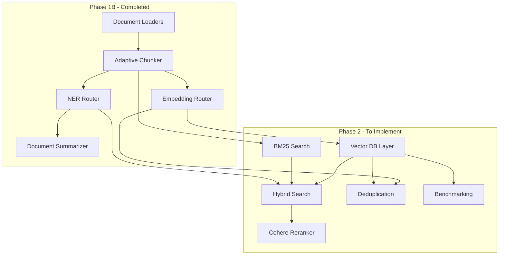
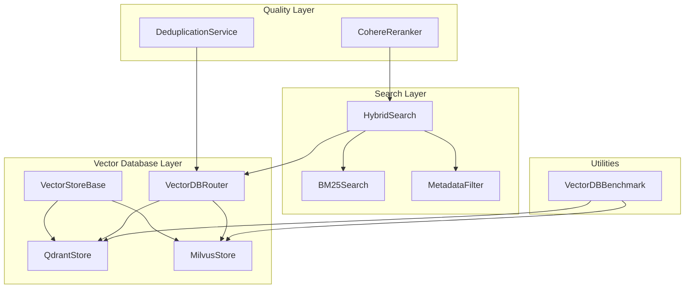
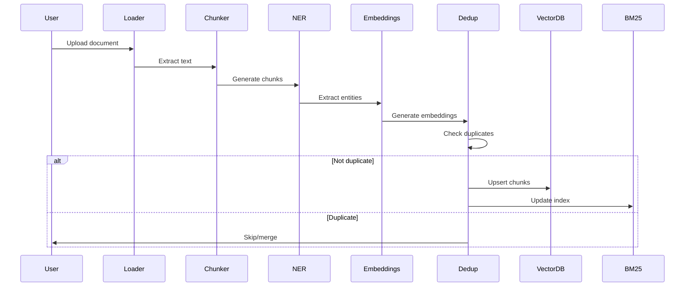
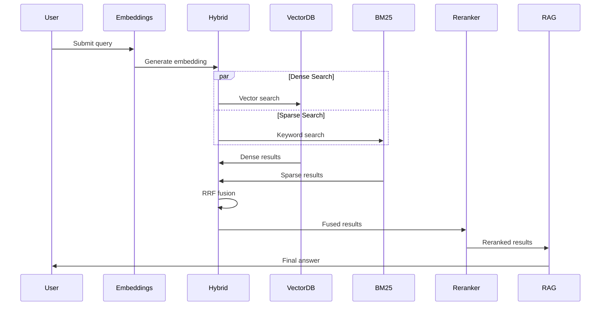

# Phase 2 Implementation Plan - Vector Database, Search & Reranking

## Overview

Phase 2 builds upon the Phase 1B foundation to implement the core retrieval infrastructure: vector database integration, hybrid search capabilities, reranking, and deduplication services. This phase transforms the document processing pipeline into a fully functional retrieval system.

### Phase 2 Goals

1. **Vector Database Layer**: Implement dual vector database support (Qdrant + Milvus) with abstraction layer
2. **Search Capabilities**: Build hybrid search combining dense vectors, BM25 sparse search, and metadata filtering
3. **Reranking**: Integrate Cohere reranker for improved retrieval precision
4. **Deduplication**: Implement content-hash and semantic deduplication
5. **Benchmarking**: Create performance comparison utilities for vector databases

### Scope

Phase 2 corresponds to **TASK-014 through TASK-022** from [`plans/spec.md`](plans/spec.md:142-178):
- Vector database abstraction and implementations
- BM25 sparse search
- Hybrid search with RRF fusion
- Metadata filtering
- Deduplication engine
- Benchmarking utilities

## Architecture Integration

### How Phase 2 Connects to Phase 1B



### Data Flow

**Document Ingestion Flow**:
1. Document → Loader → Chunker → NER Extraction (Phase 1B)
2. Chunks → Embedding Generation (Phase 1B)
3. **Embeddings + Metadata → Vector DB Upsert (Phase 2)**
4. **Chunks → BM25 Index Update (Phase 2)**
5. **Content Hash → Deduplication Check (Phase 2)**

**Query Flow**:
1. User Query → Embedding Generation (Phase 1B)
2. **Query → Dense Vector Search (Phase 2)**
3. **Query → BM25 Sparse Search (Phase 2)**
4. **Query → Metadata Filter (Phase 2)**
5. **Results → RRF Fusion (Phase 2)**
6. **Fused Results → Cohere Reranking (Phase 2)**
7. Reranked Results → RAG Pipeline (Phase 3)

## Component Specifications

### 1. Vector Database Base Interface

**File**: [`core/vectordb/base.py`](core/vectordb/base.py:1)

**Purpose**: Abstract interface defining common operations for all vector database implementations.

**Interface Definition**:

```python
from abc import ABC, abstractmethod
from typing import Optional
from config.models import ChunkMetadata, RetrievedChunk


class VectorStoreBase(ABC):
    """Abstract interface for vector database operations."""

    @abstractmethod
    async def create_collection(
        self, 
        name: str, 
        dimension: int,
        distance_metric: str = "cosine"
    ) -> None:
        """
        Create a new collection/index.
        
        Args:
            name: Collection name
            dimension: Vector dimension (1024 for Voyage/BGE-M3)
            distance_metric: Distance metric (cosine, euclidean, dot)
        """
        pass

    @abstractmethod
    async def delete_collection(self, name: str) -> None:
        """Delete a collection and all its data."""
        pass

    @abstractmethod
    async def upsert(
        self,
        collection: str,
        ids: list[str],
        embeddings: list[list[float]],
        documents: list[str],
        metadatas: list[dict],
    ) -> int:
        """
        Insert or update documents.
        
        Args:
            collection: Collection name
            ids: List of chunk IDs (UUIDs)
            embeddings: List of embedding vectors
            documents: List of chunk texts
            metadatas: List of ChunkMetadata dicts
            
        Returns:
            Count of upserted documents
        """
        pass

    @abstractmethod
    async def search(
        self,
        collection: str,
        query_embedding: list[float],
        top_k: int = 10,
        filters: Optional[dict] = None,
    ) -> list[RetrievedChunk]:
        """
        Search by vector similarity with optional metadata filters.
        
        Args:
            collection: Collection name
            query_embedding: Query vector
            top_k: Number of results to return
            filters: Metadata filters (e.g., {"organizations": ["Acme Corp"]})
            
        Returns:
            List of RetrievedChunk objects with scores
        """
        pass

    @abstractmethod
    async def delete(self, collection: str, ids: list[str]) -> int:
        """
        Delete documents by ID.
        
        Returns:
            Count of deleted documents
        """
        pass

    @abstractmethod
    async def get(self, collection: str, ids: list[str]) -> list[dict]:
        """
        Get documents by ID.
        
        Returns:
            List of documents with metadata
        """
        pass

    @abstractmethod
    async def count(self, collection: str) -> int:
        """Count documents in a collection."""
        pass

    @abstractmethod
    async def list_collections(self) -> list[str]:
        """List all collection names."""
        pass

    @abstractmethod
    async def health_check(self) -> bool:
        """Check if the database is reachable."""
        pass
```

**Key Design Decisions**:
- All methods are async for non-blocking I/O
- Uses Pydantic models from [`config/models.py`](config/models.py:1) for type safety
- Metadata filters use dict format compatible with both Qdrant and Milvus
- Returns `RetrievedChunk` objects with standardized structure

---

### 2. Qdrant Store Implementation

**File**: [`core/vectordb/qdrant_store.py`](core/vectordb/qdrant_store.py:1)

**Purpose**: Qdrant-specific implementation of the vector store interface.

**Implementation Details**:

```python
from qdrant_client import QdrantClient, AsyncQdrantClient
from qdrant_client.models import (
    Distance, VectorParams, PointStruct, 
    Filter, FieldCondition, MatchValue
)
from config.models import ChunkMetadata, RetrievedChunk
from config.settings import Settings
from .base import VectorStoreBase
import logging

logger = logging.getLogger(__name__)


class QdrantStore(VectorStoreBase):
    """Qdrant vector database implementation."""
    
    def __init__(self, settings: Settings):
        self.settings = settings
        self.client = AsyncQdrantClient(url=settings.qdrant_url)
        self.default_collection = settings.qdrant_collection
        
    async def create_collection(
        self, 
        name: str, 
        dimension: int,
        distance_metric: str = "cosine"
    ) -> None:
        """Create Qdrant collection with vector configuration."""
        distance_map = {
            "cosine": Distance.COSINE,
            "euclidean": Distance.EUCLID,
            "dot": Distance.DOT
        }
        
        await self.client.create_collection(
            collection_name=name,
            vectors_config=VectorParams(
                size=dimension,
                distance=distance_map.get(distance_metric, Distance.COSINE)
            )
        )
        logger.info(f"Created Qdrant collection: {name}")
        
    async def upsert(
        self,
        collection: str,
        ids: list[str],
        embeddings: list[list[float]],
        documents: list[str],
        metadatas: list[dict],
    ) -> int:
        """Upsert documents to Qdrant using PointStruct."""
        points = [
            PointStruct(
                id=chunk_id,
                vector=embedding,
                payload={
                    "content": document,
                    **metadata  # Flatten metadata into payload
                }
            )
            for chunk_id, embedding, document, metadata 
            in zip(ids, embeddings, documents, metadatas)
        ]
        
        await self.client.upsert(
            collection_name=collection,
            points=points
        )
        
        logger.info(f"Upserted {len(points)} documents to Qdrant collection: {collection}")
        return len(points)
        
    async def search(
        self,
        collection: str,
        query_embedding: list[float],
        top_k: int = 10,
        filters: Optional[dict] = None,
    ) -> list[RetrievedChunk]:
        """Search Qdrant with optional metadata filters."""
        # Build Qdrant filter from metadata dict
        qdrant_filter = None
        if filters:
            conditions = []
            for field, values in filters.items():
                # Support filtering by entity types (organizations, people, etc.)
                conditions.append(
                    FieldCondition(
                        key=f"entities.{field}",
                        match=MatchValue(any=values)
                    )
                )
            if conditions:
                qdrant_filter = Filter(must=conditions)
        
        results = await self.client.search(
            collection_name=collection,
            query_vector=query_embedding,
            limit=top_k,
            query_filter=qdrant_filter
        )
        
        # Convert to RetrievedChunk objects
        chunks = []
        for result in results:
            metadata = ChunkMetadata(**result.payload)
            chunks.append(
                RetrievedChunk(
                    content=result.payload["content"],
                    metadata=metadata,
                    score=result.score,
                    search_method="dense"
                )
            )
        
        return chunks
        
    async def delete(self, collection: str, ids: list[str]) -> int:
        """Delete documents from Qdrant by ID."""
        await self.client.delete(
            collection_name=collection,
            points_selector=ids
        )
        return len(ids)
        
    async def get(self, collection: str, ids: list[str]) -> list[dict]:
        """Retrieve documents by ID from Qdrant."""
        results = await self.client.retrieve(
            collection_name=collection,
            ids=ids
        )
        return [result.payload for result in results]
        
    async def count(self, collection: str) -> int:
        """Count documents in Qdrant collection."""
        info = await self.client.get_collection(collection_name=collection)
        return info.points_count
        
    async def list_collections(self) -> list[str]:
        """List all Qdrant collections."""
        collections = await self.client.get_collections()
        return [c.name for c in collections.collections]
        
    async def health_check(self) -> bool:
        """Check Qdrant health."""
        try:
            await self.client.get_collections()
            return True
        except Exception as e:
            logger.error(f"Qdrant health check failed: {e}")
            return False
```

**Key Features**:
- Uses `AsyncQdrantClient` for async operations
- Stores metadata as payload for filtering
- Supports entity-based metadata filtering
- Proper error handling and logging

---

### 3. Milvus Store Implementation

**File**: [`core/vectordb/milvus_store.py`](core/vectordb/milvus_store.py:1)

**Purpose**: Milvus-specific implementation of the vector store interface.

**Implementation Details**:

```python
from pymilvus import (
    connections, Collection, CollectionSchema, 
    FieldSchema, DataType, utility
)
from config.models import ChunkMetadata, RetrievedChunk
from config.settings import Settings
from .base import VectorStoreBase
import logging
import json

logger = logging.getLogger(__name__)


class MilvusStore(VectorStoreBase):
    """Milvus vector database implementation."""
    
    def __init__(self, settings: Settings):
        self.settings = settings
        self.default_collection = settings.milvus_collection
        
        # Parse Milvus URL
        url_parts = settings.milvus_url.replace("http://", "").split(":")
        self.host = url_parts[0]
        self.port = url_parts[1] if len(url_parts) > 1 else "19530"
        
        # Connect to Milvus
        connections.connect(
            alias="default",
            host=self.host,
            port=self.port
        )
        logger.info(f"Connected to Milvus at {self.host}:{self.port}")
        
    async def create_collection(
        self, 
        name: str, 
        dimension: int,
        distance_metric: str = "cosine"
    ) -> None:
        """Create Milvus collection with schema."""
        # Define schema
        fields = [
            FieldSchema(name="id", dtype=DataType.VARCHAR, is_primary=True, max_length=100),
            FieldSchema(name="embedding", dtype=DataType.FLOAT_VECTOR, dim=dimension),
            FieldSchema(name="content", dtype=DataType.VARCHAR, max_length=65535),
            FieldSchema(name="metadata", dtype=DataType.JSON)  # Store metadata as JSON
        ]
        
        schema = CollectionSchema(
            fields=fields,
            description=f"Document chunks for {name}"
        )
        
        collection = Collection(name=name, schema=schema)
        
        # Create index for vector field
        metric_map = {
            "cosine": "COSINE",
            "euclidean": "L2",
            "dot": "IP"
        }
        
        index_params = {
            "metric_type": metric_map.get(distance_metric, "COSINE"),
            "index_type": "IVF_FLAT",
            "params": {"nlist": 1024}
        }
        
        collection.create_index(
            field_name="embedding",
            index_params=index_params
        )
        
        logger.info(f"Created Milvus collection: {name}")
        
    async def upsert(
        self,
        collection: str,
        ids: list[str],
        embeddings: list[list[float]],
        documents: list[str],
        metadatas: list[dict],
    ) -> int:
        """Upsert documents to Milvus."""
        coll = Collection(collection)
        
        # Prepare data
        data = [
            ids,
            embeddings,
            documents,
            [json.dumps(m) for m in metadatas]  # Serialize metadata to JSON
        ]
        
        coll.insert(data)
        coll.flush()
        
        logger.info(f"Upserted {len(ids)} documents to Milvus collection: {collection}")
        return len(ids)
        
    async def search(
        self,
        collection: str,
        query_embedding: list[float],
        top_k: int = 10,
        filters: Optional[dict] = None,
    ) -> list[RetrievedChunk]:
        """Search Milvus with optional metadata filters."""
        coll = Collection(collection)
        coll.load()
        
        # Build filter expression
        expr = None
        if filters:
            # Milvus JSON filtering syntax
            conditions = []
            for field, values in filters.items():
                # Example: metadata["entities"]["organizations"] in ["Acme Corp"]
                value_list = ", ".join([f'"{v}"' for v in values])
                conditions.append(
                    f'json_contains(metadata["entities"]["{field}"], [{value_list}])'
                )
            expr = " and ".join(conditions) if conditions else None
        
        search_params = {"metric_type": "COSINE", "params": {"nprobe": 10}}
        
        results = coll.search(
            data=[query_embedding],
            anns_field="embedding",
            param=search_params,
            limit=top_k,
            expr=expr,
            output_fields=["content", "metadata"]
        )
        
        # Convert to RetrievedChunk objects
        chunks = []
        for hits in results:
            for hit in hits:
                metadata_dict = json.loads(hit.entity.get("metadata"))
                metadata = ChunkMetadata(**metadata_dict)
                chunks.append(
                    RetrievedChunk(
                        content=hit.entity.get("content"),
                        metadata=metadata,
                        score=hit.score,
                        search_method="dense"
                    )
                )
        
        return chunks
        
    async def delete(self, collection: str, ids: list[str]) -> int:
        """Delete documents from Milvus by ID."""
        coll = Collection(collection)
        expr = f'id in [{", ".join([f"{id}" for id in ids])}]'
        coll.delete(expr)
        return len(ids)
        
    async def get(self, collection: str, ids: list[str]) -> list[dict]:
        """Retrieve documents by ID from Milvus."""
        coll = Collection(collection)
        coll.load()
        
        expr = f'id in [{", ".join([f"{id}" for id in ids])}]'
        results = coll.query(
            expr=expr,
            output_fields=["content", "metadata"]
        )
        
        return [
            {
                "content": r["content"],
                "metadata": json.loads(r["metadata"])
            }
            for r in results
        ]
        
    async def count(self, collection: str) -> int:
        """Count documents in Milvus collection."""
        coll = Collection(collection)
        return coll.num_entities
        
    async def list_collections(self) -> list[str]:
        """List all Milvus collections."""
        return utility.list_collections()
        
    async def health_check(self) -> bool:
        """Check Milvus health."""
        try:
            utility.list_collections()
            return True
        except Exception as e:
            logger.error(f"Milvus health check failed: {e}")
            return False
```

**Key Features**:
- Uses `pymilvus` synchronous API (wrapped in async methods)
- Stores metadata as JSON field for flexibility
- IVF_FLAT index for good balance of speed and accuracy
- JSON-based metadata filtering

---

### 4. Vector DB Router

**File**: [`core/vectordb/router.py`](core/vectordb/router.py:1)

**Purpose**: Route vector database operations to the configured backend (Qdrant or Milvus).

**Implementation**:

```python
from config.settings import Settings
from .base import VectorStoreBase
from .qdrant_store import QdrantStore
from .milvus_store import MilvusStore
import logging

logger = logging.getLogger(__name__)


def get_vector_store(settings: Settings) -> VectorStoreBase:
    """
    Get the configured vector store implementation.
    
    Args:
        settings: Application settings
        
    Returns:
        VectorStoreBase implementation (QdrantStore or MilvusStore)
        
    Raises:
        ValueError: If vector DB backend is not supported
    """
    backend = settings.default_vector_db
    
    if backend == "qdrant":
        logger.info("Using Qdrant vector store")
        return QdrantStore(settings)
    elif backend == "milvus":
        logger.info("Using Milvus vector store")
        return MilvusStore(settings)
    else:
        raise ValueError(
            f"Unsupported vector database: {backend}. "
            f"Supported: qdrant, milvus"
        )


class VectorDBRouter:
    """
    Router for transparent switching between vector databases.
    Useful for benchmarking and A/B testing.
    """
    
    def __init__(self, settings: Settings):
        self.settings = settings
        self.stores = {
            "qdrant": QdrantStore(settings),
            "milvus": MilvusStore(settings)
        }
        self.active_store = settings.default_vector_db
        
    def get_store(self, backend: str = None) -> VectorStoreBase:
        """Get a specific vector store or the active one."""
        if backend is None:
            backend = self.active_store
            
        if backend not in self.stores:
            raise ValueError(f"Unknown vector store: {backend}")
            
        return self.stores[backend]
        
    def switch_backend(self, backend: str) -> None:
        """Switch the active vector database backend."""
        if backend not in self.stores:
            raise ValueError(f"Unknown vector store: {backend}")
            
        self.active_store = backend
        logger.info(f"Switched to {backend} vector store")
```

**Usage Example**:

```python
from core.vectordb.router import get_vector_store
from config.settings import settings

# Get the configured vector store
vector_store = get_vector_store(settings)

# Use it
await vector_store.create_collection("documents", dimension=1024)
await vector_store.upsert(
    collection="documents",
    ids=["id1", "id2"],
    embeddings=[[0.1]*1024, [0.2]*1024],
    documents=["text1", "text2"],
    metadatas=[{...}, {...}]
)
```

---

### 5. BM25 Search Implementation

**File**: [`core/search/bm25_search.py`](core/search/bm25_search.py:1)

**Purpose**: Sparse keyword search using BM25 algorithm for exact term matching.

**Implementation**:

```python
from rank_bm25 import BM25Okapi
from config.models import RetrievedChunk, ChunkMetadata
from typing import Optional
import logging

logger = logging.getLogger(__name__)


class BM25Search:
    """
    BM25 sparse keyword search for exact term matching.
    
    Complements dense vector search by catching queries with specific
    terminology that might be missed by semantic embeddings.
    """
    
    def __init__(self):
        self.index: Optional[BM25Okapi] = None
        self.documents: list[str] = []
        self.metadatas: list[ChunkMetadata] = []
        self.chunk_ids: list[str] = []
        
    def build_index(
        self, 
        documents: list[str], 
        metadatas: list[ChunkMetadata]
    ) -> None:
        """
        Build BM25 index from documents.
        
        Args:
            documents: List of document texts
            metadatas: List of ChunkMetadata objects
        """
        self.documents = documents
        self.metadatas = metadatas
        self.chunk_ids = [m.chunk_id for m in metadatas]
        
        # Tokenize documents (simple whitespace tokenization)
        tokenized_docs = [doc.lower().split() for doc in documents]
        
        # Build BM25 index
        self.index = BM25Okapi(tokenized_docs)
        
        logger.info(f"Built BM25 index with {len(documents)} documents")
        
    def add_documents(
        self, 
        documents: list[str], 
        metadatas: list[ChunkMetadata]
    ) -> None:
        """
        Add documents to existing index (incremental indexing).
        
        Args:
            documents: List of new document texts
            metadatas: List of new ChunkMetadata objects
        """
        self.documents.extend(documents)
        self.metadatas.extend(metadatas)
        self.chunk_ids.extend([m.chunk_id for m in metadatas])
        
        # Rebuild index (BM25Okapi doesn't support incremental updates)
        tokenized_docs = [doc.lower().split() for doc in self.documents]
        self.index = BM25Okapi(tokenized_docs)
        
        logger.info(f"Added {len(documents)} documents to BM25 index")
        
    def remove_documents(self, chunk_ids: list[str]) -> None:
        """
        Remove documents from index by chunk ID.
        
        Args:
            chunk_ids: List of chunk IDs to remove
        """
        # Filter out removed documents
        indices_to_keep = [
            i for i, cid in enumerate(self.chunk_ids) 
            if cid not in chunk_ids
        ]
        
        self.documents = [self.documents[i] for i in indices_to_keep]
        self.metadatas = [self.metadatas[i] for i in indices_to_keep]
        self.chunk_ids = [self.chunk_ids[i] for i in indices_to_keep]
        
        # Rebuild index
        if self.documents:
            tokenized_docs = [doc.lower().split() for doc in self.documents]
            self.index = BM25Okapi(tokenized_docs)
        else:
            self.index = None
            
        logger.info(f"Removed {len(chunk_ids)} documents from BM25 index")
        
    def search(
        self, 
        query: str, 
        top_k: int = 10,
        filters: Optional[dict] = None
    ) -> list[RetrievedChunk]:
        """
        Search using BM25 keyword matching.
        
        Args:
            query: Search query
            top_k: Number of results to return
            filters: Optional metadata filters (applied post-search)
            
        Returns:
            List of RetrievedChunk objects with BM25 scores
        """
        if self.index is None:
            logger.warning("BM25 index not built, returning empty results")
            return []
            
        # Tokenize query
        tokenized_query = query.lower().split()
        
        # Get BM25 scores
        scores = self.index.get_scores(tokenized_query)
        
        # Get top-k indices
        top_indices = sorted(
            range(len(scores)), 
            key=lambda i: scores[i], 
            reverse=True
        )[:top_k * 2]  # Get more for filtering
        
        # Build results
        results = []
        for idx in top_indices:
            metadata = self.metadatas[idx]
            
            # Apply metadata filters if provided
            if filters:
                if not self._matches_filters(metadata, filters):
                    continue
                    
            results.append(
                RetrievedChunk(
                    content=self.documents[idx],
                    metadata=metadata,
                    score=float(scores[idx]),
                    search_method="sparse"
                )
            )
            
            if len(results) >= top_k:
                break
                
        return results
        
    def _matches_filters(
        self, 
        metadata: ChunkMetadata, 
        filters: dict
    ) -> bool:
        """Check if metadata matches filter criteria."""
        for field, values in filters.items():
            # Check entity fields
            entity_values = getattr(metadata.entities, field, [])
            if not any(v in entity_values for v in values):
                return False
        return True
        
    def get_index_size(self) -> int:
        """Get number of documents in index."""
        return len(self.documents)
```

**Key Features**:
- Uses `rank_bm25` library for BM25Okapi algorithm
- Supports incremental indexing (add/remove documents)
- Post-search metadata filtering
- Returns standardized `RetrievedChunk` objects

---

### 6. Hybrid Search with RRF

**File**: [`core/search/hybrid_search.py`](core/search/hybrid_search.py:1)

**Purpose**: Combine dense vector search, BM25 sparse search, and metadata filtering using Reciprocal Rank Fusion.

**Implementation**:

```python
from config.models import RetrievedChunk
from config.settings import Settings
from core.vectordb.base import VectorStoreBase
from core.embeddings.embedding_router import get_embedding_service
from .bm25_search import BM25Search
from typing import Optional
import logging

logger = logging.getLogger(__name__)


class HybridSearch:
    """
    Hybrid search combining dense, sparse, and metadata filtering.
    
    Uses Reciprocal Rank Fusion (RRF) to merge results from:
    1. Dense vector search (semantic similarity)
    2. BM25 sparse search (keyword matching)
    3. Metadata filtering (entity-based)
    """
    
    def __init__(
        self,
        vector_store: VectorStoreBase,
        bm25_search: BM25Search,
        settings: Settings
    ):
        self.vector_store = vector_store
        self.bm25_search = bm25_search
        self.settings = settings
        self.embedding_service = get_embedding_service(settings)
        
        # RRF weights from settings
        self.dense_weight = settings.dense_weight
        self.sparse_weight = settings.sparse_weight
        self.metadata_weight = settings.metadata_weight
        
    async def search(
        self,
        query: str,
        collection: str,
        top_k: int = 10,
        search_mode: str = "hybrid",
        filters: Optional[dict] = None
    ) -> list[RetrievedChunk]:
        """
        Perform hybrid search.
        
        Args:
            query: Search query
            collection: Vector DB collection name
            top_k: Number of final results
            search_mode: "dense", "sparse", or "hybrid"
            filters: Optional metadata filters
            
        Returns:
            List of RetrievedChunk objects ranked by RRF score
        """
        if search_mode == "dense":
            return await self._dense_search(query, collection, top_k, filters)
        elif search_mode == "sparse":
            return self._sparse_search(query, top_k, filters)
        else:  # hybrid
            return await self._hybrid_search(query, collection, top_k, filters)
            
    async def _dense_search(
        self,
        query: str,
        collection: str,
        top_k: int,
        filters: Optional[dict]
    ) -> list[RetrievedChunk]:
        """Dense vector search only."""
        query_embedding = await self.embedding_service.embed_query(query)
        
        results = await self.vector_store.search(
            collection=collection,
            query_embedding=query_embedding,
            top_k=top_k,
            filters=filters
        )
        
        return results
        
    def _sparse_search(
        self,
        query: str,
        top_k: int,
        filters: Optional[dict]
    ) -> list[RetrievedChunk]:
        """BM25 sparse search only."""
        return self.bm25_search.search(
            query=query,
            top_k=top_k,
            filters=filters
        )
        
    async def _hybrid_search(
        self,
        query: str,
        collection: str,
        top_k: int,
        filters: Optional[dict]
    ) -> list[RetrievedChunk]:
        """
        Hybrid search with RRF fusion.
        
        Retrieves from both dense and sparse, then fuses using RRF.
        """
        # Retrieve more candidates for fusion
        retrieval_k = top_k * 3
        
        # Dense search
        dense_results = await self._dense_search(
            query, collection, retrieval_k, filters
        )
        
        # Sparse search
        sparse_results = self._sparse_search(
            query, retrieval_k, filters
        )
        
        # Apply RRF fusion
        fused_results = self._reciprocal_rank_fusion(
            dense_results=dense_results,
            sparse_results=sparse_results,
            top_k=top_k
        )
        
        return fused_results
        
    def _reciprocal_rank_fusion(
        self,
        dense_results: list[RetrievedChunk],
        sparse_results: list[RetrievedChunk],
        top_k: int,
        k: int = 60  # RRF constant
    ) -> list[RetrievedChunk]:
        """
        Merge results using Reciprocal Rank Fusion.
        
        RRF formula: score = sum(1 / (k + rank_i)) for each result list
        
        Args:
            dense_results: Results from dense search
            sparse_results: Results from sparse search
            top_k: Number of final results
            k: RRF constant (default 60)
            
        Returns:
            Fused and reranked results
        """
        # Build chunk_id -> RetrievedChunk mapping
        chunk_map = {}
        rrf_scores = {}
        
        # Process dense results
        for rank, chunk in enumerate(dense_results, start=1):
            chunk_id = chunk.metadata.chunk_id
            chunk_map[chunk_id] = chunk
            rrf_scores[chunk_id] = self.dense_weight / (k + rank)
            
        # Process sparse results
        for rank, chunk in enumerate(sparse_results, start=1):
            chunk_id = chunk.metadata.chunk_id
            if chunk_id not in chunk_map:
                chunk_map[chunk_id] = chunk
                rrf_scores[chunk_id] = 0
            rrf_scores[chunk_id] += self.sparse_weight / (k + rank)
            
        # Sort by RRF score
        sorted_chunks = sorted(
            chunk_map.items(),
            key=lambda x: rrf_scores[x[0]],
            reverse=True
        )[:top_k]
        
        # Build final results with RRF scores
        results = []
        for chunk_id, chunk in sorted_chunks:
            chunk.score = rrf_scores[chunk_id]
            chunk.search_method = "hybrid"
            results.append(chunk)
            
        logger.info(
            f"RRF fusion: {len(dense_results)} dense + "
            f"{len(sparse_results)} sparse → {len(results)} final"
        )
        
        return results
```

**Key Features**:
- Supports three search modes: dense, sparse, hybrid
- Configurable RRF weights for dense/sparse/metadata
- Retrieves more candidates before fusion for better results
- Deduplicates results by chunk_id

---

### 7. Metadata Filtering

**File**: [`core/search/metadata_filter.py`](core/search/metadata_filter.py:1)

**Purpose**: Filter search results based on extracted NER entities and other metadata.

**Implementation**:

```python
from config.models import RetrievedChunk, ChunkMetadata
from typing import Optional
import logging

logger = logging.getLogger(__name__)


class MetadataFilter:
    """
    Filter search results based on metadata criteria.
    
    Supports filtering by:
    - Entity types (people, organizations, dates, locations, topics)
    - File type
    - Date range
    - Custom metadata fields
    """
    
    @staticmethod
    def apply_filters(
        chunks: list[RetrievedChunk],
        filters: Optional[dict] = None
    ) -> list[RetrievedChunk]:
        """
        Apply metadata filters to search results.
        
        Args:
            chunks: List of retrieved chunks
            filters: Filter criteria dict, e.g.:
                {
                    "organizations": ["Acme Corp", "TechCo"],
                    "people": ["John Doe"],
                    "file_type": ["pdf"],
                    "date_range": {"start": "2024-01-01", "end": "2024-12-31"}
                }
                
        Returns:
            Filtered list of chunks
        """
        if not filters:
            return chunks
            
        filtered = []
        for chunk in chunks:
            if MetadataFilter._matches_filters(chunk.metadata, filters):
                filtered.append(chunk)
                
        logger.info(f"Filtered {len(chunks)} → {len(filtered)} chunks")
        return filtered
        
    @staticmethod
    def _matches_filters(metadata: ChunkMetadata, filters: dict) -> bool:
        """Check if metadata matches all filter criteria."""
        for field, criteria in filters.items():
            if field == "organizations":
                if not any(org in metadata.entities.organizations for org in criteria):
                    return False
                    
            elif field == "people":
                if not any(person in metadata.entities.people for person in criteria):
                    return False
                    
            elif field == "dates":
                if not any(date in metadata.entities.dates for date in criteria):
                    return False
                    
            elif field == "locations":
                if not any(loc in metadata.entities.locations for loc in criteria):
                    return False
                    
            elif field == "topics":
                if not any(topic in metadata.entities.topics for topic in criteria):
                    return False
                    
            elif field == "file_type":
                if metadata.file_type not in criteria:
                    return False
                    
            elif field == "source_file":
                if metadata.source_file not in criteria:
                    return False
                    
            elif field == "chunk_type":
                if metadata.chunk_type not in criteria:
                    return False
                    
            elif field == "date_range":
                # Filter by document creation date
                start = criteria.get("start")
                end = criteria.get("end")
                doc_date = metadata.created_at
                
                if start and doc_date < start:
                    return False
                if end and doc_date > end:
                    return False
                    
        return True
        
    @staticmethod
    def build_filter_summary(filters: dict) -> str:
        """Build human-readable filter summary."""
        if not filters:
            return "No filters applied"
            
        parts = []
        for field, criteria in filters.items():
            if isinstance(criteria, list):
                parts.append(f"{field}: {', '.join(criteria)}")
            elif isinstance(criteria, dict):
                parts.append(f"{field}: {criteria}")
                
        return " | ".join(parts)
```

**Usage Example**:

```python
from core.search.metadata_filter import MetadataFilter

# Apply filters to search results
filtered_chunks = MetadataFilter.apply_filters(
    chunks=search_results,
    filters={
        "organizations": ["Acme Corp"],
        "file_type": ["pdf"],
        "date_range": {"start": "2024-01-01", "end": "2024-12-31"}
    }
)
```

---

### 8. Cohere Reranker

**File**: [`core/reranking/cohere_reranker.py`](core/reranking/cohere_reranker.py:1)

**Purpose**: Apply cross-encoder reranking using Cohere's rerank-v3.5 API for improved precision.

**Implementation**:

```python
import cohere
from config.models import RetrievedChunk
from config.settings import Settings
from typing import Optional
import logging

logger = logging.getLogger(__name__)


class CohereReranker:
    """
    Cohere cross-encoder reranking service.
    
    Applies rerank-v3.5 model to reorder retrieved chunks
    based on query-document relevance.
    """
    
    def __init__(self, settings: Settings):
        self.settings = settings
        
        if not settings.cohere_api_key:
            raise ValueError("Cohere API key not configured")
            
        self.client = cohere.Client(api_key=settings.cohere_api_key)
        self.model = "rerank-english-v3.0"  # or rerank-multilingual-v3.0
        
    async def rerank(
        self,
        query: str,
        chunks: list[RetrievedChunk],
        top_k: Optional[int] = None,
        score_threshold: float = 0.0
    ) -> list[RetrievedChunk]:
        """
        Rerank chunks using Cohere reranker.
        
        Args:
            query: Original search query
            chunks: Retrieved chunks to rerank
            top_k: Number of top results to return (None = all)
            score_threshold: Minimum relevance score (0.0-1.0)
            
        Returns:
            Reranked chunks with updated scores
        """
        if not chunks:
            return []
            
        # Extract documents for reranking
        documents = [chunk.content for chunk in chunks]
        
        # Call Cohere rerank API
        try:
            response = self.client.rerank(
                model=self.model,
                query=query,
                documents=documents,
                top_n=top_k if top_k else len(documents),
                return_documents=False  # We already have the documents
            )
            
            # Build reranked results
            reranked = []
            for result in response.results:
                idx = result.index
                relevance_score = result.relevance_score
                
                # Apply score threshold
                if relevance_score < score_threshold:
                    continue
                    
                # Update chunk with reranker score
                chunk = chunks[idx]
                chunk.score = relevance_score
                reranked.append(chunk)
                
            logger.info(
                f"Reranked {len(chunks)} → {len(reranked)} chunks "
                f"(threshold: {score_threshold})"
            )
            
            return reranked
            
        except Exception as e:
            logger.error(f"Cohere reranking failed: {e}")
            # Fallback: return original chunks
            return chunks[:top_k] if top_k else chunks
            
    def get_model_info(self) -> dict:
        """Get information about the reranker model."""
        return {
            "model": self.model,
            "provider": "cohere",
            "type": "cross-encoder"
        }
```

**Key Features**:
- Uses Cohere's rerank-v3.5 API
- Supports score thresholding
- Graceful fallback on API errors
- Updates chunk scores with reranker scores

---

### 9. Deduplication Service

**File**: [`core/document_processing/deduplication.py`](core/document_processing/deduplication.py:1)

**Purpose**: Detect exact and near-duplicate documents using content hashing and semantic similarity.

**Implementation**:

```python
from config.models import ChunkMetadata
from config.settings import Settings
from core.embeddings.embedding_router import get_embedding_service
from typing import Literal
import hashlib
import numpy as np
import logging

logger = logging.getLogger(__name__)


class DeduplicationService:
    """
    Document deduplication using content hashing and semantic similarity.
    
    Two-stage approach:
    1. Content-hash deduplication: SHA-256 for exact duplicates
    2. Semantic deduplication: Cosine similarity for near-duplicates
    """
    
    def __init__(self, settings: Settings):
        self.settings = settings
        self.embedding_service = get_embedding_service(settings)
        self.similarity_threshold = settings.dedup_similarity_threshold
        
        # In-memory cache of seen documents
        self.content_hashes: set[str] = set()
        self.embeddings_cache: dict[str, list[float]] = {}
        
    def compute_content_hash(self, text: str) -> str:
        """
        Compute SHA-256 hash of normalized text.
        
        Args:
            text: Document text
            
        Returns:
            Hex digest of SHA-256 hash
        """
        # Normalize: lowercase, strip whitespace
        normalized = text.lower().strip()
        return hashlib.sha256(normalized.encode()).hexdigest()
        
    def check_exact_duplicate(self, content_hash: str) -> bool:
        """
        Check if content hash exists in cache.
        
        Args:
            content_hash: SHA-256 hash of document
            
        Returns:
            True if exact duplicate found
        """
        return content_hash in self.content_hashes
        
    def add_content_hash(self, content_hash: str) -> None:
        """Add content hash to cache."""
        self.content_hashes.add(content_hash)
        
    async def check_semantic_duplicate(
        self,
        text: str,
        embedding: list[float] = None
    ) -> tuple[bool, float]:
        """
        Check for semantic near-duplicates using cosine similarity.
        
        Args:
            text: Document text
            embedding: Pre-computed embedding (optional)
            
        Returns:
            Tuple of (is_duplicate, max_similarity)
        """
        # Generate embedding if not provided
        if embedding is None:
            embedding = await self.embedding_service.embed_query(text)
            
        # Compare with cached embeddings
        max_similarity = 0.0
        for cached_hash, cached_embedding in self.embeddings_cache.items():
            similarity = self._cosine_similarity(embedding, cached_embedding)
            max_similarity = max(max_similarity, similarity)
            
            if similarity >= self.similarity_threshold:
                logger.info(
                    f"Semantic duplicate found (similarity: {similarity:.3f})"
                )
                return True, similarity
                
        return False, max_similarity
        
    def add_embedding(self, content_hash: str, embedding: list[float]) -> None:
        """Add embedding to cache for future comparisons."""
        self.embeddings_cache[content_hash] = embedding
        
    async def check_duplicate(
        self,
        text: str,
        metadata: ChunkMetadata
    ) -> tuple[Literal["new", "exact_duplicate", "near_duplicate"], float]:
        """
        Check for both exact and semantic duplicates.
        
        Args:
            text: Document text
            metadata: Chunk metadata with content_hash
            
        Returns:
            Tuple of (status, similarity_score)
        """
        content_hash = metadata.content_hash
        
        # Check exact duplicate first (fast)
        if self.check_exact_duplicate(content_hash):
            logger.info(f"Exact duplicate found: {content_hash[:8]}...")
            return "exact_duplicate", 1.0
            
        # Check semantic duplicate (slower)
        is_semantic_dup, similarity = await self.check_semantic_duplicate(text)
        
        if is_semantic_dup:
            return "near_duplicate", similarity
            
        # Not a duplicate - add to cache
        self.add_content_hash(content_hash)
        embedding = await self.embedding_service.embed_query(text)
        self.add_embedding(content_hash, embedding)
        
        return "new", 0.0
        
    @staticmethod
    def _cosine_similarity(vec1: list[float], vec2: list[float]) -> float:
        """Compute cosine similarity between two vectors."""
        v1 = np.array(vec1)
        v2 = np.array(vec2)
        
        dot_product = np.dot(v1, v2)
        norm1 = np.linalg.norm(v1)
        norm2 = np.linalg.norm(v2)
        
        if norm1 == 0 or norm2 == 0:
            return 0.0
            
        return float(dot_product / (norm1 * norm2))
        
    def clear_cache(self) -> None:
        """Clear deduplication cache."""
        self.content_hashes.clear()
        self.embeddings_cache.clear()
        logger.info("Deduplication cache cleared")
        
    def get_cache_stats(self) -> dict:
        """Get cache statistics."""
        return {
            "content_hashes": len(self.content_hashes),
            "embeddings_cached": len(self.embeddings_cache),
            "similarity_threshold": self.similarity_threshold
        }
```

**Key Features**:
- Two-stage deduplication: exact (fast) then semantic (accurate)
- In-memory caching for performance
- Configurable similarity threshold
- Returns detailed duplicate status

---

### 10. Benchmarking Utilities

**File**: [`core/vectordb/benchmark.py`](core/vectordb/benchmark.py:1)

**Purpose**: Compare Qdrant vs Milvus performance on indexing, search, and memory usage.

**Implementation**:

```python
from config.models import BenchmarkResult
from config.settings import Settings
from .base import VectorStoreBase
from .qdrant_store import QdrantStore
from .milvus_store import MilvusStore
import time
import psutil
import numpy as np
from datetime import datetime
import logging

logger = logging.getLogger(__name__)


class VectorDBBenchmark:
    """
    Benchmark vector database performance.
    
    Measures:
    - Indexing throughput (docs/sec)
    - Query latency (p50, p95, p99)
    - Recall@k
    - Memory usage
    """
    
    def __init__(self, settings: Settings):
        self.settings = settings
        self.qdrant = QdrantStore(settings)
        self.milvus = MilvusStore(settings)
        
    async def run_benchmark(
        self,
        num_documents: int = 1000,
        dimension: int = 1024,
        num_queries: int = 100
    ) -> dict[str, BenchmarkResult]:
        """
        Run comprehensive benchmark on both databases.
        
        Args:
            num_documents: Number of documents to index
            dimension: Vector dimension
            num_queries: Number of search queries to run
            
        Returns:
            Dict mapping db_name to BenchmarkResult
        """
        logger.info(
            f"Starting benchmark: {num_documents} docs, "
            f"{dimension}D, {num_queries} queries"
        )
        
        # Generate test data
        test_data = self._generate_test_data(num_documents, dimension)
        test_queries = self._generate_test_queries(num_queries, dimension)
        
        results = {}
        
        # Benchmark Qdrant
        logger.info("Benchmarking Qdrant...")
        results["qdrant"] = await self._benchmark_store(
            store=self.qdrant,
            db_name="qdrant",
            test_data=test_data,
            test_queries=test_queries
        )
        
        # Benchmark Milvus
        logger.info("Benchmarking Milvus...")
        results["milvus"] = await self._benchmark_store(
            store=self.milvus,
            db_name="milvus",
            test_data=test_data,
            test_queries=test_queries
        )
        
        return results
        
    async def _benchmark_store(
        self,
        store: VectorStoreBase,
        db_name: str,
        test_data: dict,
        test_queries: list[list[float]]
    ) -> BenchmarkResult:
        """Benchmark a single vector store."""
        collection_name = f"benchmark_{db_name}_{int(time.time())}"
        
        # Create collection
        await store.create_collection(
            name=collection_name,
            dimension=len(test_data["embeddings"][0])
        )
        
        # Benchmark indexing
        index_result = await self._benchmark_indexing(
            store=store,
            collection=collection_name,
            test_data=test_data
        )
        
        # Benchmark search
        search_result = await self._benchmark_search(
            store=store,
            collection=collection_name,
            test_queries=test_queries
        )
        
        # Measure memory
        memory_mb = self._measure_memory()
        
        # Cleanup
        await store.delete_collection(collection_name)
        
        return BenchmarkResult(
            db_name=db_name,
            operation="combined",
            num_documents=len(test_data["ids"]),
            latency_p50_ms=search_result["p50"],
            latency_p95_ms=search_result["p95"],
            latency_p99_ms=search_result["p99"],
            throughput_ops_per_sec=index_result["throughput"],
            memory_usage_mb=memory_mb,
            recall_at_k=search_result.get("recall_at_k"),
            timestamp=datetime.now()
        )
        
    async def _benchmark_indexing(
        self,
        store: VectorStoreBase,
        collection: str,
        test_data: dict
    ) -> dict:
        """Benchmark indexing performance."""
        start_time = time.time()
        
        await store.upsert(
            collection=collection,
            ids=test_data["ids"],
            embeddings=test_data["embeddings"],
            documents=test_data["documents"],
            metadatas=test_data["metadatas"]
        )
        
        elapsed = time.time() - start_time
        throughput = len(test_data["ids"]) / elapsed
        
        logger.info(
            f"Indexed {len(test_data['ids'])} docs in {elapsed:.2f}s "
            f"({throughput:.1f} docs/sec)"
        )
        
        return {
            "elapsed": elapsed,
            "throughput": throughput
        }
        
    async def _benchmark_search(
        self,
        store: VectorStoreBase,
        collection: str,
        test_queries: list[list[float]]
    ) -> dict:
        """Benchmark search performance."""
        latencies = []
        
        for query_embedding in test_queries:
            start_time = time.time()
            
            await store.search(
                collection=collection,
                query_embedding=query_embedding,
                top_k=10
            )
            
            latency_ms = (time.time() - start_time) * 1000
            latencies.append(latency_ms)
            
        # Calculate percentiles
        p50 = float(np.percentile(latencies, 50))
        p95 = float(np.percentile(latencies, 95))
        p99 = float(np.percentile(latencies, 99))
        
        logger.info(
            f"Search latency - p50: {p50:.2f}ms, "
            f"p95: {p95:.2f}ms, p99: {p99:.2f}ms"
        )
        
        return {
            "p50": p50,
            "p95": p95,
            "p99": p99,
            "latencies": latencies
        }
        
    def _generate_test_data(
        self, 
        num_documents: int, 
        dimension: int
    ) -> dict:
        """Generate synthetic test data."""
        return {
            "ids": [f"doc_{i}" for i in range(num_documents)],
            "embeddings": [
                np.random.rand(dimension).tolist() 
                for _ in range(num_documents)
            ],
            "documents": [
                f"Test document {i} with some content" 
                for i in range(num_documents)
            ],
            "metadatas": [
                {"chunk_id": f"doc_{i}", "source_file": "test.pdf"}
                for i in range(num_documents)
            ]
        }
        
    def _generate_test_queries(
        self, 
        num_queries: int, 
        dimension: int
    ) -> list[list[float]]:
        """Generate synthetic query vectors."""
        return [
            np.random.rand(dimension).tolist() 
            for _ in range(num_queries)
        ]
        
    def _measure_memory(self) -> float:
        """Measure current process memory usage in MB."""
        process = psutil.Process()
        memory_info = process.memory_info()
        return memory_info.rss / (1024 * 1024)  # Convert to MB
```

**Key Features**:
- Benchmarks both Qdrant and Milvus
- Measures indexing throughput and search latency
- Calculates p50, p95, p99 percentiles
- Tracks memory usage
- Returns standardized `BenchmarkResult` models

---

## Data Models

All Phase 2 components use existing Pydantic models from [`config/models.py`](config/models.py:1). No new models are required, but we'll use:

- **`ChunkMetadata`**: Metadata for each chunk (already defined)
- **`RetrievedChunk`**: Search result with score (already defined)
- **`BenchmarkResult`**: Benchmark metrics (already defined)
- **`NEREntities`**: Entity metadata for filtering (already defined)

## Configuration Updates

Add Phase 2 settings to [`config/settings.py`](config/settings.py:1):

```python
# ============= Vector DB Settings =============
default_vector_db: Literal["qdrant", "milvus"] = "qdrant"
qdrant_url: str = "http://localhost:6333"
qdrant_collection: str = "documents"
milvus_url: str = "http://localhost:19530"
milvus_collection: str = "documents"

# ============= Search Settings =============
search_mode: Literal["dense", "sparse", "hybrid"] = "hybrid"
dense_weight: float = 0.5
sparse_weight: float = 0.3
metadata_weight: float = 0.2

# ============= Deduplication Settings =============
dedup_similarity_threshold: float = 0.95
```

**Note**: These settings are already present in the current [`config/settings.py`](config/settings.py:34-56).

## Dependencies

All required dependencies are already in [`pyproject.toml`](pyproject.toml:1):

```toml
# Vector databases
"qdrant-client>=1.12.0",
"pymilvus>=2.4.0",

# Search
"rank-bm25>=0.2.2",

# Reranking
"cohere>=5.0.0",
"langchain-cohere>=0.3.0",

# Utilities
"numpy>=1.24.0",  # For similarity calculations
"psutil>=5.9.0",  # For memory benchmarking
```

**Action**: Verify `numpy` and `psutil` are in dependencies. If not, add them.

## Implementation Order

Implement Phase 2 components in this sequence to minimize dependencies:

### Step 1: Vector Database Layer (Foundation)
1. **`core/vectordb/base.py`** - Abstract interface
2. **`core/vectordb/qdrant_store.py`** - Qdrant implementation
3. **`core/vectordb/milvus_store.py`** - Milvus implementation
4. **`core/vectordb/router.py`** - Router for backend selection

**Dependencies**: Phase 1B embeddings, config/models.py
**Testing**: Create test collection, upsert, search, delete

### Step 2: Search Layer
5. **`core/search/bm25_search.py`** - BM25 sparse search
6. **`core/search/metadata_filter.py`** - Metadata filtering utilities
7. **`core/search/hybrid_search.py`** - Hybrid search with RRF

**Dependencies**: Step 1 (vector stores), Phase 1B embeddings
**Testing**: Compare dense vs sparse vs hybrid results

### Step 3: Reranking
8. **`core/reranking/cohere_reranker.py`** - Cohere reranker

**Dependencies**: config/settings.py (Cohere API key)
**Testing**: Verify reranking improves result quality

### Step 4: Deduplication
9. **`core/document_processing/deduplication.py`** - Dedup service

**Dependencies**: Phase 1B embeddings
**Testing**: Test exact and semantic duplicate detection

### Step 5: Benchmarking
10. **`core/vectordb/benchmark.py`** - Benchmarking utilities

**Dependencies**: Step 1 (both vector stores)
**Testing**: Run benchmark with synthetic data

## Testing Strategy

### Test Files

Create the following test files in [`tests/`](tests/):

1. **`tests/test_phase2_vectordb.py`**
   - Test abstract interface compliance
   - Test Qdrant CRUD operations
   - Test Milvus CRUD operations
   - Test router switching
   - Test metadata filtering in vector stores

2. **`tests/test_phase2_search.py`**
   - Test BM25 indexing and search
   - Test hybrid search RRF fusion
   - Test metadata filtering
   - Compare search modes (dense, sparse, hybrid)

3. **`tests/test_phase2_reranking.py`**
   - Test Cohere reranker integration
   - Test score thresholding
   - Test fallback on API errors

4. **`tests/test_phase2_deduplication.py`**
   - Test exact duplicate detection
   - Test semantic duplicate detection
   - Test similarity threshold tuning

5. **`tests/test_phase2_benchmark.py`**
   - Test benchmark execution
   - Test result formatting
   - Verify metrics calculation

6. **`tests/test_phase2_integration.py`**
   - End-to-end: document → chunking → embedding → vector DB
   - End-to-end: query → hybrid search → reranking
   - Test deduplication in ingestion pipeline

### Test Coverage Goals

- **Unit tests**: >80% coverage for each component
- **Integration tests**: Full pipeline from document to retrieval
- **Performance tests**: Benchmark with realistic data sizes

### Test Data

Use existing test documents from Phase 1B:
- Sample PDFs, DOCX, TXT files
- Pre-generated embeddings for speed
- Mock Cohere API responses for reranking tests

## Integration Points with Phase 1B

### Document Ingestion Pipeline

**Phase 1B Output** → **Phase 2 Input**:

```python
# Phase 1B: Generate chunks and embeddings
from core.document_processing.loaders import DocumentLoaderFactory
from core.document_processing.chunker import AdaptiveChunker
from core.embeddings.embedding_router import get_embedding_service

documents = DocumentLoaderFactory.load_document("file.pdf")
chunker = AdaptiveChunker(settings)
chunks = chunker.chunk_documents(documents)

embeddings_service = get_embedding_service(settings)
chunk_texts = [text for text, _ in chunks]
embeddings = await embeddings_service.embed_documents(chunk_texts)

# Phase 2: Store in vector DB and BM25 index
from core.vectordb.router import get_vector_store
from core.search.bm25_search import BM25Search

vector_store = get_vector_store(settings)
bm25_search = BM25Search()

# Upsert to vector DB
await vector_store.upsert(
    collection="documents",
    ids=[metadata.chunk_id for _, metadata in chunks],
    embeddings=embeddings,
    documents=chunk_texts,
    metadatas=[metadata.dict() for _, metadata in chunks]
)

# Build BM25 index
bm25_search.build_index(
    documents=chunk_texts,
    metadatas=[metadata for _, metadata in chunks]
)
```

### Query Pipeline

**Phase 2 Output** → **Phase 3 Input** (RAG):

```python
# Phase 2: Hybrid search + reranking
from core.search.hybrid_search import HybridSearch
from core.reranking.cohere_reranker import CohereReranker

hybrid_search = HybridSearch(vector_store, bm25_search, settings)
reranker = CohereReranker(settings)

# Search
results = await hybrid_search.search(
    query="What is the revenue?",
    collection="documents",
    top_k=20,
    search_mode="hybrid"
)

# Rerank
reranked = await reranker.rerank(
    query="What is the revenue?",
    chunks=results,
    top_k=5
)

# Phase 3 (future): Pass to RAG pipeline
# rag_response = await rag_pipeline.execute(query, reranked)
```

## Success Criteria

Phase 2 is complete when:

### Functional Criteria
- ✅ Both Qdrant and Milvus stores implement full CRUD operations
- ✅ Vector DB router allows transparent switching between backends
- ✅ BM25 search returns relevant results for keyword queries
- ✅ Hybrid search with RRF fusion outperforms single-method search
- ✅ Metadata filtering works with NER-extracted entities
- ✅ Cohere reranker improves result precision
- ✅ Deduplication detects exact and near-duplicate documents
- ✅ Benchmarking produces valid metrics for both databases

### Performance Criteria
- ✅ Vector DB indexing: >100 docs/sec for 1024D vectors
- ✅ Vector DB search: <100ms p95 latency for top-10 queries
- ✅ BM25 search: <50ms for 1000-document corpus
- ✅ Hybrid search: <200ms end-to-end (dense + sparse + fusion)
- ✅ Reranking: <500ms for 20 candidates

### Quality Criteria
- ✅ Hybrid search recall@10 > dense-only recall@10
- ✅ Reranking improves top-5 precision by >10%
- ✅ Deduplication catches >95% of exact duplicates
- ✅ Semantic deduplication catches >80% of near-duplicates (similarity >0.95)

### Testing Criteria
- ✅ All unit tests pass with >80% coverage
- ✅ Integration tests verify end-to-end pipelines
- ✅ Benchmark tests run successfully on both databases
- ✅ No regressions in Phase 1B functionality

### Documentation Criteria
- ✅ All public methods have docstrings
- ✅ Usage examples provided for each component
- ✅ Integration patterns documented
- ✅ Configuration options explained

## Example Usage Patterns

### Pattern 1: Document Ingestion with Deduplication

```python
from core.document_processing.loaders import DocumentLoaderFactory
from core.document_processing.chunker import AdaptiveChunker
from core.document_processing.deduplication import DeduplicationService
from core.embeddings.embedding_router import get_embedding_service
from core.vectordb.router import get_vector_store
from core.search.bm25_search import BM25Search

async def ingest_document(file_path: str):
    # Load and chunk
    documents = DocumentLoaderFactory.load_document(file_path)
    chunker = AdaptiveChunker(settings)
    chunks = chunker.chunk_documents(documents)
    
    # Check for duplicates
    dedup_service = DeduplicationService(settings)
    for chunk_text, metadata in chunks:
        status, similarity = await dedup_service.check_duplicate(
            text=chunk_text,
            metadata=metadata
        )
        
        if status == "exact_duplicate":
            print(f"Skipping exact duplicate: {metadata.chunk_id}")
            continue
        elif status == "near_duplicate":
            print(f"Near duplicate (sim={similarity:.3f}): {metadata.chunk_id}")
            # Optionally skip or merge metadata
            
    # Generate embeddings
    embeddings_service = get_embedding_service(settings)
    chunk_texts = [text for text, _ in chunks]
    embeddings = await embeddings_service.embed_documents(chunk_texts)
    
    # Store in vector DB
    vector_store = get_vector_store(settings)
    await vector_store.upsert(
        collection="documents",
        ids=[m.chunk_id for _, m in chunks],
        embeddings=embeddings,
        documents=chunk_texts,
        metadatas=[m.dict() for _, m in chunks]
    )
    
    # Update BM25 index
    bm25_search = BM25Search()
    bm25_search.add_documents(
        documents=chunk_texts,
        metadatas=[m for _, m in chunks]
    )
    
    print(f"Ingested {len(chunks)} chunks from {file_path}")
```

### Pattern 2: Hybrid Search with Reranking

```python
from core.search.hybrid_search import HybridSearch
from core.reranking.cohere_reranker import CohereReranker
from core.vectordb.router import get_vector_store
from core.search.bm25_search import BM25Search

async def search_documents(query: str, filters: dict = None):
    # Initialize components
    vector_store = get_vector_store(settings)
    bm25_search = BM25Search()  # Assume already built
    hybrid_search = HybridSearch(vector_store, bm25_search, settings)
    reranker = CohereReranker(settings)
    
    # Hybrid search
    results = await hybrid_search.search(
        query=query,
        collection="documents",
        top_k=20,
        search_mode="hybrid",
        filters=filters
    )
    
    print(f"Hybrid search returned {len(results)} results")
    
    # Rerank
    reranked = await reranker.rerank(
        query=query,
        chunks=results,
        top_k=5,
        score_threshold=0.5
    )
    
    print(f"Reranked to {len(reranked)} high-quality results")
    
    return reranked
```

### Pattern 3: Benchmarking Vector Databases

```python
from core.vectordb.benchmark import VectorDBBenchmark

async def compare_vector_dbs():
    benchmark = VectorDBBenchmark(settings)
    
    results = await benchmark.run_benchmark(
        num_documents=10000,
        dimension=1024,
        num_queries=100
    )
    
    # Compare results
    qdrant_result = results["qdrant"]
    milvus_result = results["milvus"]
    
    print(f"Qdrant - Throughput: {qdrant_result.throughput_ops_per_sec:.1f} docs/sec")
    print(f"Qdrant - Search p95: {qdrant_result.latency_p95_ms:.2f}ms")
    print(f"Qdrant - Memory: {qdrant_result.memory_usage_mb:.1f}MB")
    
    print(f"Milvus - Throughput: {milvus_result.throughput_ops_per_sec:.1f} docs/sec")
    print(f"Milvus - Search p95: {milvus_result.latency_p95_ms:.2f}ms")
    print(f"Milvus - Memory: {milvus_result.memory_usage_mb:.1f}MB")
    
    return results
```

## Risk Mitigation

### Risk 1: Vector DB Connection Issues
**Mitigation**: 
- Implement health checks before operations
- Provide clear error messages for connection failures
- Document Docker setup in README

### Risk 2: Cohere API Rate Limits
**Mitigation**:
- Implement exponential backoff
- Graceful fallback to non-reranked results
- Document rate limits in configuration

### Risk 3: Memory Usage with Large Corpora
**Mitigation**:
- BM25 index uses memory-efficient data structures
- Deduplication cache has configurable size limits
- Benchmark memory usage and document limits

### Risk 4: Inconsistent Results Between Vector DBs
**Mitigation**:
- Standardize distance metrics (cosine)
- Normalize scores in RetrievedChunk
- Test with same data on both backends

## Next Steps After Phase 2

Once Phase 2 is complete, the project will be ready for:

**Phase 3: RAG Engine** (TASK-023 to TASK-032)
- Simple RAG pipeline
- Corrective RAG (CRAG)
- Self-Reflective RAG (SRAG)
- Advanced RAG with RSF
- Query decomposition
- Contextual compression
- Answer grounding verification

**Phase 4: Agent Layer** (TASK-033 to TASK-038)
- LangGraph state graph
- 15-node agent architecture
- Multi-document synthesis
- Conversational memory
- Citation tracking

**Phase 5: Streamlit UI** (TASK-039 to TASK-044)
- Chat interface
- Document upload
- Explorer
- Settings
- Benchmark dashboard

## Appendix: Architecture Diagrams

### Phase 2 Component Relationships



### Data Flow: Document Ingestion



### Data Flow: Query Processing



---

## Summary

Phase 2 implements the core retrieval infrastructure for the Visual RAG Document Explorer:

1. **Vector Database Layer**: Dual support for Qdrant and Milvus with abstraction
2. **Search Capabilities**: Hybrid search combining dense, sparse, and metadata filtering
3. **Reranking**: Cohere cross-encoder for improved precision
4. **Deduplication**: Content-hash and semantic duplicate detection
5. **Benchmarking**: Performance comparison utilities

This phase builds directly on Phase 1B's document processing and embedding capabilities, creating a complete ingestion and retrieval pipeline ready for Phase 3's RAG strategies.

**Implementation Time**: Phase 2 can be implemented incrementally following the 10-step sequence outlined above. Each component is independently testable and integrates cleanly with existing Phase 1B code.

**Key Success Metric**: Hybrid search with reranking should significantly outperform single-method retrieval on diverse query types (factual, analytical, multi-document).
