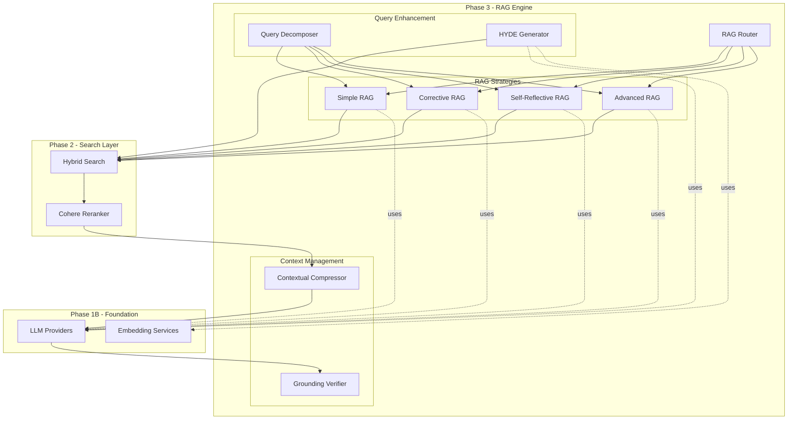
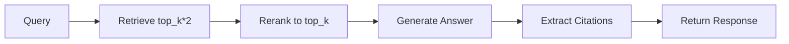
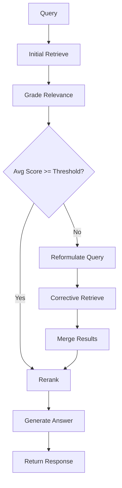
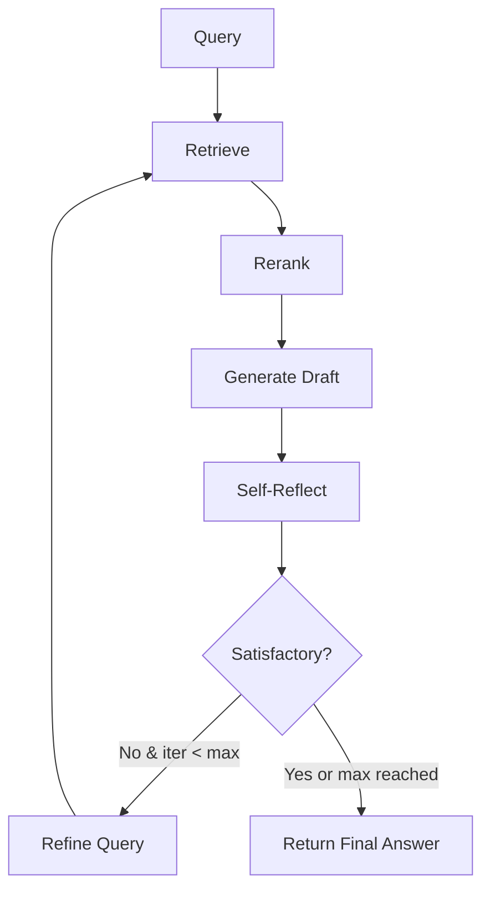
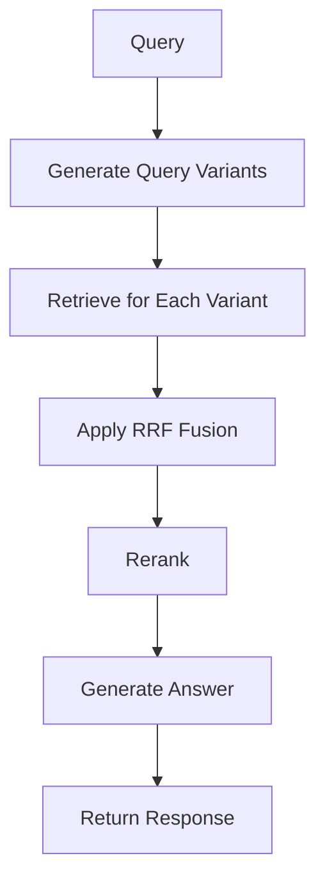

# Phase 3 Implementation Plan - RAG Strategies & Query Enhancement

## Overview

Phase 3 implements the core RAG (Retrieval-Augmented Generation) strategies and query enhancement components that transform the Visual RAG Document Explorer from a search system into an intelligent question-answering system. Building on Phase 1B's document processing and Phase 2's hybrid search capabilities, Phase 3 delivers five distinct RAG strategies, two query enhancement techniques, and two context management components.

### Phase 3 Goals

1. **Implement 5 RAG Strategies** with varying complexity and accuracy trade-offs
2. **Add Query Enhancement** to improve retrieval quality for complex queries
3. **Implement Context Management** to reduce noise and verify answer quality
4. **Create Unified Interface** for seamless strategy switching
5. **Enable Strategy Selection** through intelligent routing based on query analysis

### Scope

**In Scope:**
- Base RAG interface and abstract class
- Simple RAG (baseline)
- Corrective RAG (CRAG) with retrieval grading
- Self-Reflective RAG (SRAG) with iterative refinement
- Advanced RAG with multi-query retrieval
- RAG Router for strategy selection
- Query Decomposer for complex queries
- HYDE (Hypothetical Document Embeddings)
- Contextual Compressor for noise reduction
- Grounding Verifier for answer validation

**Out of Scope (Phase 4):**
- LangGraph agent orchestration
- Multi-document synthesis
- Conversational memory
- Streamlit UI integration

---

## Architecture

### High-Level Architecture



### Integration with Phase 1B and Phase 2

**Phase 1B Provides:**
- Document processing pipeline (loaders, chunking, NER, summarization)
- Embedding services (Voyage AI, BGE-M3)
- LLM providers (OpenAI, OpenRouter)

**Phase 2 Provides:**
- Vector databases (Qdrant, Milvus)
- Hybrid search (dense + sparse + metadata)
- Reranking (Cohere)
- Deduplication

**Phase 3 Consumes:**
- `HybridSearch` for retrieval across all RAG strategies
- `CohereReranker` for precision improvement
- `OpenAIProvider` / `OpenRouterProvider` for generation and evaluation
- `VoyageEmbeddings` / `BGE-M3Embeddings` for HYDE
- Existing Pydantic models from `config/models.py`

**Phase 3 Produces:**
- `QueryResponse` objects with answers, citations, and quality metrics
- Strategy-specific results (`CRAGResult`, `SelfReflectiveResult`, etc.)
- Enhanced retrieval through query decomposition and HYDE

---

## Component Specifications

### 1. Base RAG Interface

**File:** `core/rag/base.py`

**Purpose:** Abstract base class defining the common interface for all RAG strategies.

**Design:**

```python
from abc import ABC, abstractmethod
from typing import Optional
from config.models import QueryRequest, QueryResponse, RetrievedChunk
from config.settings import Settings


class RAGStrategy(ABC):
    """Abstract base class for all RAG strategies."""
    
    def __init__(
        self,
        settings: Settings,
        vector_store,
        hybrid_search,
        reranker,
        llm_provider,
        embedding_service
    ):
        """
        Initialize RAG strategy with required dependencies.
        
        Args:
            settings: Application settings
            vector_store: Vector database instance (from Phase 2)
            hybrid_search: HybridSearch instance (from Phase 2)
            reranker: CohereReranker instance (from Phase 2)
            llm_provider: LLM provider instance (from Phase 1B)
            embedding_service: Embedding service (from Phase 1B)
        """
        self.settings = settings
        self.vector_store = vector_store
        self.hybrid_search = hybrid_search
        self.reranker = reranker
        self.llm = llm_provider
        self.embeddings = embedding_service
    
    @abstractmethod
    async def execute(self, request: QueryRequest) -> QueryResponse:
        """
        Execute the RAG pipeline for a given query.
        
        Args:
            request: Query request with all parameters
            
        Returns:
            Complete query response with answer and metadata
        """
        pass
    
    @property
    @abstractmethod
    def strategy_name(self) -> str:
        """Return the strategy identifier."""
        pass
    
    async def _retrieve(
        self,
        query: str,
        top_k: int,
        filters: Optional[dict] = None
    ) -> list[RetrievedChunk]:
        """
        Common retrieval method using hybrid search.
        
        Args:
            query: Search query
            top_k: Number of results to retrieve
            filters: Optional metadata filters
            
        Returns:
            List of retrieved chunks
        """
        return await self.hybrid_search.search(
            query=query,
            collection=self.settings.collection_name,
            top_k=top_k,
            search_mode=self.settings.search_mode,
            filters=filters
        )
    
    async def _rerank(
        self,
        query: str,
        chunks: list[RetrievedChunk],
        top_k: int
    ) -> list[RetrievedChunk]:
        """
        Common reranking method using Cohere.
        
        Args:
            query: Original query
            chunks: Retrieved chunks to rerank
            top_k: Number of top results to keep
            
        Returns:
            Reranked chunks
        """
        if not self.settings.enable_reranking:
            return chunks[:top_k]
        
        return await self.reranker.rerank(
            query=query,
            chunks=chunks,
            top_k=top_k,
            score_threshold=self.settings.rerank_score_threshold
        )
    
    def _format_sources_for_prompt(
        self,
        chunks: list[RetrievedChunk]
    ) -> str:
        """
        Format retrieved chunks for LLM prompt.
        
        Args:
            chunks: Retrieved chunks
            
        Returns:
            Formatted string for prompt
        """
        formatted = []
        for i, chunk in enumerate(chunks, 1):
            formatted.append(
                f"[Source {i}]\n"
                f"File: {chunk.metadata.source_file}\n"
                f"Page: {chunk.metadata.page_number or 'N/A'}\n"
                f"Content: {chunk.content}\n"
            )
        return "\n\n".join(formatted)
```

**Key Features:**
- Dependency injection for all required services
- Common helper methods for retrieval, reranking, and formatting
- Abstract `execute()` method enforces consistent interface
- Async throughout for non-blocking operations

---

### 2. Simple RAG

**File:** `core/rag/simple_rag.py`

**Purpose:** Baseline RAG implementation with retrieve → rerank → generate pipeline.

**Flow:**


**Implementation:**

```python
from typing import Optional
import time
from datetime import datetime

from core.rag.base import RAGStrategy
from config.models import (
    QueryRequest,
    QueryResponse,
    Citation,
    GroundingResult,
    ClaimVerification
)


class SimpleRAG(RAGStrategy):
    """Simple RAG: Basic retrieve → rerank → generate pipeline."""
    
    @property
    def strategy_name(self) -> str:
        return "simple"
    
    async def execute(self, request: QueryRequest) -> QueryResponse:
        """
        Execute simple RAG pipeline.
        
        Steps:
        1. Retrieve documents using hybrid search
        2. Rerank with Cohere
        3. Generate answer with LLM
        4. Extract citations
        5. Return response
        """
        start_time = time.time()
        
        # Step 1: Retrieve
        initial_k = request.top_k * 2  # Retrieve more for reranking
        retrieved_chunks = await self._retrieve(
            query=request.query,
            top_k=initial_k,
            filters=request.metadata_filters
        )
        
        # Step 2: Rerank
        if request.enable_reranking:
            reranked_chunks = await self._rerank(
                query=request.query,
                chunks=retrieved_chunks,
                top_k=request.top_k
            )
        else:
            reranked_chunks = retrieved_chunks[:request.top_k]
        
        # Step 3: Generate answer
        answer = await self._generate_answer(
            query=request.query,
            chunks=reranked_chunks
        )
        
        # Step 4: Extract citations
        citations = self._extract_citations(reranked_chunks)
        
        # Step 5: Create placeholder grounding (will be enhanced by GroundingVerifier)
        grounding = GroundingResult(
            grounding_score=1.0,  # Placeholder
            total_claims=0,
            grounded_claims=0,
            partially_grounded_claims=0,
            ungrounded_claims=0,
            claim_details=[],
            verified_at=datetime.now()
        )
        
        response_time = (time.time() - start_time) * 1000
        
        return QueryResponse(
            query=request.query,
            answer=answer,
            mode="simple",
            search_mode=request.search_mode,
            sources=reranked_chunks,
            citations=citations,
            grounding=grounding,
            response_time_ms=response_time,
            hyde_used=request.enable_hyde,
            reranking_used=request.enable_reranking,
            compression_used=False,  # Simple RAG doesn't use compression
            initial_retrieval_count=len(retrieved_chunks),
            final_retrieval_count=len(reranked_chunks)
        )
    
    async def _generate_answer(
        self,
        query: str,
        chunks: list[RetrievedChunk]
    ) -> str:
        """Generate answer using LLM."""
        system_prompt = """You are a helpful document assistant. Answer the user query based ONLY on the provided source documents.

Rules:
1. Only use information from the provided sources
2. If sources don't contain enough information, say so explicitly
3. Cite your sources using [Source: filename, Page: X] format
4. Be precise and factual
5. If sources contradict each other, note the contradiction with both sources cited"""
        
        sources_text = self._format_sources_for_prompt(chunks)
        
        user_prompt = f"""Query: {query}

Source Documents:
{sources_text}

Provide a comprehensive answer with citations."""
        
        answer = await self.llm.generate(
            prompt=user_prompt,
            system_prompt=system_prompt,
            temperature=self.settings.temperature,
            max_tokens=self.settings.max_tokens
        )
        
        return answer
    
    def _extract_citations(
        self,
        chunks: list[RetrievedChunk]
    ) -> list[Citation]:
        """Extract citations from retrieved chunks."""
        citations = []
        for chunk in chunks:
            citations.append(Citation(
                source_file=chunk.metadata.source_file,
                page_number=chunk.metadata.page_number,
                chunk_index=chunk.metadata.chunk_index,
                relevant_text=chunk.content[:200] + "...",
                relevance_score=chunk.score
            ))
        return citations
```

**Key Features:**
- Straightforward pipeline with minimal complexity
- Fast execution (baseline for comparison)
- Uses hybrid search from Phase 2
- Optional reranking
- Citation extraction from sources

---

### 3. Corrective RAG (CRAG)

**File:** `core/rag/corrective_rag.py`

**Purpose:** Grades retrieval quality and triggers corrective retrieval if relevance is low.

**Flow:**


**Implementation:**

```python
from typing import Optional
import time
from datetime import datetime
import json

from core.rag.base import RAGStrategy
from config.models import (
    QueryRequest,
    QueryResponse,
    CRAGEvaluation,
    CRAGResult,
    RetrievedChunk,
    Citation,
    GroundingResult
)


class CorrectiveRAG(RAGStrategy):
    """Corrective RAG: Grades relevance and triggers corrective retrieval."""
    
    @property
    def strategy_name(self) -> str:
        return "crag"
    
    async def execute(self, request: QueryRequest) -> QueryResponse:
        """
        Execute CRAG pipeline with relevance grading.
        
        Steps:
        1. Initial retrieval
        2. Grade relevance of each document
        3. If low relevance, reformulate query and retrieve again
        4. Merge results
        5. Rerank
        6. Generate answer
        """
        start_time = time.time()
        
        # Step 1: Initial retrieval
        initial_k = request.top_k * 3  # Retrieve more for grading
        retrieved_chunks = await self._retrieve(
            query=request.query,
            top_k=initial_k,
            filters=request.metadata_filters
        )
        
        # Step 2: Grade relevance
        evaluation = await self._grade_relevance(
            query=request.query,
            chunks=retrieved_chunks
        )
        
        # Step 3: Corrective retrieval if needed
        corrected_chunks = None
        reformulated_query = None
        
        if evaluation.needs_correction:
            reformulated_query = await self._reformulate_query(
                query=request.query,
                low_relevance_chunks=retrieved_chunks,
                strategy=evaluation.correction_strategy
            )
            
            corrected_chunks = await self._retrieve(
                query=reformulated_query,
                top_k=initial_k,
                filters=request.metadata_filters
            )
            
            # Merge original and corrected results
            all_chunks = self._merge_chunks(retrieved_chunks, corrected_chunks)
        else:
            all_chunks = retrieved_chunks
        
        # Step 4: Rerank
        if request.enable_reranking:
            reranked_chunks = await self._rerank(
                query=request.query,
                chunks=all_chunks,
                top_k=request.top_k
            )
        else:
            reranked_chunks = all_chunks[:request.top_k]
        
        # Step 5: Generate answer
        answer = await self._generate_answer(
            query=request.query,
            chunks=reranked_chunks
        )
        
        # Step 6: Extract citations
        citations = self._extract_citations(reranked_chunks)
        
        # Create CRAG result
        crag_result = CRAGResult(
            correction_applied=evaluation.needs_correction,
            evaluation=evaluation,
            original_chunks=retrieved_chunks,
            corrected_chunks=corrected_chunks,
            reformulated_query=reformulated_query
        )
        
        # Placeholder grounding
        grounding = GroundingResult(
            grounding_score=1.0,
            total_claims=0,
            grounded_claims=0,
            partially_grounded_claims=0,
            ungrounded_claims=0,
            claim_details=[],
            verified_at=datetime.now()
        )
        
        response_time = (time.time() - start_time) * 1000
        
        return QueryResponse(
            query=request.query,
            answer=answer,
            mode="crag",
            search_mode=request.search_mode,
            sources=reranked_chunks,
            citations=citations,
            grounding=grounding,
            crag_details=crag_result,
            response_time_ms=response_time,
            hyde_used=request.enable_hyde,
            reranking_used=request.enable_reranking,
            compression_used=False,
            initial_retrieval_count=len(retrieved_chunks),
            final_retrieval_count=len(reranked_chunks)
        )
    
    async def _grade_relevance(
        self,
        query: str,
        chunks: list[RetrievedChunk]
    ) -> CRAGEvaluation:
        """
        Grade relevance of retrieved documents using LLM.
        
        Returns evaluation with average relevance score and correction decision.
        """
        # Sample up to 5 chunks for grading (to reduce LLM calls)
        sample_chunks = chunks[:5]
        
        scores = []
        for chunk in sample_chunks:
            score = await self._grade_single_chunk(query, chunk)
            scores.append(score)
        
        avg_score = sum(scores) / len(scores) if scores else 0.0
        
        # Determine relevance label
        if avg_score >= 0.6:
            label = "relevant"
        elif avg_score >= 0.3:
            label = "ambiguous"
        else:
            label = "irrelevant"
        
        # Decide if correction is needed
        needs_correction = avg_score < self.settings.crag_relevance_threshold
        
        # Determine correction strategy
        correction_strategy = None
        if needs_correction:
            if avg_score < 0.2:
                correction_strategy = "broaden"
            elif avg_score < 0.4:
                correction_strategy = "reformulate"
            else:
                correction_strategy = "decompose"
        
        return CRAGEvaluation(
            relevance_score=avg_score,
            relevance_label=label,
            confidence=0.8,  # Fixed confidence for now
            evaluation_method="llm_grader",
            needs_correction=needs_correction,
            correction_strategy=correction_strategy,
            evaluated_at=datetime.now()
        )
    
    async def _grade_single_chunk(
        self,
        query: str,
        chunk: RetrievedChunk
    ) -> float:
        """Grade a single chunk's relevance to the query."""
        system_prompt = """You are a relevance grader for a document retrieval system. Evaluate whether the retrieved document is relevant to the user query.

Score the relevance on a scale of 0.0 to 1.0:
- 0.0-0.3: Irrelevant - document has no useful information for the query
- 0.3-0.6: Ambiguous - document has some tangentially related information
- 0.6-1.0: Relevant - document directly addresses the query

Respond in JSON format:
{
  "relevance_score": 0.0-1.0,
  "reasoning": "brief explanation"
}"""
        
        user_prompt = f"""Query: {query}

Document: {chunk.content[:500]}

Evaluate relevance."""
        
        response = await self.llm.generate(
            prompt=user_prompt,
            system_prompt=system_prompt,
            temperature=0.0  # Deterministic grading
        )
        
        try:
            result = json.loads(response)
            return float(result.get("relevance_score", 0.5))
        except:
            # Fallback to vector similarity score
            return chunk.score
    
    async def _reformulate_query(
        self,
        query: str,
        low_relevance_chunks: list[RetrievedChunk],
        strategy: str
    ) -> str:
        """Reformulate query based on correction strategy."""
        system_prompt = f"""The initial retrieval for the following query returned low-relevance results. Reformulate the query to improve retrieval using the "{strategy}" strategy.

Strategies:
- reformulate: Rephrase using different terminology
- broaden: Expand the scope slightly
- decompose: Break into simpler sub-query

Respond with only the reformulated query text."""
        
        # Summarize low-relevance docs
        doc_summaries = "\n".join([
            f"- {chunk.content[:100]}..."
            for chunk in low_relevance_chunks[:3]
        ])
        
        user_prompt = f"""Original query: {query}

Low-relevance documents:
{doc_summaries}

Reformulate the query."""
        
        reformulated = await self.llm.generate(
            prompt=user_prompt,
            system_prompt=system_prompt,
            temperature=0.3
        )
        
        return reformulated.strip()
    
    def _merge_chunks(
        self,
        original: list[RetrievedChunk],
        corrected: list[RetrievedChunk]
    ) -> list[RetrievedChunk]:
        """Merge and deduplicate chunks from original and corrected retrieval."""
        seen_ids = set()
        merged = []
        
        # Prioritize corrected chunks
        for chunk in corrected:
            chunk_id = chunk.metadata.chunk_id
            if chunk_id not in seen_ids:
                merged.append(chunk)
                seen_ids.add(chunk_id)
        
        # Add original chunks not in corrected
        for chunk in original:
            chunk_id = chunk.metadata.chunk_id
            if chunk_id not in seen_ids:
                merged.append(chunk)
                seen_ids.add(chunk_id)
        
        return merged
    
    async def _generate_answer(
        self,
        query: str,
        chunks: list[RetrievedChunk]
    ) -> str:
        """Generate answer using LLM (same as Simple RAG)."""
        system_prompt = """You are a helpful document assistant. Answer the user query based ONLY on the provided source documents.

Rules:
1. Only use information from the provided sources
2. If sources don't contain enough information, say so explicitly
3. Cite your sources using [Source: filename, Page: X] format
4. Be precise and factual
5. If sources contradict each other, note the contradiction with both sources cited"""
        
        sources_text = self._format_sources_for_prompt(chunks)
        
        user_prompt = f"""Query: {query}

Source Documents:
{sources_text}

Provide a comprehensive answer with citations."""
        
        answer = await self.llm.generate(
            prompt=user_prompt,
            system_prompt=system_prompt,
            temperature=self.settings.temperature,
            max_tokens=self.settings.max_tokens
        )
        
        return answer
    
    def _extract_citations(
        self,
        chunks: list[RetrievedChunk]
    ) -> list[Citation]:
        """Extract citations from retrieved chunks."""
        citations = []
        for chunk in chunks:
            citations.append(Citation(
                source_file=chunk.metadata.source_file,
                page_number=chunk.metadata.page_number,
                chunk_index=chunk.metadata.chunk_index,
                relevant_text=chunk.content[:200] + "...",
                relevance_score=chunk.score
            ))
        return citations
```

**Key Features:**
- LLM-as-judge relevance grading
- Automatic query reformulation when relevance is low
- Three correction strategies: reformulate, broaden, decompose
- Merges original and corrected results
- Tracks correction metadata in `CRAGResult`

---

### 4. Self-Reflective RAG (SRAG)

**File:** `core/rag/self_reflective_rag.py`

**Purpose:** Generates draft answer, self-evaluates for quality, and iteratively refines.

**Flow:**


**Implementation:**

```python
from typing import Optional
import time
from datetime import datetime
import json

from core.rag.base import RAGStrategy
from config.models import (
    QueryRequest,
    QueryResponse,
    ReflectionResult,
    SelfReflectiveResult,
    RetrievedChunk,
    Citation,
    GroundingResult
)


class SelfReflectiveRAG(RAGStrategy):
    """Self-Reflective RAG: Iterative refinement with self-critique."""
    
    @property
    def strategy_name(self) -> str:
        return "srag"
    
    async def execute(self, request: QueryRequest) -> QueryResponse:
        """
        Execute SRAG pipeline with self-reflection loop.
        
        Steps:
        1. Retrieve documents
        2. Generate draft answer
        3. Self-reflect on quality
        4. If unsatisfactory and iterations remain, refine and retry
        5. Return final answer with reflection history
        """
        start_time = time.time()
        
        max_iterations = self.settings.srag_max_iterations
        reflections = []
        
        # Initial retrieval
        query = request.query
        retrieved_chunks = await self._retrieve(
            query=query,
            top_k=request.top_k * 2,
            filters=request.metadata_filters
        )
        
        if request.enable_reranking:
            reranked_chunks = await self._rerank(
                query=query,
                chunks=retrieved_chunks,
                top_k=request.top_k
            )
        else:
            reranked_chunks = retrieved_chunks[:request.top_k]
        
        # Reflection loop
        for iteration in range(max_iterations):
            # Generate draft answer
            draft_answer = await self._generate_answer(
                query=query,
                chunks=reranked_chunks
            )
            
            # Self-reflect
            reflection = await self._self_reflect(
                query=query,
                answer=draft_answer,
                sources=reranked_chunks,
                iteration=iteration
            )
            
            reflections.append(reflection)
            
            # Check if satisfactory
            if not reflection.needs_regeneration:
                final_answer = draft_answer
                break
            
            # If not satisfactory and iterations remain, refine
            if iteration < max_iterations - 1:
                # Refine query based on reflection feedback
                query = await self._refine_query(
                    original_query=request.query,
                    reflection=reflection
                )
                
                # Re-retrieve with refined query
                retrieved_chunks = await self._retrieve(
                    query=query,
                    top_k=request.top_k * 2,
                    filters=request.metadata_filters
                )
                
                if request.enable_reranking:
                    reranked_chunks = await self._rerank(
                        query=query,
                        chunks=retrieved_chunks,
                        top_k=request.top_k
                    )
                else:
                    reranked_chunks = retrieved_chunks[:request.top_k]
            else:
                # Max iterations reached, use current draft
                final_answer = draft_answer
        
        # Extract citations
        citations = self._extract_citations(reranked_chunks)
        
        # Create SRAG result
        srag_result = SelfReflectiveResult(
            final_answer=final_answer,
            total_iterations=len(reflections),
            reflections=reflections,
            retrieved_chunks=reranked_chunks
        )
        
        # Placeholder grounding
        grounding = GroundingResult(
            grounding_score=reflections[-1].reflection_score if reflections else 1.0,
            total_claims=0,
            grounded_claims=0,
            partially_grounded_claims=0,
            ungrounded_claims=0,
            claim_details=[],
            verified_at=datetime.now()
        )
        
        response_time = (time.time() - start_time) * 1000
        
        return QueryResponse(
            query=request.query,
            answer=final_answer,
            mode="srag",
            search_mode=request.search_mode,
            sources=reranked_chunks,
            citations=citations,
            grounding=grounding,
            reflection_details=srag_result,
            response_time_ms=response_time,
            hyde_used=request.enable_hyde,
            reranking_used=request.enable_reranking,
            compression_used=False,
            initial_retrieval_count=len(retrieved_chunks),
            final_retrieval_count=len(reranked_chunks)
        )
    
    async def _self_reflect(
        self,
        query: str,
        answer: str,
        sources: list[RetrievedChunk],
        iteration: int
    ) -> ReflectionResult:
        """
        Self-evaluate the generated answer for quality.
        
        Checks for:
        - Hallucination (claims not in sources)
        - Completeness (all aspects of query addressed)
        - Faithfulness (accurate representation of sources)
        """
        system_prompt = """You are a quality evaluator for AI-generated answers. Evaluate the following answer against the source documents for:

1. **Hallucination**: Does the answer contain claims not supported by the sources?
2. **Completeness**: Does the answer address all aspects of the query?
3. **Faithfulness**: Does the answer accurately represent the source content without distortion?

Respond in JSON format:
{
  "hallucination_detected": true|false,
  "hallucination_details": "specific claims not in sources, or empty string",
  "completeness_score": 0.0-1.0,
  "faithfulness_score": 0.0-1.0,
  "needs_regeneration": true|false,
  "feedback": "specific suggestions for improvement",
  "overall_score": 0.0-1.0
}"""
        
        sources_text = self._format_sources_for_prompt(sources)
        
        user_prompt = f"""Query: {query}

Generated Answer: {answer}

Source Documents:
{sources_text}

Evaluate the answer."""
        
        response = await self.llm.generate(
            prompt=user_prompt,
            system_prompt=system_prompt,
            temperature=0.0  # Deterministic evaluation
        )
        
        try:
            result = json.loads(response)
            
            # Extract cited sources from answer
            sources_cited = [
                chunk.metadata.source_file
                for chunk in sources
            ]
            
            return ReflectionResult(
                answer_grounded=not result.get("hallucination_detected", False),
                hallucination_detected=result.get("hallucination_detected", False),
                completeness_score=result.get("completeness_score", 0.5),
                faithfulness_score=result.get("faithfulness_score", 0.5),
                sources_cited=sources_cited,
                reflection_score=result.get("overall_score", 0.5),
                needs_regeneration=result.get("needs_regeneration", False),
                reflection_reason=result.get("feedback", ""),
                iteration=iteration,
                reflected_at=datetime.now()
            )
        except:
            # Fallback: assume satisfactory
            return ReflectionResult(
                answer_grounded=True,
                hallucination_detected=False,
                completeness_score=0.8,
                faithfulness_score=0.8,
                sources_cited=[chunk.metadata.source_file for chunk in sources],
                reflection_score=0.8,
                needs_regeneration=False,
                reflection_reason="Evaluation failed, assuming satisfactory",
                iteration=iteration,
                reflected_at=datetime.now()
            )
    
    async def _refine_query(
        self,
        original_query: str,
        reflection: ReflectionResult
    ) -> str:
        """Refine query based on reflection feedback."""
        system_prompt = """Based on the reflection feedback, refine the search query to retrieve better sources.

Focus on addressing the identified issues (hallucination, incompleteness, unfaithfulness).

Respond with only the refined query text."""
        
        user_prompt = f"""Original Query: {original_query}

Reflection Feedback: {reflection.reflection_reason}

Completeness Score: {reflection.completeness_score}
Faithfulness Score: {reflection.faithfulness_score}

Refine the query to retrieve better sources."""
        
        refined = await self.llm.generate(
            prompt=user_prompt,
            system_prompt=system_prompt,
            temperature=0.3
        )
        
        return refined.strip()
    
    async def _generate_answer(
        self,
        query: str,
        chunks: list[RetrievedChunk]
    ) -> str:
        """Generate answer using LLM."""
        system_prompt = """You are a helpful document assistant. Answer the user query based ONLY on the provided source documents.

Rules:
1. Only use information from the provided sources
2. If sources don't contain enough information, say so explicitly
3. Cite your sources using [Source: filename, Page: X] format
4. Be precise and factual
5. If sources contradict each other, note the contradiction with both sources cited"""
        
        sources_text = self._format_sources_for_prompt(chunks)
        
        user_prompt = f"""Query: {query}

Source Documents:
{sources_text}

Provide a comprehensive answer with citations."""
        
        answer = await self.llm.generate(
            prompt=user_prompt,
            system_prompt=system_prompt,
            temperature=self.settings.temperature,
            max_tokens=self.settings.max_tokens
        )
        
        return answer
    
    def _extract_citations(
        self,
        chunks: list[RetrievedChunk]
    ) -> list[Citation]:
        """Extract citations from retrieved chunks."""
        citations = []
        for chunk in chunks:
            citations.append(Citation(
                source_file=chunk.metadata.source_file,
                page_number=chunk.metadata.page_number,
                chunk_index=chunk.metadata.chunk_index,
                relevant_text=chunk.content[:200] + "...",
                relevance_score=chunk.score
            ))
        return citations
```

**Key Features:**
- Iterative refinement loop (configurable max iterations)
- Self-evaluation for hallucination, completeness, faithfulness
- Query refinement based on reflection feedback
- Tracks all reflection iterations in `SelfReflectiveResult`
- Stops early if answer is satisfactory

---

### 5. Advanced RAG

**File:** `core/rag/advanced_rag.py`

**Purpose:** Multi-query retrieval with Reciprocal Rank Fusion for maximum recall.

**Flow:**


**Implementation:**

```python
from typing import Optional
import time
from datetime import datetime

from core.rag.base import RAGStrategy
from config.models import (
    QueryRequest,
    QueryResponse,
    RetrievedChunk,
    Citation,
    GroundingResult
)


class AdvancedRAG(RAGStrategy):
    """Advanced RAG: Multi-query retrieval with RRF fusion."""
    
    @property
    def strategy_name(self) -> str:
        return "advanced"
    
    async def execute(self, request: QueryRequest) -> QueryResponse:
        """
        Execute Advanced RAG with multi-query retrieval.
        
        Steps:
        1. Generate query variants
        2. Retrieve for each variant
        3. Apply Reciprocal Rank Fusion
        4. Rerank
        5. Generate answer
        """
        start_time = time.time()
        
        # Step 1: Generate query variants
        query_variants = await self._generate_query_variants(request.query)
        
        # Step 2: Retrieve for each variant
        all_retrievals = []
        for variant in query_variants:
            chunks = await self._retrieve(
                query=variant,
                top_k=request.top_k * 2,
                filters=request.metadata_filters
            )
            all_retrievals.append(chunks)
        
        # Step 3: Apply RRF fusion
        fused_chunks = self._apply_rrf_fusion(all_retrievals)
        
        # Step 4: Rerank
        if request.enable_reranking:
            reranked_chunks = await self._rerank(
                query=request.query,
                chunks=fused_chunks,
                top_k=request.top_k
            )
        else:
            reranked_chunks = fused_chunks[:request.top_k]
        
        # Step 5: Generate answer
        answer = await self._generate_answer(
            query=request.query,
            chunks=reranked_chunks
        )
        
        # Extract citations
        citations = self._extract_citations(reranked_chunks)
        
        # Placeholder grounding
        grounding = GroundingResult(
            grounding_score=1.0,
            total_claims=0,
            grounded_claims=0,
            partially_grounded_claims=0,
            ungrounded_claims=0,
            claim_details=[],
            verified_at=datetime.now()
        )
        
        response_time = (time.time() - start_time) * 1000
        
        # Calculate total initial retrievals
        total_initial = sum(len(r) for r in all_retrievals)
        
        return QueryResponse(
            query=request.query,
            answer=answer,
            mode="advanced",
            search_mode=request.search_mode,
            sources=reranked_chunks,
            citations=citations,
            grounding=grounding,
            response_time_ms=response_time,
            hyde_used=request.enable_hyde,
            reranking_used=request.enable_reranking,
            compression_used=False,
            initial_retrieval_count=total_initial,
            final_retrieval_count=len(reranked_chunks)
        )
    
    async def _generate_query_variants(self, query: str) -> list[str]:
        """
        Generate 3-5 query variants for multi-query retrieval.
        
        Variants include:
        - Original query
        - Rephrased versions
        - Focused sub-aspects
        """
        system_prompt = """Generate 3-5 query variants for multi-query retrieval. Each variant should:
- Target the same information need
- Use different terminology or phrasing
- Focus on different aspects of the question

Respond in JSON format:
{
  "variants": ["variant 1", "variant 2", "variant 3", ...]
}"""
        
        user_prompt = f"""Original Query: {query}

Generate query variants."""
        
        response = await self.llm.generate(
            prompt=user_prompt,
            system_prompt=system_prompt,
            temperature=0.7  # Higher temperature for diversity
        )
        
        try:
            import json
            result = json.loads(response)
            variants = result.get("variants", [query])
            # Always include original query
            if query not in variants:
                variants.insert(0, query)
            return variants[:5]  # Max 5 variants
        except:
            # Fallback: just use original query
            return [query]
    
    def _apply_rrf_fusion(
        self,
        retrievals: list[list[RetrievedChunk]],
        k: int = 60
    ) -> list[RetrievedChunk]:
        """
        Apply Reciprocal Rank Fusion to merge multiple retrieval results.
        
        RRF formula: score(d) = sum(1 / (k + rank(d)))
        
        Args:
            retrievals: List of retrieval results (one per query variant)
            k: RRF constant (default 60)
            
        Returns:
            Fused and ranked chunks
        """
        # Build chunk ID to chunk mapping
        chunk_map = {}
        rrf_scores = {}
        
        for retrieval in retrievals:
            for rank, chunk in enumerate(retrieval, 1):
                chunk_id = chunk.metadata.chunk_id
                
                # Store chunk
                if chunk_id not in chunk_map:
                    chunk_map[chunk_id] = chunk
                
                # Accumulate RRF score
                if chunk_id not in rrf_scores:
                    rrf_scores[chunk_id] = 0.0
                rrf_scores[chunk_id] += 1.0 / (k + rank)
        
        # Sort by RRF score
        sorted_ids = sorted(
            rrf_scores.keys(),
            key=lambda cid: rrf_scores[cid],
            reverse=True
        )
        
        # Build result list with updated scores
        fused = []
        for chunk_id in sorted_ids:
            chunk = chunk_map[chunk_id]
            # Update score to RRF score
            chunk.score = rrf_scores[chunk_id]
            fused.append(chunk)
        
        return fused
    
    async def _generate_answer(
        self,
        query: str,
        chunks: list[RetrievedChunk]
    ) -> str:
        """Generate answer using LLM."""
        system_prompt = """You are a helpful document assistant. Answer the user query based ONLY on the provided source documents.

Rules:
1. Only use information from the provided sources
2. If sources don't contain enough information, say so explicitly
3. Cite your sources using [Source: filename, Page: X] format
4. Be precise and factual
5. If sources contradict each other, note the contradiction with both sources cited"""
        
        sources_text = self._format_sources_for_prompt(chunks)
        
        user_prompt = f"""Query: {query}

Source Documents:
{sources_text}

Provide a comprehensive answer with citations."""
        
        answer = await self.llm.generate(
            prompt=user_prompt,
            system_prompt=system_prompt,
            temperature=self.settings.temperature,
            max_tokens=self.settings.max_tokens
        )
        
        return answer
    
    def _extract_citations(
        self,
        chunks: list[RetrievedChunk]
    ) -> list[Citation]:
        """Extract citations from retrieved chunks."""
        citations = []
        for chunk in chunks:
            citations.append(Citation(
                source_file=chunk.metadata.source_file,
                page_number=chunk.metadata.page_number,
                chunk_index=chunk.metadata.chunk_index,
                relevant_text=chunk.content[:200] + "...",
                relevance_score=chunk.score
            ))
        return citations
```

**Key Features:**
- Generates 3-5 query variants for diversity
- Retrieves independently for each variant
- Applies Reciprocal Rank Fusion to merge results
- Higher recall than single-query approaches
- Particularly effective for ambiguous queries

---

### 6. RAG Router

**File:** `core/rag/rag_router.py`

**Purpose:** Selects the appropriate RAG strategy based on query analysis or explicit user choice.

**Implementation:**

```python
from typing import Optional
import json

from core.rag.base import RAGStrategy
from core.rag.simple_rag import SimpleRAG
from core.rag.corrective_rag import CorrectiveRAG
from core.rag.self_reflective_rag import SelfReflectiveRAG
from core.rag.advanced_rag import AdvancedRAG
from config.models import QueryRequest, QueryResponse
from config.settings import Settings


class RAGRouter:
    """Routes queries to the appropriate RAG strategy."""
    
    def __init__(
        self,
        settings: Settings,
        vector_store,
        hybrid_search,
        reranker,
        llm_provider,
        embedding_service
    ):
        """
        Initialize RAG router with all strategies.
        
        Args:
            settings: Application settings
            vector_store: Vector database instance
            hybrid_search: HybridSearch instance
            reranker: CohereReranker instance
            llm_provider: LLM provider instance
            embedding_service: Embedding service
        """
        self.settings = settings
        self.llm = llm_provider
        
        # Initialize all strategies
        self.strategies = {
            "simple": SimpleRAG(
                settings, vector_store, hybrid_search,
                reranker, llm_provider, embedding_service
            ),
            "crag": CorrectiveRAG(
                settings, vector_store, hybrid_search,
                reranker, llm_provider, embedding_service
            ),
            "srag": SelfReflectiveRAG(
                settings, vector_store, hybrid_search,
                reranker, llm_provider, embedding_service
            ),
            "advanced": AdvancedRAG(
                settings, vector_store, hybrid_search,
                reranker, llm_provider, embedding_service
            )
        }
    
    async def route(self, request: QueryRequest) -> QueryResponse:
        """
        Route query to appropriate strategy.
        
        Args:
            request: Query request
            
        Returns:
            Query response from selected strategy
        """
        # If mode is explicitly set (not "auto"), use that strategy
        if request.mode != "auto":
            strategy = self.strategies.get(request.mode)
            if not strategy:
                # Fallback to simple if invalid mode
                strategy = self.strategies["simple"]
            return await strategy.execute(request)
        
        # Auto mode: classify query and select strategy
        query_type = await self._classify_query(request.query)
        
        # Map query type to strategy
        strategy_map = {
            "simple": "simple",
            "complex": "crag",
            "analytical": "srag",
            "multi_doc": "advanced"
        }
        
        strategy_name = strategy_map.get(query_type, "simple")
        strategy = self.strategies[strategy_name]
        
        return await strategy.execute(request)
    
    async def _classify_query(self, query: str) -> str:
        """
        Classify query into one of four types.
        
        Types:
        - simple: Direct factual question
        - complex: Multi-faceted question
        - analytical: Requires deep analysis
        - multi_doc: Spans multiple documents
        
        Returns:
            Query type string
        """
        system_prompt = """You are a query classifier for a document retrieval system. Classify the user query into one of four categories based on its complexity and requirements.

Categories:
- "simple": Direct factual question answerable from a single passage. Example: "What is the company revenue?"
- "complex": Multi-faceted question that may need corrective retrieval if initial results are poor. Example: "What are the main risks mentioned in the compliance report?"
- "analytical": Question requiring deep analysis, verification, and self-reflection. Example: "How does the Q1 strategy compare to industry best practices?"
- "multi_doc": Question that explicitly or implicitly requires information from multiple documents. Example: "Compare the financial performance across all quarterly reports."

Respond in JSON format:
{
  "query_type": "simple|complex|analytical|multi_doc",
  "reasoning": "brief explanation"
}"""
        
        user_prompt = f"""Query: {query}

Classify this query."""
        
        response = await self.llm.generate(
            prompt=user_prompt,
            system_prompt=system_prompt,
            temperature=0.0  # Deterministic classification
        )
        
        try:
            result = json.loads(response)
            query_type = result.get("query_type", "simple")
            # Validate query type
            if query_type not in ["simple", "complex", "analytical", "multi_doc"]:
                query_type = "simple"
            return query_type
        except:
            # Fallback to simple
            return "simple"
```

**Key Features:**
- Supports both explicit mode selection and auto-routing
- LLM-based query classification
- Maps query types to appropriate strategies
- Fallback to Simple RAG if classification fails

---

### 7. Query Decomposer

**File:** `core/rag/query_decomposer.py`

**Purpose:** Breaks complex multi-part queries into focused sub-queries.

**Implementation:**

```python
from typing import Optional
import json

from config.settings import Settings


class QueryDecomposer:
    """Decomposes complex queries into focused sub-queries."""
    
    def __init__(self, settings: Settings, llm_provider):
        """
        Initialize query decomposer.
        
        Args:
            settings: Application settings
            llm_provider: LLM provider for decomposition
        """
        self.settings = settings
        self.llm = llm_provider
    
    async def decompose(
        self,
        query: str,
        max_sub_queries: int = 5
    ) -> list[str]:
        """
        Decompose a complex query into sub-queries.
        
        Args:
            query: Original complex query
            max_sub_queries: Maximum number of sub-queries to generate
            
        Returns:
            List of sub-queries (includes original if not decomposable)
        """
        # Check if decomposition is needed
        needs_decomposition = await self._needs_decomposition(query)
        
        if not needs_decomposition:
            return [query]
        
        # Decompose query
        sub_queries = await self._generate_sub_queries(query, max_sub_queries)
        
        return sub_queries
    
    async def _needs_decomposition(self, query: str) -> bool:
        """
        Determine if query needs decomposition.
        
        Indicators:
        - Multiple questions
        - Comparative language ("compare", "difference")
        - Multiple topics
        - Temporal comparisons ("Q1 vs Q2")
        """
        system_prompt = """Determine if the query needs to be decomposed into sub-queries.

A query needs decomposition if it:
- Contains multiple distinct questions
- Requires comparison across multiple entities/documents
- Has multiple topics that should be addressed separately
- Contains temporal comparisons

Respond in JSON format:
{
  "needs_decomposition": true|false,
  "reasoning": "brief explanation"
}"""
        
        user_prompt = f"""Query: {query}

Does this query need decomposition?"""
        
        response = await self.llm.generate(
            prompt=user_prompt,
            system_prompt=system_prompt,
            temperature=0.0
        )
        
        try:
            result = json.loads(response)
            return result.get("needs_decomposition", False)
        except:
            return False
    
    async def _generate_sub_queries(
        self,
        query: str,
        max_sub_queries: int
    ) -> list[str]:
        """Generate focused sub-queries."""
        system_prompt = f"""Break down the following complex query into 2-{max_sub_queries} focused sub-queries that, when answered individually, will provide all the information needed to answer the original query.

Each sub-query should:
- Target a specific aspect of the original question
- Be self-contained and searchable
- Not overlap significantly with other sub-queries

Respond in JSON format:
{{
  "sub_queries": ["sub-query 1", "sub-query 2", ...],
  "reasoning": "brief explanation of decomposition strategy"
}}"""
        
        user_prompt = f"""Original query: {query}

Decompose this query."""
        
        response = await self.llm.generate(
            prompt=user_prompt,
            system_prompt=system_prompt,
            temperature=0.3
        )
        
        try:
            result = json.loads(response)
            sub_queries = result.get("sub_queries", [query])
            # Limit to max_sub_queries
            return sub_queries[:max_sub_queries]
        except:
            # Fallback: return original query
            return [query]
```

**Key Features:**
- Automatic detection of decomposition need
- Generates 2-5 focused sub-queries
- Each sub-query is self-contained
- Fallback to original query if decomposition fails

---

### 8. HYDE (Hypothetical Document Embeddings)

**File:** `core/rag/hyde.py`

**Purpose:** Generates hypothetical answer documents for better semantic retrieval.

**Implementation:**

```python
from typing import Optional

from config.models import HYDEResult, RetrievedChunk
from config.settings import Settings


class HYDE:
    """Hypothetical Document Embeddings for query expansion."""
    
    def __init__(
        self,
        settings: Settings,
        llm_provider,
        embedding_service,
        hybrid_search
    ):
        """
        Initialize HYDE.
        
        Args:
            settings: Application settings
            llm_provider: LLM for generating hypothetical documents
            embedding_service: Embedding service for encoding
            hybrid_search: HybridSearch for retrieval
        """
        self.settings = settings
        self.llm = llm_provider
        self.embeddings = embedding_service
        self.hybrid_search = hybrid_search
    
    async def retrieve_with_hyde(
        self,
        query: str,
        top_k: int,
        filters: Optional[dict] = None
    ) -> tuple[list[RetrievedChunk], HYDEResult]:
        """
        Retrieve documents using HYDE-enhanced query.
        
        Steps:
        1. Generate hypothetical answer document
        2. Embed hypothetical document
        3. Retrieve using hypothetical embedding
        4. Return results + HYDE metadata
        
        Args:
            query: Original query
            top_k: Number of results
            filters: Optional metadata filters
            
        Returns:
            Tuple of (retrieved chunks, HYDE result)
        """
        # Generate hypothetical document
        hypothetical_doc = await self._generate_hypothetical_document(query)
        
        # Embed hypothetical document
        hyp_embedding = await self.embeddings.embed_query(hypothetical_doc)
        
        # Retrieve using hypothetical embedding
        # Note: This requires direct vector search, not hybrid search
        # For simplicity, we'll use the query text but this could be enhanced
        retrieved_chunks = await self.hybrid_search.search(
            query=hypothetical_doc,  # Use hypothetical doc as query
            collection=self.settings.collection_name,
            top_k=top_k,
            search_mode="dense",  # HYDE works best with dense search
            filters=filters
        )
        
        hyde_result = HYDEResult(
            original_query=query,
            hypothetical_documents=[hypothetical_doc],
            enhanced_retrieval=True
        )
        
        return retrieved_chunks, hyde_result
    
    async def _generate_hypothetical_document(self, query: str) -> str:
        """
        Generate a hypothetical document that would answer the query.
        
        This document is used for retrieval, not shown to the user.
        """
        system_prompt = """Generate a hypothetical document passage that would perfectly answer the following query. This passage will be used to find similar real documents.

Write it as if it were an excerpt from an actual document. Be specific and detailed. Use 2-3 paragraphs."""
        
        user_prompt = f"""Query: {query}

Write a hypothetical passage that answers this query."""
        
        hypothetical_doc = await self.llm.generate(
            prompt=user_prompt,
            system_prompt=system_prompt,
            temperature=0.7  # Some creativity for diversity
        )
        
        return hypothetical_doc.strip()
```

**Key Features:**
- Generates hypothetical answer documents
- Uses hypothetical document for retrieval
- Works best with dense (semantic) search
- Particularly effective for abstract or conceptual queries

---

### 9. Contextual Compressor

**File:** `core/rag/contextual_compressor.py`

**Purpose:** Extracts only relevant portions of retrieved chunks to reduce noise.

**Implementation:**

```python
from typing import Optional

from config.models import RetrievedChunk
from config.settings import Settings


class ContextualCompressor:
    """Compresses retrieved context by extracting only relevant portions."""
    
    def __init__(self, settings: Settings, llm_provider):
        """
        Initialize contextual compressor.
        
        Args:
            settings: Application settings
            llm_provider: LLM for compression
        """
        self.settings = settings
        self.llm = llm_provider
    
    async def compress(
        self,
        query: str,
        chunks: list[RetrievedChunk]
    ) -> list[RetrievedChunk]:
        """
        Compress chunks by extracting only query-relevant content.
        
        Args:
            query: Original query
            chunks: Retrieved chunks to compress
            
        Returns:
            Compressed chunks with reduced content
        """
        compressed_chunks = []
        
        for chunk in chunks:
            compressed_content = await self._compress_single_chunk(
                query=query,
                content=chunk.content
            )
            
            # Create new chunk with compressed content
            compressed_chunk = RetrievedChunk(
                content=compressed_content,
                metadata=chunk.metadata,
                score=chunk.score,
                search_method=chunk.search_method
            )
            
            compressed_chunks.append(compressed_chunk)
        
        return compressed_chunks
    
    async def _compress_single_chunk(
        self,
        query: str,
        content: str
    ) -> str:
        """
        Compress a single chunk by extracting relevant sentences.
        
        Args:
            query: Original query
            content: Chunk content to compress
            
        Returns:
            Compressed content (relevant sentences only)
        """
        system_prompt = """Extract only the sentences from the following document that are directly relevant to answering the user query.

Rules:
1. Remove all irrelevant content
2. Preserve the exact wording of relevant sentences
3. Maintain sentence order
4. If no sentences are relevant, return "No relevant content found"

Return only the relevant sentences, preserving their original wording."""
        
        user_prompt = f"""Query: {query}

Document: {content}

Extract relevant sentences."""
        
        compressed = await self.llm.generate(
            prompt=user_prompt,
            system_prompt=system_prompt,
            temperature=0.0,  # Deterministic extraction
            max_tokens=len(content) // 2  # Limit to half original length
        )
        
        # If compression failed or returned nothing, keep original
        if not compressed.strip() or compressed.strip() == "No relevant content found":
            return content
        
        return compressed.strip()
```

**Key Features:**
- LLM-based sentence extraction
- Preserves exact wording of relevant sentences
- Reduces token usage for generation
- Improves answer quality by removing noise
- Fallback to original content if compression fails

---

### 10. Grounding Verifier

**File:** `core/rag/grounding_verifier.py`

**Purpose:** Verifies that answer claims are supported by retrieved sources.

**Implementation:**

```python
from typing import Optional
import json
from datetime import datetime

from config.models import (
    GroundingResult,
    ClaimVerification,
    RetrievedChunk
)
from config.settings import Settings


class GroundingVerifier:
    """Verifies answer grounding in source documents."""
    
    def __init__(self, settings: Settings, llm_provider):
        """
        Initialize grounding verifier.
        
        Args:
            settings: Application settings
            llm_provider: LLM for verification
        """
        self.settings = settings
        self.llm = llm_provider
    
    async def verify(
        self,
        answer: str,
        sources: list[RetrievedChunk]
    ) -> GroundingResult:
        """
        Verify that answer claims are grounded in sources.
        
        Steps:
        1. Extract claims from answer
        2. Verify each claim against sources
        3. Compute grounding score
        4. Return detailed verification result
        
        Args:
            answer: Generated answer to verify
            sources: Source chunks used for generation
            
        Returns:
            Grounding result with per-claim verification
        """
        # Extract claims from answer
        claims = await self._extract_claims(answer)
        
        # Verify each claim
        claim_verifications = []
        for claim in claims:
            verification = await self._verify_claim(claim, sources)
            claim_verifications.append(verification)
        
        # Compute statistics
        total_claims = len(claim_verifications)
        grounded = sum(1 for v in claim_verifications if v.status == "grounded")
        partially_grounded = sum(1 for v in claim_verifications if v.status == "partially_grounded")
        ungrounded = sum(1 for v in claim_verifications if v.status == "ungrounded")
        
        # Compute grounding score
        # Grounded = 1.0, Partially = 0.5, Ungrounded = 0.0
        if total_claims == 0:
            grounding_score = 1.0  # No claims = fully grounded
        else:
            grounding_score = (grounded + 0.5 * partially_grounded) / total_claims
        
        return GroundingResult(
            grounding_score=grounding_score,
            total_claims=total_claims,
            grounded_claims=grounded,
            partially_grounded_claims=partially_grounded,
            ungrounded_claims=ungrounded,
            claim_details=claim_verifications,
            verified_at=datetime.now()
        )
    
    async def _extract_claims(self, answer: str) -> list[str]:
        """
        Extract individual claims from the answer.
        
        Args:
            answer: Generated answer
            
        Returns:
            List of claim strings
        """
        system_prompt = """Extract individual factual claims from the following answer. Each claim should be:
- A single, verifiable statement
- Self-contained (understandable without context)
- Factual (not opinion or speculation)

Respond in JSON format:
{
  "claims": ["claim 1", "claim 2", ...]
}"""
        
        user_prompt = f"""Answer: {answer}

Extract factual claims."""
        
        response = await self.llm.generate(
            prompt=user_prompt,
            system_prompt=system_prompt,
            temperature=0.0
        )
        
        try:
            result = json.loads(response)
            claims = result.get("claims", [])
            return claims
        except:
            # Fallback: split by sentences
            import re
            sentences = re.split(r'[.!?]+', answer)
            return [s.strip() for s in sentences if s.strip()]
    
    async def _verify_claim(
        self,
        claim: str,
        sources: list[RetrievedChunk]
    ) -> ClaimVerification:
        """
        Verify a single claim against sources.
        
        Args:
            claim: Claim to verify
            sources: Source chunks
            
        Returns:
            Claim verification result
        """
        # Format sources for prompt
        sources_text = "\n\n".join([
            f"[Source {i+1} - {chunk.metadata.source_file}]\n{chunk.content}"
            for i, chunk in enumerate(sources)
        ])
        
        system_prompt = """Verify if the claim is supported by the source documents.

Determine:
- "grounded": The claim is directly supported by a specific source passage
- "partially_grounded": The claim is partially supported but includes inference
- "ungrounded": The claim cannot be traced to any source

Respond in JSON format:
{
  "status": "grounded|partially_grounded|ungrounded",
  "supporting_source_indices": [1, 2, ...],
  "confidence": 0.0-1.0,
  "reasoning": "brief explanation"
}"""
        
        user_prompt = f"""Claim: {claim}

Source Documents:
{sources_text}

Verify this claim."""
        
        response = await self.llm.generate(
            prompt=user_prompt,
            system_prompt=system_prompt,
            temperature=0.0
        )
        
        try:
            result = json.loads(response)
            status = result.get("status", "ungrounded")
            source_indices = result.get("supporting_source_indices", [])
            confidence = result.get("confidence", 0.5)
            
            # Map source indices to chunk IDs
            supporting_chunks = [
                sources[i-1].metadata.chunk_id
                for i in source_indices
                if 0 < i <= len(sources)
            ]
            
            return ClaimVerification(
                claim=claim,
                is_grounded=(status == "grounded"),
                supporting_chunks=supporting_chunks,
                confidence=confidence,
                status=status
            )
        except:
            # Fallback: assume ungrounded
            return ClaimVerification(
                claim=claim,
                is_grounded=False,
                supporting_chunks=[],
                confidence=0.0,
                status="ungrounded"
            )
```

**Key Features:**
- Extracts individual claims from answers
- Verifies each claim against sources
- Three-level grounding: grounded, partially grounded, ungrounded
- Computes overall grounding score
- Identifies supporting sources for each claim
- Provides confidence scores

---

## Data Models

All required Pydantic models already exist in [`config/models.py`](config/models.py:1). Phase 3 uses:

**Existing Models:**
- `QueryRequest` - User query with all options
- `QueryResponse` - Complete response with answer and metadata
- `RetrievedChunk` - Retrieved document chunk with score
- `ChunkMetadata` - Chunk metadata from Phase 1B
- `CRAGEvaluation` - Relevance grading result
- `CRAGResult` - Full CRAG pipeline result
- `ReflectionResult` - Self-reflection evaluation
- `SelfReflectiveResult` - Full SRAG pipeline result
- `ClaimVerification` - Single claim verification
- `GroundingResult` - Full grounding verification result
- `Citation` - Source citation
- `HYDEResult` - HYDE metadata

**No new models needed** - Phase 3 uses existing models from Phase 1B and Phase 2.

---

## Configuration

Add the following settings to [`config/settings.py`](config/settings.py:1):

```python
# RAG Strategy Settings
rag_strategy: Literal["simple", "crag", "srag", "advanced", "auto"] = "auto"
search_mode: Literal["dense", "sparse", "hybrid"] = "hybrid"

# CRAG Settings
crag_relevance_threshold: float = 0.5  # Trigger correction if avg relevance < threshold
crag_max_corrections: int = 1  # Max number of correction iterations

# SRAG Settings
srag_max_iterations: int = 3  # Max self-reflection iterations
srag_satisfactory_threshold: float = 0.7  # Stop if reflection score >= threshold

# Advanced RAG Settings
advanced_num_query_variants: int = 3  # Number of query variants to generate
advanced_rrf_k: int = 60  # RRF constant

# Query Enhancement
enable_query_decomposition: bool = True
max_sub_queries: int = 5

# Context Management
enable_contextual_compression: bool = True
enable_grounding_verification: bool = True
grounding_score_threshold: float = 0.7  # Warn if grounding score < threshold

# Reranking
enable_reranking: bool = True
rerank_score_threshold: float = 0.5
```

---

## Dependencies

All required dependencies are already in [`pyproject.toml`](pyproject.toml:1):

**Existing Dependencies:**
- `langchain` - For LLM integration
- `langchain-openai` - OpenAI provider
- `langchain-community` - OpenRouter provider
- `pydantic` - Data models
- `cohere` - Reranking
- `voyageai` - Embeddings
- `sentence-transformers` - BGE-M3 embeddings

**No new dependencies needed** for Phase 3.

---

## Implementation Order

Implement components in this sequence to minimize dependencies:

### Step 1: Base Infrastructure
1. **Base RAG Interface** (`core/rag/base.py`)
   - Abstract class with common methods
   - Dependency injection pattern
   - Helper methods for retrieval, reranking, formatting

### Step 2: Simple RAG (Baseline)
2. **Simple RAG** (`core/rag/simple_rag.py`)
   - Basic retrieve → rerank → generate
   - Establishes baseline for comparison
   - Tests integration with Phase 2

### Step 3: Query Enhancement
3. **Query Decomposer** (`core/rag/query_decomposer.py`)
   - Standalone component
   - Can be tested independently
   - Used by multiple RAG strategies

4. **HYDE** (`core/rag/hyde.py`)
   - Standalone component
   - Enhances retrieval quality
   - Optional feature

### Step 4: Context Management
5. **Contextual Compressor** (`core/rag/contextual_compressor.py`)
   - Post-retrieval processing
   - Reduces noise
   - Can be tested independently

6. **Grounding Verifier** (`core/rag/grounding_verifier.py`)
   - Post-generation verification
   - Standalone component
   - Critical for answer quality

### Step 5: Advanced RAG Strategies
7. **Corrective RAG** (`core/rag/corrective_rag.py`)
   - Builds on Simple RAG
   - Adds relevance grading
   - Implements correction loop

8. **Self-Reflective RAG** (`core/rag/self_reflective_rag.py`)
   - Builds on Simple RAG
   - Adds self-reflection loop
   - Most complex strategy

9. **Advanced RAG** (`core/rag/advanced_rag.py`)
   - Multi-query retrieval
   - RRF fusion
   - Highest recall

### Step 6: Router
10. **RAG Router** (`core/rag/rag_router.py`)
    - Integrates all strategies
    - Query classification
    - Strategy selection

---

## Testing Strategy

### Test Files

Create the following test files:

1. **`tests/test_phase3_base_rag.py`**
   - Test base RAG interface
   - Test common helper methods
   - Test dependency injection

2. **`tests/test_phase3_simple_rag.py`**
   - Test Simple RAG pipeline
   - Test retrieval integration
   - Test answer generation
   - Test citation extraction

3. **`tests/test_phase3_crag.py`**
   - Test relevance grading
   - Test query reformulation
   - Test correction loop
   - Test result merging

4. **`tests/test_phase3_srag.py`**
   - Test self-reflection
   - Test iteration loop
   - Test query refinement
   - Test early stopping

5. **`tests/test_phase3_advanced_rag.py`**
   - Test query variant generation
   - Test RRF fusion
   - Test multi-query retrieval

6. **`tests/test_phase3_router.py`**
   - Test query classification
   - Test strategy selection
   - Test explicit mode selection
   - Test auto-routing

7. **`tests/test_phase3_query_decomposer.py`**
   - Test decomposition detection
   - Test sub-query generation
   - Test fallback behavior

8. **`tests/test_phase3_hyde.py`**
   - Test hypothetical document generation
   - Test HYDE-enhanced retrieval
   - Test integration with embeddings

9. **`tests/test_phase3_compressor.py`**
   - Test contextual compression
   - Test sentence extraction
   - Test token reduction

10. **`tests/test_phase3_grounding.py`**
    - Test claim extraction
    - Test claim verification
    - Test grounding score calculation

11. **`tests/test_phase3_integration.py`**
    - End-to-end pipeline tests
    - Test all strategies with real queries
    - Test Phase 1B → Phase 2 → Phase 3 flow

### Test Coverage Goals

- **Unit Tests**: >80% coverage for each component
- **Integration Tests**: Cover all RAG strategies end-to-end
- **Mock LLM Responses**: Use fixtures for deterministic testing
- **Real Integration Tests**: Optional tests with actual LLM calls (marked with `@pytest.mark.integration`)

### Example Test Structure

```python
import pytest
from unittest.mock import AsyncMock, MagicMock
from core.rag.simple_rag import SimpleRAG
from config.models import QueryRequest, RetrievedChunk, ChunkMetadata
from datetime import datetime


@pytest.fixture
def mock_dependencies():
    """Create mock dependencies for RAG strategies."""
    settings = MagicMock()
    settings.temperature = 0.7
    settings.max_tokens = 2048
    settings.collection_name = "test_collection"
    settings.search_mode = "hybrid"
    settings.enable_reranking = True
    settings.rerank_score_threshold = 0.5
    
    vector_store = AsyncMock()
    hybrid_search = AsyncMock()
    reranker = AsyncMock()
    llm_provider = AsyncMock()
    embedding_service = AsyncMock()
    
    return {
        "settings": settings,
        "vector_store": vector_store,
        "hybrid_search": hybrid_search,
        "reranker": reranker,
        "llm_provider": llm_provider,
        "embedding_service": embedding_service
    }


@pytest.fixture
def sample_chunks():
    """Create sample retrieved chunks for testing."""
    return [
        RetrievedChunk(
            content="Sample content 1",
            metadata=ChunkMetadata(
                chunk_id="chunk1",
                source_file="doc1.pdf",
                file_type="pdf",
                chunk_index=0,
                total_chunks=10,
                chunk_size=512,
                token_count=100,
                char_count=500,
                content_hash="hash1",
                content_preview="Sample...",
                created_at=datetime.now(),
                processed_at=datetime.now()
            ),
            score=0.9,
            search_method="hybrid"
        )
    ]


@pytest.mark.asyncio
async def test_simple_rag_execute(mock_dependencies, sample_chunks):
    """Test Simple RAG execution."""
    deps = mock_dependencies
    
    # Setup mocks
    deps["hybrid_search"].search.return_value = sample_chunks
    deps["reranker"].rerank.return_value = sample_chunks
    deps["llm_provider"].generate.return_value = "Sample answer with [Source: doc1.pdf, Page: 1]"
    
    # Create Simple RAG instance
    rag = SimpleRAG(**deps)
    
    # Execute
    request = QueryRequest(
        query="What is the sample content?",
        mode="simple",
        top_k=5
    )
    
    response = await rag.execute(request)
    
    # Assertions
    assert response.query == request.query
    assert response.mode == "simple"
    assert len(response.sources) > 0
    assert len(response.citations) > 0
    assert response.answer == "Sample answer with [Source: doc1.pdf, Page: 1]"
    assert response.response_time_ms > 0
```

---

## Integration Points

### Phase 3 Uses Phase 1B Components

**LLM Providers:**
- `OpenAIProvider.generate()` - For answer generation, grading, reflection
- `OpenRouterProvider.generate()` - Alternative LLM provider
- `LLMRouter` - For provider selection

**Embedding Services:**
- `VoyageEmbeddings.embed_query()` - For HYDE
- `BGE-M3Embeddings.embed_query()` - Alternative embeddings
- `EmbeddingRouter` - For embedding selection

**Document Processing:**
- `ChunkMetadata` - Metadata from chunked documents
- `NEREntities` - Entity metadata for filtering

### Phase 3 Uses Phase 2 Components

**Vector Databases:**
- `VectorStoreBase` interface - For retrieval
- `QdrantStore` / `MilvusStore` - Actual implementations
- `VectorDBRouter` - For database selection

**Search:**
- `HybridSearch.search()` - Primary retrieval method
- `BM25Search` - Sparse keyword search (via HybridSearch)
- `MetadataFilter` - Entity-based filtering (via HybridSearch)

**Reranking:**
- `CohereReranker.rerank()` - Precision improvement

**Deduplication:**
- `DeduplicationService` - Used during retrieval merging

### Phase 3 Produces for Phase 4

**For LangGraph Agents:**
- `QueryResponse` - Complete response object
- Strategy-specific results (`CRAGResult`, `SelfReflectiveResult`)
- `GroundingResult` - Answer quality metrics

**For UI:**
- `QueryResponse` - Displayed in chat interface
- `Citation` list - Citation viewer component
- `GroundingResult` - Quality indicator

---

## Success Criteria

Phase 3 is complete when:

### Functional Criteria
- ✅ All 5 RAG strategies implemented and working
- ✅ RAG Router correctly classifies and routes queries
- ✅ Query Decomposer breaks complex queries into sub-queries
- ✅ HYDE generates hypothetical documents and enhances retrieval
- ✅ Contextual Compressor reduces noise in retrieved chunks
- ✅ Grounding Verifier accurately verifies answer claims

### Quality Criteria
- ✅ All components have comprehensive docstrings
- ✅ Type hints throughout
- ✅ Async/await for all I/O operations
- ✅ Proper error handling with informative messages
- ✅ Logging for debugging and monitoring

### Testing Criteria
- ✅ >80% test coverage for all components
- ✅ All unit tests pass
- ✅ Integration tests pass (with mocked LLMs)
- ✅ Optional real integration tests work with actual LLM calls

### Integration Criteria
- ✅ Seamless integration with Phase 1B (LLMs, embeddings)
- ✅ Seamless integration with Phase 2 (search, reranking)
- ✅ All strategies use HybridSearch correctly
- ✅ All strategies produce valid QueryResponse objects

### Performance Criteria
- ✅ Simple RAG: <3 seconds response time
- ✅ CRAG: <5 seconds (with correction)
- ✅ SRAG: <10 seconds (with 3 iterations)
- ✅ Advanced RAG: <7 seconds (with multi-query)
- ✅ Grounding verification: <2 seconds

---

## Example Usage

### Simple RAG

```python
from core.rag.simple_rag import SimpleRAG
from config.models import QueryRequest
from config.settings import settings

# Initialize (with dependencies from Phase 1B and Phase 2)
simple_rag = SimpleRAG(
    settings=settings,
    vector_store=vector_store,
    hybrid_search=hybrid_search,
    reranker=reranker,
    llm_provider=llm_provider,
    embedding_service=embedding_service
)

# Execute query
request = QueryRequest(
    query="What is the company revenue for Q1 2024?",
    mode="simple",
    top_k=5,
    enable_reranking=True
)

response = await simple_rag.execute(request)

print(f"Answer: {response.answer}")
print(f"Sources: {len(response.sources)}")
print(f"Grounding Score: {response.grounding.grounding_score}")
```

### Corrective RAG

```python
from core.rag.corrective_rag import CorrectiveRAG

# Initialize
crag = CorrectiveRAG(
    settings=settings,
    vector_store=vector_store,
    hybrid_search=hybrid_search,
    reranker=reranker,
    llm_provider=llm_provider,
    embedding_service=embedding_service
)

# Execute query
request = QueryRequest(
    query="What are the main compliance risks?",
    mode="crag",
    top_k=5
)

response = await crag.execute(request)

# Check if correction was applied
if response.crag_details.correction_applied:
    print(f"Original query: {request.query}")
    print(f"Reformulated query: {response.crag_details.reformulated_query}")
    print(f"Relevance score: {response.crag_details.evaluation.relevance_score}")
```

### Self-Reflective RAG

```python
from core.rag.self_reflective_rag import SelfReflectiveRAG

# Initialize
srag = SelfReflectiveRAG(
    settings=settings,
    vector_store=vector_store,
    hybrid_search=hybrid_search,
    reranker=reranker,
    llm_provider=llm_provider,
    embedding_service=embedding_service
)

# Execute query
request = QueryRequest(
    query="How does our Q1 strategy compare to industry best practices?",
    mode="srag",
    top_k=5
)

response = await srag.execute(request)

# Check reflection iterations
print(f"Total iterations: {response.reflection_details.total_iterations}")
for i, reflection in enumerate(response.reflection_details.reflections):
    print(f"Iteration {i+1}:")
    print(f"  Reflection score: {reflection.reflection_score}")
    print(f"  Needs regeneration: {reflection.needs_regeneration}")
    print(f"  Feedback: {reflection.reflection_reason}")
```

### Advanced RAG

```python
from core.rag.advanced_rag import AdvancedRAG

# Initialize
advanced_rag = AdvancedRAG(
    settings=settings,
    vector_store=vector_store,
    hybrid_search=hybrid_search,
    reranker=reranker,
    llm_provider=llm_provider,
    embedding_service=embedding_service
)

# Execute query
request = QueryRequest(
    query="Compare financial performance across all quarterly reports",
    mode="advanced",
    top_k=5
)

response = await advanced_rag.execute(request)

print(f"Initial retrievals: {response.initial_retrieval_count}")
print(f"Final results: {response.final_retrieval_count}")
```

### RAG Router (Auto Mode)

```python
from core.rag.rag_router import RAGRouter

# Initialize router with all strategies
router = RAGRouter(
    settings=settings,
    vector_store=vector_store,
    hybrid_search=hybrid_search,
    reranker=reranker,
    llm_provider=llm_provider,
    embedding_service=embedding_service
)

# Auto-route based on query
request = QueryRequest(
    query="What is the company revenue?",
    mode="auto",  # Router will classify and select strategy
    top_k=5
)

response = await router.route(request)

print(f"Selected strategy: {response.mode}")
print(f"Answer: {response.answer}")
```

### Query Decomposer

```python
from core.rag.query_decomposer import QueryDecomposer

# Initialize
decomposer = QueryDecomposer(settings, llm_provider)

# Decompose complex query
query = "Compare Q1 and Q2 revenue, and explain the difference"
sub_queries = await decomposer.decompose(query)

print(f"Original: {query}")
print(f"Sub-queries:")
for i, sq in enumerate(sub_queries, 1):
    print(f"  {i}. {sq}")
```

### HYDE

```python
from core.rag.hyde import HYDE

# Initialize
hyde = HYDE(settings, llm_provider, embedding_service, hybrid_search)

# Retrieve with HYDE
query = "What are the benefits of machine learning?"
chunks, hyde_result = await hyde.retrieve_with_hyde(
    query=query,
    top_k=5
)

print(f"Hypothetical document: {hyde_result.hypothetical_documents[0]}")
print(f"Retrieved {len(chunks)} chunks")
```

### Contextual Compressor

```python
from core.rag.contextual_compressor import ContextualCompressor

# Initialize
compressor = ContextualCompressor(settings, llm_provider)

# Compress retrieved chunks
query = "What is the revenue?"
compressed_chunks = await compressor.compress(query, retrieved_chunks)

# Compare sizes
original_tokens = sum(chunk.metadata.token_count for chunk in retrieved_chunks)
compressed_tokens = sum(chunk.metadata.token_count for chunk in compressed_chunks)

print(f"Token reduction: {original_tokens} → {compressed_tokens}")
print(f"Reduction: {(1 - compressed_tokens/original_tokens)*100:.1f}%")
```

### Grounding Verifier

```python
from core.rag.grounding_verifier import GroundingVerifier

# Initialize
verifier = GroundingVerifier(settings, llm_provider)

# Verify answer grounding
answer = "The company revenue was $10M in Q1 2024."
grounding_result = await verifier.verify(answer, retrieved_chunks)

print(f"Grounding score: {grounding_result.grounding_score}")
print(f"Total claims: {grounding_result.total_claims}")
print(f"Grounded: {grounding_result.grounded_claims}")
print(f"Ungrounded: {grounding_result.ungrounded_claims}")

for claim in grounding_result.claim_details:
    print(f"\nClaim: {claim.claim}")
    print(f"Status: {claim.status}")
    print(f"Confidence: {claim.confidence}")
```

---

## Phase 3 Summary

Phase 3 transforms the Visual RAG Document Explorer from a search system into an intelligent question-answering system with:

**5 RAG Strategies:**
1. Simple RAG - Fast baseline
2. Corrective RAG - Self-correcting retrieval
3. Self-Reflective RAG - Iterative refinement
4. Advanced RAG - Maximum recall
5. RAG Router - Intelligent strategy selection

**2 Query Enhancement Techniques:**
1. Query Decomposer - Handles complex queries
2. HYDE - Improves semantic retrieval

**2 Context Management Components:**
1. Contextual Compressor - Reduces noise
2. Grounding Verifier - Ensures answer quality

**Key Benefits:**
- **Flexibility**: Choose strategy based on query complexity
- **Quality**: Multiple quality control mechanisms
- **Transparency**: Detailed metadata for every response
- **Extensibility**: Easy to add new strategies
- **Integration**: Seamless with Phase 1B and Phase 2

**Ready for Phase 4:**
- All components produce structured outputs
- LangGraph can orchestrate these strategies
- UI can display rich metadata
- Benchmarking can compare strategies

---

## Next Steps (Phase 4)

After Phase 3 completion, Phase 4 will implement:

1. **LangGraph Agent Orchestration**
   - 15-node state graph
   - Conditional routing
   - Multi-document synthesis

2. **Conversational Memory**
   - Short-term (session state)
   - Long-term (vector DB)
   - Context window management

3. **Streamlit UI**
   - Chat interface
   - Document upload
   - Settings configuration
   - Benchmark dashboard

Phase 3 provides the foundation for these advanced features by delivering robust, tested RAG strategies that can be orchestrated by LangGraph agents.

---

**Phase 3 Implementation Plan Complete**

This plan provides everything needed to implement Phase 3:
- Detailed component specifications
- Complete code examples
- Integration points
- Testing strategy
- Success criteria
- Usage examples

All components are designed to work seamlessly with Phase 1B and Phase 2, following established patterns and using existing data models.