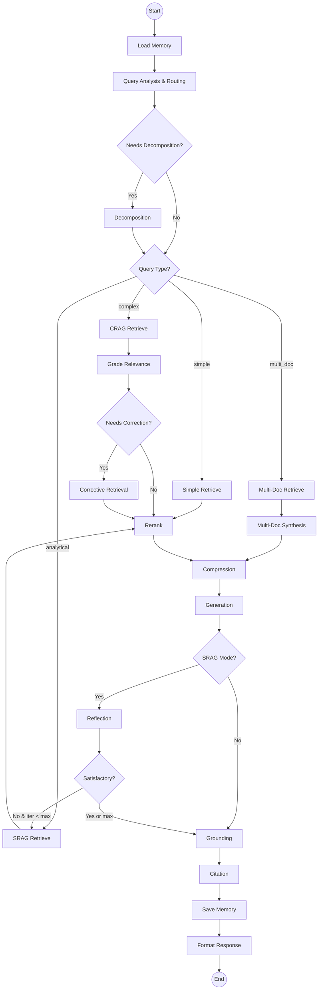

# Phase 4 Implementation Plan - LangGraph Agent Orchestration

## Overview

Phase 4 implements the **LangGraph Agent Orchestration Layer** that coordinates all Phase 1B, 2, and 3 components into an intelligent, adaptive RAG system. This phase transforms the existing RAG strategies into a stateful, multi-node agent graph with conditional routing, iterative refinement loops, and conversational memory.

### Goals

1. **Stateful Orchestration**: Implement LangGraph StateGraph with shared state across all nodes
2. **Intelligent Routing**: Dynamic strategy selection based on query complexity and state
3. **Iterative Refinement**: Support CRAG correction loops and SRAG reflection loops
4. **Multi-Document Synthesis**: Combine information across documents with contradiction detection
5. **Conversational Memory**: Short-term (session) and long-term (vector DB) memory management
6. **Streaming Responses**: Real-time answer generation for UI
7. **Quality Control**: End-to-end grounding verification and citation tracking

### Architecture Overview



---

## 1. State Schema

### AgentState TypedDict

The complete state schema that flows through all nodes:

```python
# agents/state.py

from typing import TypedDict, Literal, Annotated, Optional
from langgraph.graph import add_messages
from config.models import RetrievedChunk, Citation, GroundingResult, CRAGResult, SelfReflectiveResult, SynthesisResult

class AgentState(TypedDict):
    """
    Shared state for the LangGraph agent.
    
    Every node reads from and writes to this state. Fields are updated
    incrementally as the query flows through the graph.
    """
    
    # ============= Input =============
    query: str
    """Original user query"""
    
    chat_history: Annotated[list[dict], add_messages]
    """Conversation history with add_messages reducer for automatic merging"""
    
    session_id: str
    """Session identifier for memory management"""
    
    collection: str
    """Vector DB collection to search"""
    
    # ============= Query Analysis =============
    query_type: Literal["simple", "complex", "analytical", "multi_doc"]
    """Classified query type determining RAG strategy"""
    
    needs_decomposition: bool
    """Whether query should be broken into sub-queries"""
    
    sub_queries: list[str]
    """Decomposed sub-queries for complex/multi-doc queries"""
    
    query_analysis_reasoning: str
    """LLM reasoning for query classification"""
    
    # ============= Retrieval =============
    retrieved_docs: list[RetrievedChunk]
    """Raw retrieved documents from hybrid search"""
    
    reranked_docs: list[RetrievedChunk]
    """Documents after Cohere reranking"""
    
    compressed_docs: list[RetrievedChunk]
    """Documents after contextual compression"""
    
    retrieval_metadata: dict
    """Metadata about retrieval: search_mode, top_k, filters used"""
    
    # ============= CRAG Specific =============
    relevance_scores: dict[str, float]
    """Document ID -> relevance score from grading"""
    
    needs_correction: bool
    """Whether CRAG correction is needed"""
    
    correction_strategy: Optional[Literal["reformulate", "broaden", "decompose"]]
    """Strategy chosen for correction"""
    
    reformulated_query: Optional[str]
    """Query after CRAG reformulation"""
    
    crag_result: Optional[CRAGResult]
    """Complete CRAG evaluation and correction details"""
    
    # ============= SRAG Specific =============
    iteration_count: int
    """Current SRAG reflection iteration"""
    
    max_iterations: int
    """Maximum SRAG iterations (default 3)"""
    
    needs_reflection: bool
    """Whether SRAG reflection loop should continue"""
    
    reflection_feedback: str
    """Accumulated feedback from reflection iterations"""
    
    reflection_history: list[dict]
    """History of all reflection evaluations"""
    
    srag_result: Optional[SelfReflectiveResult]
    """Complete SRAG reflection details"""
    
    # ============= Multi-Doc Synthesis =============
    is_multi_doc: bool
    """Whether query requires multi-document synthesis"""
    
    document_groups: dict[str, list[RetrievedChunk]]
    """Chunks grouped by source document"""
    
    document_summaries: dict[str, str]
    """Per-document summaries for synthesis"""
    
    contradictions: list[dict]
    """Detected contradictions between documents"""
    
    synthesis_result: Optional[SynthesisResult]
    """Complete synthesis details"""
    
    # ============= Generation =============
    draft_answer: str
    """Initial generated answer before verification"""
    
    final_answer: str
    """Final answer after grounding verification"""
    
    generation_metadata: dict
    """Metadata: model used, temperature, tokens, etc."""
    
    # ============= Quality Control =============
    grounding_score: float
    """Overall grounding score (0.0 to 1.0)"""
    
    grounding_details: list[dict]
    """Per-claim grounding verification"""
    
    grounding_result: Optional[GroundingResult]
    """Complete grounding verification result"""
    
    citations: list[Citation]
    """Formatted source citations"""
    
    # ============= Memory Management =============
    relevant_memory: list[dict]
    """Retrieved relevant past conversations"""
    
    memory_summary: Optional[str]
    """Summarized conversation history if context window exceeded"""
    
    context_window_usage: float
    """Percentage of context window used (0.0 to 1.0)"""
    
    # ============= Routing & Control Flow =============
    rag_strategy: Literal["simple", "crag", "srag", "advanced"]
    """RAG strategy being executed"""
    
    current_node: str
    """Current node name for debugging"""
    
    error: Optional[str]
    """Error message if any node fails"""
    
    # ============= Performance Metrics =============
    start_time: float
    """Query start timestamp"""
    
    node_timings: dict[str, float]
    """Per-node execution time in milliseconds"""
    
    total_time_ms: float
    """Total execution time"""
    
    # ============= Configuration =============
    enable_reranking: bool
    """Whether to use Cohere reranking"""
    
    enable_compression: bool
    """Whether to use contextual compression"""
    
    enable_hyde: bool
    """Whether to use HYDE query expansion"""
    
    top_k: int
    """Number of final chunks to use"""
    
    metadata_filters: Optional[dict[str, list[str]]]
    """Entity-based metadata filters"""
```

### State Field Usage by Node

| Node | Reads | Writes |
|------|-------|--------|
| **memory_load** | query, session_id | chat_history, relevant_memory, context_window_usage |
| **routing** | query, chat_history | query_type, needs_decomposition, query_analysis_reasoning, rag_strategy |
| **decomposition** | query, query_type | sub_queries |
| **retrieval** | query, sub_queries, metadata_filters, top_k | retrieved_docs, retrieval_metadata |
| **grading** | query, retrieved_docs | relevance_scores, needs_correction, correction_strategy |
| **correction** | query, relevance_scores, correction_strategy | reformulated_query, retrieved_docs (appended) |
| **reranking** | query, retrieved_docs, enable_reranking | reranked_docs |
| **compression** | query, reranked_docs, enable_compression | compressed_docs |
| **synthesis** | sub_queries, compressed_docs | document_groups, document_summaries, contradictions, synthesis_result |
| **generation** | query, compressed_docs, chat_history, synthesis_result | draft_answer, generation_metadata |
| **reflection** | query, draft_answer, compressed_docs, iteration_count | needs_reflection, reflection_feedback, reflection_history, iteration_count |
| **grounding** | draft_answer, compressed_docs | final_answer, grounding_score, grounding_details, grounding_result |
| **citation** | final_answer, compressed_docs, grounding_details | citations |
| **memory_save** | query, final_answer, session_id, chat_history | chat_history (updated), memory_summary |
| **format** | All fields | (Compiles final response, no state changes) |

---

## 2. Node Specifications

### 2.1 Memory Load Node

**File:** `agents/nodes/memory_load.py`

**Purpose:** Load conversation history and relevant past context

**Input State Fields:**
- `query`: Current user query
- `session_id`: Session identifier
- `collection`: Vector DB collection

**Output State Fields:**
- `chat_history`: Last N messages from session
- `relevant_memory`: Similar past conversations from vector DB
- `context_window_usage`: Current context window percentage

**Processing Logic:**

```python
async def memory_load_node(state: AgentState) -> dict:
    """
    Load conversational memory from session state and vector DB.
    
    Steps:
    1. Load short-term memory from session state (last N messages)
    2. Search vector DB for relevant past conversations
    3. Calculate context window usage with tiktoken
    4. Trigger summarization if usage > 60%
    
    Returns:
        Partial state update with memory fields
    """
    from config.settings import Settings
    from core.vectordb.router import get_vector_store
    import tiktoken
    
    settings = Settings()
    
    # 1. Load short-term memory from session state
    # In Streamlit: st.session_state.chat_history
    # For now, use empty list if not in session context
    chat_history = state.get("chat_history", [])
    
    # 2. Search vector DB for relevant past conversations
    # Collection: "conversation_memory"
    # Query: current query
    # Top-k: 3-5 relevant past Q&A pairs
    vector_store = get_vector_store(settings)
    relevant_memory = []
    
    try:
        # Search for similar past conversations
        # This requires conversation summaries to be stored during memory_save
        memory_results = await vector_store.search(
            collection="conversation_memory",
            query_embedding=await embed_query(state["query"]),
            top_k=3,
            filters={"session_id": state["session_id"]}
        )
        relevant_memory = [
            {
                "query": r.metadata.get("query"),
                "answer": r.metadata.get("answer"),
                "timestamp": r.metadata.get("timestamp")
            }
            for r in memory_results
        ]
    except Exception as e:
        # Memory collection may not exist yet
        pass
    
    # 3. Calculate context window usage
    encoding = tiktoken.encoding_for_model(settings.llm_model)
    
    # Count tokens in chat history
    history_tokens = sum(
        len(encoding.encode(msg.get("content", "")))
        for msg in chat_history
    )
    
    # Count tokens in relevant memory
    memory_tokens = sum(
        len(encoding.encode(f"{m['query']} {m['answer']}"))
        for m in relevant_memory
    )
    
    # Model context window (e.g., 128k for GPT-4)
    context_window = settings.llm_context_window
    
    # Reserve 40% for retrieval + generation
    available_for_history = context_window * 0.6
    
    context_usage = (history_tokens + memory_tokens) / available_for_history
    
    # 4. Trigger summarization if needed
    memory_summary = None
    if context_usage > 0.6 and len(chat_history) > 10:
        # Summarize older messages
        memory_summary = await summarize_conversation_history(
            chat_history[:-5],  # All but last 5 messages
            settings
        )
        # Keep only recent messages + summary
        chat_history = [
            {"role": "system", "content": f"Previous conversation summary: {memory_summary}"}
        ] + chat_history[-5:]
    
    return {
        "chat_history": chat_history,
        "relevant_memory": relevant_memory,
        "context_window_usage": context_usage,
        "memory_summary": memory_summary
    }
```

**Error Handling:**
- If vector DB is unavailable, continue with empty `relevant_memory`
- If summarization fails, keep full history and log warning

**Integration:**
- Uses `core.vectordb.router.get_vector_store()` from Phase 2
- Uses `core.embeddings.embedding_router.get_embedding_service()` from Phase 1B
- Uses `core.llm.llm_router.get_llm_provider()` for summarization

---

### 2.2 Query Analysis & Routing Node

**File:** `agents/nodes/routing.py`

**Purpose:** Classify query type and determine RAG strategy

**Input State Fields:**
- `query`: User query
- `chat_history`: Conversation context

**Output State Fields:**
- `query_type`: "simple", "complex", "analytical", or "multi_doc"
- `needs_decomposition`: Boolean
- `query_analysis_reasoning`: LLM explanation
- `rag_strategy`: Strategy to use

**Processing Logic:**

```python
async def routing_node(state: AgentState) -> dict:
    """
    Analyze query and determine routing strategy.
    
    Uses LLM to classify query complexity and decide:
    - Query type (simple/complex/analytical/multi_doc)
    - Whether decomposition is needed
    - Which RAG strategy to use
    
    Returns:
        Partial state update with routing decisions
    """
    from core.llm.llm_router import get_llm_provider
    from config.settings import Settings
    import json
    
    settings = Settings()
    llm = get_llm_provider(settings)
    
    # Classification prompt
    system_prompt = """You are a query classifier for a document retrieval system.
    
Classify the user query into one of four categories:

1. **simple**: Direct factual question answerable from a single passage
   - Example: "What is the company revenue?"
   - Example: "When was the product launched?"

2. **complex**: Multi-faceted question that may need corrective retrieval
   - Example: "What are the main risks mentioned in the compliance report?"
   - Example: "Explain the new policy changes"

3. **analytical**: Question requiring deep analysis and verification
   - Example: "How does the Q1 strategy compare to industry best practices?"
   - Example: "Evaluate the effectiveness of the marketing campaign"

4. **multi_doc**: Question spanning multiple documents
   - Example: "Compare revenue across all quarterly reports"
   - Example: "What are the common themes in customer feedback?"

Also determine if the query needs decomposition into sub-queries.

Respond in JSON format:
{
  "query_type": "simple|complex|analytical|multi_doc",
  "needs_decomposition": true|false,
  "reasoning": "brief explanation"
}"""
    
    user_prompt = f"""Query: {state['query']}

Recent conversation context:
{format_chat_history(state.get('chat_history', [])[-3:])}

Classify this query."""
    
    # Get classification
    response = await llm.generate(
        prompt=user_prompt,
        system_prompt=system_prompt,
        temperature=0.0,
        max_tokens=500
    )
    
    # Parse JSON response
    try:
        classification = json.loads(extract_json(response))
    except:
        # Fallback to simple if parsing fails
        classification = {
            "query_type": "simple",
            "needs_decomposition": False,
            "reasoning": "Failed to parse classification, defaulting to simple"
        }
    
    query_type = classification["query_type"]
    needs_decomposition = classification["needs_decomposition"]
    
    # Map query type to RAG strategy
    strategy_map = {
        "simple": "simple",
        "complex": "crag",
        "analytical": "srag",
        "multi_doc": "advanced"
    }
    
    rag_strategy = strategy_map.get(query_type, "simple")
    
    return {
        "query_type": query_type,
        "needs_decomposition": needs_decomposition,
        "query_analysis_reasoning": classification["reasoning"],
        "rag_strategy": rag_strategy
    }
```

**Error Handling:**
- If LLM fails, default to "simple" query type
- If JSON parsing fails, use regex fallback to extract fields

**Integration:**
- Uses `core.llm.llm_router.get_llm_provider()` from Phase 1B

---

### 2.3 Query Decomposition Node

**File:** `agents/nodes/decomposition.py`

**Purpose:** Break complex queries into focused sub-queries

**Input State Fields:**
- `query`: Original query
- `query_type`: Query classification
- `needs_decomposition`: Whether to decompose

**Output State Fields:**
- `sub_queries`: List of 2-5 sub-queries

**Processing Logic:**

```python
async def decomposition_node(state: AgentState) -> dict:
    """
    Decompose complex query into focused sub-queries.
    
    Only runs if needs_decomposition is True.
    Uses QueryDecomposer from Phase 3.
    
    Returns:
        Partial state update with sub_queries
    """
    from core.rag.query_decomposer import QueryDecomposer
    from config.settings import Settings
    
    # Skip if decomposition not needed
    if not state.get("needs_decomposition", False):
        return {"sub_queries": [state["query"]]}
    
    settings = Settings()
    decomposer = QueryDecomposer(settings)
    
    # Decompose query
    sub_queries = await decomposer.decompose(state["query"])
    
    # Ensure we have at least the original query
    if not sub_queries:
        sub_queries = [state["query"]]
    
    # Limit to 5 sub-queries max
    sub_queries = sub_queries[:5]
    
    return {"sub_queries": sub_queries}
```

**Error Handling:**
- If decomposition fails, return original query as single sub-query
- Limit sub-queries to prevent excessive retrieval

**Integration:**
- Uses `core.rag.query_decomposer.QueryDecomposer` from Phase 3

---

### 2.4 Retrieval Node

**File:** `agents/nodes/retrieval.py`

**Purpose:** Retrieve relevant documents using hybrid search

**Input State Fields:**
- `query`: Original query
- `sub_queries`: Decomposed queries (if any)
- `rag_strategy`: Strategy being used
- `top_k`: Number of results
- `metadata_filters`: Entity filters
- `enable_hyde`: Whether to use HYDE

**Output State Fields:**
- `retrieved_docs`: Retrieved chunks
- `retrieval_metadata`: Search metadata

**Processing Logic:**

```python
async def retrieval_node(state: AgentState) -> dict:
    """
    Retrieve relevant documents using hybrid search.
    
    Supports:
    - Simple retrieval (single query)
    - Multi-query retrieval (for decomposed queries)
    - HYDE-enhanced retrieval
    - Metadata filtering
    
    Returns:
        Partial state update with retrieved_docs
    """
    from core.search.hybrid_search import HybridSearch
    from core.rag.hyde import HYDEGenerator
    from config.settings import Settings
    
    settings = Settings()
    
    # Initialize hybrid search
    # Note: This requires vector_store and bm25_search to be passed
    # In practice, these would be initialized in the orchestrator
    hybrid_search = state.get("_hybrid_search")  # Injected dependency
    
    # Determine queries to search
    queries = state.get("sub_queries", [state["query"]])
    
    # Retrieve for each query
    all_chunks = []
    
    for query in queries:
        # Use HYDE if enabled
        if state.get("enable_hyde", False):
            hyde = HYDEGenerator(settings, hybrid_search)
            chunks, hyde_result = await hyde.retrieve_with_hyde(
                query=query,
                collection=state["collection"],
                top_k=state.get("top_k", 5) * 2  # Retrieve more for reranking
            )
        else:
            # Standard hybrid search
            chunks = await hybrid_search.search(
                query=query,
                collection=state["collection"],
                top_k=state.get("top_k", 5) * 2,
                filters=state.get("metadata_filters")
            )
        
        all_chunks.extend(chunks)
    
    # Deduplicate by chunk_id
    seen_ids = set()
    unique_chunks = []
    for chunk in all_chunks:
        if chunk.chunk_id not in seen_ids:
            seen_ids.add(chunk.chunk_id)
            unique_chunks.append(chunk)
    
    retrieval_metadata = {
        "num_queries": len(queries),
        "total_retrieved": len(all_chunks),
        "unique_chunks": len(unique_chunks),
        "hyde_used": state.get("enable_hyde", False)
    }
    
    return {
        "retrieved_docs": unique_chunks,
        "retrieval_metadata": retrieval_metadata
    }
```

**Error Handling:**
- If retrieval fails, return empty list and set error state
- If HYDE fails, fall back to standard retrieval

**Integration:**
- Uses `core.search.hybrid_search.HybridSearch` from Phase 2
- Uses `core.rag.hyde.HYDEGenerator` from Phase 3

---

### 2.5 Grading Node (CRAG)

**File:** `agents/nodes/grading.py`

**Purpose:** Grade retrieved documents for relevance (CRAG only)

**Input State Fields:**
- `query`: User query
- `retrieved_docs`: Retrieved chunks
- `rag_strategy`: Must be "crag"

**Output State Fields:**
- `relevance_scores`: Dict of chunk_id -> score
- `needs_correction`: Boolean
- `correction_strategy`: Strategy if correction needed

**Processing Logic:**

```python
async def grading_node(state: AgentState) -> dict:
    """
    Grade retrieved documents for relevance (CRAG).
    
    Uses LLM-as-judge to evaluate each document.
    Determines if corrective retrieval is needed.
    
    Returns:
        Partial state update with grading results
    """
    from core.llm.llm_router import get_llm_provider
    from config.settings import Settings
    import json
    
    # Only run for CRAG strategy
    if state.get("rag_strategy") != "crag":
        return {}
    
    settings = Settings()
    llm = get_llm_provider(settings)
    
    # Grade top 5 documents
    docs_to_grade = state["retrieved_docs"][:5]
    relevance_scores = {}
    
    for doc in docs_to_grade:
        # Grading prompt
        system_prompt = """You are a relevance grader for a document retrieval system.

Evaluate whether the retrieved document is relevant to the user query.

Score the relevance on a scale of 0.0 to 1.0:
- 0.0-0.3: Irrelevant - document has no useful information
- 0.3-0.6: Ambiguous - document has some tangentially related information
- 0.6-1.0: Relevant - document directly addresses the query

Respond in JSON format:
{
  "relevance_score": 0.0-1.0,
  "relevance_label": "relevant|ambiguous|irrelevant",
  "confidence": 0.0-1.0,
  "reasoning": "brief explanation"
}"""
        
        user_prompt = f"""Query: {state['query']}

Document:
{doc.content[:1000]}...

Evaluate relevance."""
        
        response = await llm.generate(
            prompt=user_prompt,
            system_prompt=system_prompt,
            temperature=0.0,
            max_tokens=300
        )
        
        try:
            grading = json.loads(extract_json(response))
            score = grading["relevance_score"]
        except:
            # Default to ambiguous if parsing fails
            score = 0.5
        
        relevance_scores[doc.chunk_id] = score
    
    # Calculate average relevance
    avg_relevance = sum(relevance_scores.values()) / len(relevance_scores)
    
    # Determine if correction is needed
    needs_correction = avg_relevance < settings.crag_relevance_threshold  # Default 0.5
    
    # Determine correction strategy
    correction_strategy = None
    if needs_correction:
        if avg_relevance < 0.3:
            correction_strategy = "broaden"  # Very low relevance, broaden search
        elif state.get("query_type") == "complex":
            correction_strategy = "decompose"  # Complex query, try decomposition
        else:
            correction_strategy = "reformulate"  # Rephrase query
    
    return {
        "relevance_scores": relevance_scores,
        "needs_correction": needs_correction,
        "correction_strategy": correction_strategy
    }
```

**Error Handling:**
- If grading fails for a document, assign score of 0.5
- If all gradings fail, skip correction

**Integration:**
- Uses `core.llm.llm_router.get_llm_provider()` from Phase 1B

---

### 2.6 Correction Node (CRAG)

**File:** `agents/nodes/correction.py`

**Purpose:** Perform corrective retrieval when relevance is low

**Input State Fields:**
- `query`: Original query
- `needs_correction`: Whether correction is needed
- `correction_strategy`: Strategy to use
- `retrieved_docs`: Original results

**Output State Fields:**
- `reformulated_query`: New query if reformulated
- `retrieved_docs`: Merged results (original + corrected)

**Processing Logic:**

```python
async def correction_node(state: AgentState) -> dict:
    """
    Perform corrective retrieval (CRAG).
    
    Three strategies:
    1. Reformulate: Rephrase query
    2. Broaden: Relax search parameters
    3. Decompose: Break into sub-queries
    
    Returns:
        Partial state update with corrected results
    """
    from core.llm.llm_router import get_llm_provider
    from core.rag.query_decomposer import QueryDecomposer
    from config.settings import Settings
    import json
    
    # Skip if no correction needed
    if not state.get("needs_correction", False):
        return {}
    
    settings = Settings()
    llm = get_llm_provider(settings)
    hybrid_search = state.get("_hybrid_search")
    
    strategy = state.get("correction_strategy", "reformulate")
    original_query = state["query"]
    new_chunks = []
    reformulated_query = None
    
    if strategy == "reformulate":
        # Reformulate query using LLM
        system_prompt = """The initial retrieval returned low-relevance results.
Reformulate the query to improve retrieval. You may:
1. Rephrase using different terminology
2. Focus on key concepts
3. Add context

Respond in JSON format:
{
  "reformulated_query": "new query text",
  "reasoning": "brief explanation"
}"""
        
        user_prompt = f"""Original query: {original_query}

Low-relevance documents summary:
{summarize_docs(state['retrieved_docs'][:3])}

Reformulate the query."""
        
        response = await llm.generate(
            prompt=user_prompt,
            system_prompt=system_prompt,
            temperature=0.3,
            max_tokens=300
        )
        
        try:
            result = json.loads(extract_json(response))
            reformulated_query = result["reformulated_query"]
        except:
            reformulated_query = original_query
        
        # Retrieve with reformulated query
        new_chunks = await hybrid_search.search(
            query=reformulated_query,
            collection=state["collection"],
            top_k=state.get("top_k", 5) * 2
        )
    
    elif strategy == "broaden":
        # Broaden search by increasing top_k and relaxing filters
        new_chunks = await hybrid_search.search(
            query=original_query,
            collection=state["collection"],
            top_k=state.get("top_k", 5) * 4,  # 2x more results
            filters=None  # Remove metadata filters
        )
    
    elif strategy == "decompose":
        # Decompose and retrieve for each sub-query
        decomposer = QueryDecomposer(settings)
        sub_queries = await decomposer.decompose(original_query)
        
        for sub_query in sub_queries:
            chunks = await hybrid_search.search(
                query=sub_query,
                collection=state["collection"],
                top_k=state.get("top_k", 5)
            )
            new_chunks.extend(chunks)
    
    # Merge with original results and deduplicate
    all_chunks = state["retrieved_docs"] + new_chunks
    seen_ids = set()
    merged_chunks = []
    for chunk in all_chunks:
        if chunk.chunk_id not in seen_ids:
            seen_ids.add(chunk.chunk_id)
            merged_chunks.append(chunk)
    
    return {
        "reformulated_query": reformulated_query,
        "retrieved_docs": merged_chunks
    }
```

**Error Handling:**
- If reformulation fails, use original query
- If corrective retrieval fails, keep original results

**Integration:**
- Uses `core.llm.llm_router.get_llm_provider()` from Phase 1B
- Uses `core.rag.query_decomposer.QueryDecomposer` from Phase 3
- Uses `core.search.hybrid_search.HybridSearch` from Phase 2

---

### 2.7 Reranking Node

**File:** `agents/nodes/reranking.py`

**Purpose:** Rerank retrieved documents using Cohere

**Input State Fields:**
- `query`: User query
- `retrieved_docs`: Retrieved chunks
- `enable_reranking`: Whether to rerank
- `top_k`: Final number of chunks

**Output State Fields:**
- `reranked_docs`: Top-k reranked chunks

**Processing Logic:**

```python
async def reranking_node(state: AgentState) -> dict:
    """
    Rerank retrieved documents using Cohere.
    
    Reduces from retrieved_docs to top_k final chunks.
    
    Returns:
        Partial state update with reranked_docs
    """
    from core.reranking.cohere_reranker import CohereReranker
    from config.settings import Settings
    
    # Skip if reranking disabled
    if not state.get("enable_reranking", True):
        # Just take top_k
        top_k = state.get("top_k", 5)
        return {"reranked_docs": state["retrieved_docs"][:top_k]}
    
    settings = Settings()
    reranker = CohereReranker(settings)
    
    # Rerank
    reranked = await reranker.rerank(
        query=state["query"],
        chunks=state["retrieved_docs"],
        top_k=state.get("top_k", 5)
    )
    
    return {"reranked_docs": reranked}
```

**Error Handling:**
- If reranking fails, return top_k from retrieved_docs
- Log warning but don't fail the pipeline

**Integration:**
- Uses `core.reranking.cohere_reranker.CohereReranker` from Phase 2

---

### 2.8 Compression Node

**File:** `agents/nodes/compression.py`

**Purpose:** Extract relevant portions from chunks

**Input State Fields:**
- `query`: User query
- `reranked_docs`: Reranked chunks
- `enable_compression`: Whether to compress

**Output State Fields:**
- `compressed_docs`: Compressed chunks

**Processing Logic:**

```python
async def compression_node(state: AgentState) -> dict:
    """
    Apply contextual compression to extract relevant content.
    
    Uses ContextualCompressor from Phase 3.
    
    Returns:
        Partial state update with compressed_docs
    """
    from core.rag.contextual_compressor import ContextualCompressor
    from config.settings import Settings
    
    # Skip if compression disabled
    if not state.get("enable_compression", True):
        return {"compressed_docs": state["reranked_docs"]}
    
    settings = Settings()
    compressor = ContextualCompressor(settings)
    
    # Compress chunks
    compressed = await compressor.compress_chunks(
        query=state["query"],
        chunks=state["reranked_docs"],
        preserve_top_k=2  # Keep top 2 chunks uncompressed
    )
    
    return {"compressed_docs": compressed}
```

**Error Handling:**
- If compression fails, return uncompressed chunks
- Log warning but continue

**Integration:**
- Uses `core.rag.contextual_compressor.ContextualCompressor` from Phase 3

---

### 2.9 Synthesis Node (Multi-Doc)

**File:** `agents/nodes/synthesis.py`

**Purpose:** Synthesize information across multiple documents

**Input State Fields:**
- `query`: User query
- `sub_queries`: Sub-queries used
- `compressed_docs`: Retrieved chunks
- `is_multi_doc`: Whether multi-doc synthesis is needed

**Output State Fields:**
- `document_groups`: Chunks grouped by source
- `document_summaries`: Per-document summaries
- `contradictions`: Detected contradictions
- `synthesis_result`: Complete synthesis metadata

**Processing Logic:**

```python
async def synthesis_node(state: AgentState) -> dict:
    """
    Synthesize information across multiple documents.
    
    Steps:
    1. Group chunks by source document
    2. Generate per-document summaries
    3. Detect contradictions
    4. Create synthesis context for generation
    
    Returns:
        Partial state update with synthesis results
    """
    from core.llm.llm_router import get_llm_provider
    from config.settings import Settings
    from config.models import SynthesisResult
    import json
    
    # Skip if not multi-doc
    if not state.get("is_multi_doc", False):
        return {}
    
    settings = Settings()
    llm = get_llm_provider(settings)
    
    # 1. Group chunks by source document
    document_groups = {}
    for chunk in state["compressed_docs"]:
        source = chunk.metadata.source_file
        if source not in document_groups:
            document_groups[source] = []
        document_groups[source].append(chunk)
    
    # 2. Generate per-document summaries
    document_summaries = {}
    for source, chunks in document_groups.items():
        # Combine chunk content
        combined_content = "\n\n".join(c.content for c in chunks[:5])
        
        # Summarize
        system_prompt = f"""Summarize the key information from {source} relevant to the query."""
        user_prompt = f"""Query: {state['query']}

Content from {source}:
{combined_content}

Provide a concise summary of the key points."""
        
        summary = await llm.generate(
            prompt=user_prompt,
            system_prompt=system_prompt,
            temperature=0.0,
            max_tokens=300
        )
        
        document_summaries[source] = summary
    
    # 3. Detect contradictions
    contradictions = []
    if len(document_summaries) > 1:
        # Ask LLM to identify contradictions
        system_prompt = """Identify any contradictions between the document summaries.

Respond in JSON format:
{
  "contradictions": [
    {
      "topic": "what the contradiction is about",
      "document_1": "source file 1",
      "claim_1": "what document 1 says",
      "document_2": "source file 2",
      "claim_2": "what document 2 says"
    }
  ]
}"""
        
        summaries_text = "\n\n".join(
            f"**{source}**: {summary}"
            for source, summary in document_summaries.items()
        )
        
        user_prompt = f"""Query: {state['query']}

Document Summaries:
{summaries_text}

Identify contradictions."""
        
        response = await llm.generate(
            prompt=user_prompt,
            system_prompt=system_prompt,
            temperature=0.0,
            max_tokens=500
        )
        
        try:
            result = json.loads(extract_json(response))
            contradictions = result.get("contradictions", [])
        except:
            contradictions = []
    
    # 4. Create synthesis result
    synthesis_result = SynthesisResult(
        query=state["query"],
        num_documents=len(document_groups),
        document_summaries=document_summaries,
        contradictions_found=len(contradictions) > 0,
        contradictions=contradictions
    )
    
    return {
        "document_groups": document_groups,
        "document_summaries": document_summaries,
        "contradictions": contradictions,
        "synthesis_result": synthesis_result
    }
```

**Error Handling:**
- If summarization fails for a document, use first chunk content
- If contradiction detection fails, continue without contradictions

**Integration:**
- Uses `core.llm.llm_router.get_llm_provider()` from Phase 1B
- Uses `config.models.SynthesisResult` model

---

### 2.10 Generation Node

**File:** `agents/nodes/generation.py`

**Purpose:** Generate answer using LLM

**Input State Fields:**
- `query`: User query
- `compressed_docs`: Final chunks
- `chat_history`: Conversation context
- `synthesis_result`: Multi-doc synthesis (if any)

**Output State Fields:**
- `draft_answer`: Generated answer
- `generation_metadata`: Model, tokens, etc.

**Processing Logic:**

```python
async def generation_node(state: AgentState) -> dict:
    """
    Generate answer using LLM.
    
    Constructs prompt with:
    - Query
    - Retrieved sources
    - Chat history
    - Synthesis context (if multi-doc)
    
    Returns:
        Partial state update with draft_answer
    """
    from core.llm.llm_router import get_llm_provider
    from config.settings import Settings
    
    settings = Settings()
    llm = get_llm_provider(settings)
    
    # Format sources
    sources_text = "\n\n".join(
        f"[Source {i+1}: {chunk.metadata.source_file}, Page {chunk.metadata.page_number}]\n{chunk.content}"
        for i, chunk in enumerate(state["compressed_docs"])
    )
    
    # Format chat history
    history_text = "\n".join(
        f"{msg['role']}: {msg['content']}"
        for msg in state.get("chat_history", [])[-5:]
    )
    
    # Add synthesis context if multi-doc
    synthesis_context = ""
    if state.get("synthesis_result"):
        synth = state["synthesis_result"]
        synthesis_context = f"""
Multi-Document Synthesis:
- {synth.num_documents} documents analyzed
- Document summaries:
{format_dict(synth.document_summaries)}

"""
        if synth.contradictions:
            synthesis_context += f"""
Contradictions detected:
{format_contradictions(synth.contradictions)}
"""
    
    # System prompt
    system_prompt = """You are a helpful document assistant. Answer the user query based ONLY on the provided source documents.

Rules:
1. Only use information from the provided sources
2. If sources don't contain enough information, say so explicitly
3. Cite your sources using [Source: filename, Page: X] format
4. Be precise and factual
5. If sources contradict each other, note the contradiction with both sources cited
6. Do not make up information or use external knowledge"""
    
    # User prompt
    user_prompt = f"""Query: {state['query']}

{synthesis_context}

Source Documents:
{sources_text}

Previous conversation context:
{history_text}

Provide a comprehensive answer with citations."""
    
    # Generate answer
    answer = await llm.generate(
        prompt=user_prompt,
        system_prompt=system_prompt,
        temperature=0.0,
        max_tokens=2048
    )
    
    generation_metadata = {
        "model": settings.llm_model,
        "temperature": 0.0,
        "max_tokens": 2048,
        "num_sources": len(state["compressed_docs"])
    }
    
    return {
        "draft_answer": answer,
        "generation_metadata": generation_metadata
    }
```

**Error Handling:**
- If generation fails, return error message as draft_answer
- Set error state for downstream handling

**Integration:**
- Uses `core.llm.llm_router.get_llm_provider()` from Phase 1B

---

### 2.11 Reflection Node (SRAG)

**File:** `agents/nodes/reflection.py`

**Purpose:** Self-evaluate answer quality (SRAG only)

**Input State Fields:**
- `query`: User query
- `draft_answer`: Generated answer
- `compressed_docs`: Source chunks
- `iteration_count`: Current iteration
- `max_iterations`: Maximum iterations
- `rag_strategy`: Must be "srag"

**Output State Fields:**
- `needs_reflection`: Whether to iterate again
- `reflection_feedback`: Feedback for improvement
- `reflection_history`: All reflection evaluations
- `iteration_count`: Incremented if iterating

**Processing Logic:**

```python
async def reflection_node(state: AgentState) -> dict:
    """
    Self-evaluate answer quality (SRAG).
    
    Checks for:
    - Hallucination
    - Completeness
    - Faithfulness
    
    Decides whether to iterate or proceed.
    
    Returns:
        Partial state update with reflection results
    """
    from core.llm.llm_router import get_llm_provider
    from config.settings import Settings
    import json
    
    # Only run for SRAG strategy
    if state.get("rag_strategy") != "srag":
        return {"needs_reflection": False}
    
    settings = Settings()
    llm = get_llm_provider(settings)
    
    # Format sources
    sources_text = "\n\n".join(
        f"[Source {i+1}]\n{chunk.content}"
        for i, chunk in enumerate(state["compressed_docs"])
    )
    
    # Reflection prompt
    system_prompt = """You are a quality evaluator for AI-generated answers.

Evaluate the following answer against the source documents for:

1. **Hallucination**: Does the answer contain claims not supported by the sources?
2. **Completeness**: Does the answer address all aspects of the query?
3. **Faithfulness**: Does the answer accurately represent the source content?

Respond in JSON format:
{
  "hallucination_detected": true|false,
  "hallucination_details": "specific claims not in sources, or empty",
  "completeness_score": 0.0-1.0,
  "faithfulness_score": 0.0-1.0,
  "needs_regeneration": true|false,
  "feedback": "specific suggestions for improvement",
  "overall_score": 0.0-1.0
}"""
    
    user_prompt = f"""Query: {state['query']}

Generated Answer:
{state['draft_answer']}

Source Documents:
{sources_text}

Evaluate the answer."""
    
    response = await llm.generate(
        prompt=user_prompt,
        system_prompt=system_prompt,
        temperature=0.0,
        max_tokens=800
    )
    
    try:
        reflection = json.loads(extract_json(response))
    except:
        # Default to passing if parsing fails
        reflection = {
            "hallucination_detected": False,
            "completeness_score": 0.8,
            "faithfulness_score": 0.8,
            "needs_regeneration": False,
            "feedback": "Parsing failed, accepting answer",
            "overall_score": 0.8
        }
    
    # Add to reflection history
    reflection_history = state.get("reflection_history", [])
    reflection_history.append({
        "iteration": state.get("iteration_count", 0),
        "reflection": reflection
    })
    
    # Decide whether to iterate
    current_iteration = state.get("iteration_count", 0)
    max_iterations = state.get("max_iterations", 3)
    
    needs_reflection = (
        reflection.get("needs_regeneration", False) and
        current_iteration < max_iterations and
        reflection.get("overall_score", 1.0) < 0.8
    )
    
    return {
        "needs_reflection": needs_reflection,
        "reflection_feedback": reflection.get("feedback", ""),
        "reflection_history": reflection_history,
        "iteration_count": current_iteration + 1 if needs_reflection else current_iteration
    }
```

**Error Handling:**
- If reflection fails, accept the answer and proceed
- Limit iterations to prevent infinite loops

**Integration:**
- Uses `core.llm.llm_router.get_llm_provider()` from Phase 1B

---

### 2.12 Grounding Verification Node

**File:** `agents/nodes/grounding.py`

**Purpose:** Verify answer grounding in sources

**Input State Fields:**
- `draft_answer`: Generated answer
- `compressed_docs`: Source chunks

**Output State Fields:**
- `final_answer`: Verified answer
- `grounding_score`: Overall score
- `grounding_details`: Per-claim verification
- `grounding_result`: Complete result object

**Processing Logic:**

```python
async def grounding_node(state: AgentState) -> dict:
    """
    Verify answer grounding in sources.
    
    Uses GroundingVerifier from Phase 3.
    
    Returns:
        Partial state update with grounding results
    """
    from core.rag.grounding_verifier import GroundingVerifier
    from config.settings import Settings
    
    settings = Settings()
    verifier = GroundingVerifier(settings)
    
    # Verify grounding
    grounding_result = await verifier.verify_answer(
        answer=state["draft_answer"],
        chunks=state["compressed_docs"]
    )
    
    # Decide whether to modify answer
    # If grounding score is very low, add disclaimer
    final_answer = state["draft_answer"]
    
    if grounding_result.grounding_score < 0.5:
        final_answer = f"""**Note: This answer has low grounding confidence ({grounding_result.grounding_score:.2f}). Please verify claims independently.**

{final_answer}"""
    
    return {
        "final_answer": final_answer,
        "grounding_score": grounding_result.grounding_score,
        "grounding_details": [
            {
                "claim": claim.claim,
                "status": claim.status,
                "supporting_chunk": claim.supporting_chunk_id,
                "confidence": claim.confidence
            }
            for claim in grounding_result.claims
        ],
        "grounding_result": grounding_result
    }
```

**Error Handling:**
- If verification fails, use draft_answer as final_answer
- Set grounding_score to 0.5 (neutral)

**Integration:**
- Uses `core.rag.grounding_verifier.GroundingVerifier` from Phase 3

---

### 2.13 Citation Formatting Node

**File:** `agents/nodes/citation.py`

**Purpose:** Format source citations

**Input State Fields:**
- `final_answer`: Verified answer
- `compressed_docs`: Source chunks
- `grounding_details`: Per-claim grounding

**Output State Fields:**
- `citations`: List of Citation objects

**Processing Logic:**

```python
async def citation_node(state: AgentState) -> dict:
    """
    Format source citations.
    
    Maps grounded claims to source documents.
    
    Returns:
        Partial state update with citations
    """
    from config.models import Citation
    
    citations = []
    
    # Create citation for each source chunk
    for i, chunk in enumerate(state["compressed_docs"]):
        # Find claims supported by this chunk
        supported_claims = [
            detail["claim"]
            for detail in state.get("grounding_details", [])
            if detail.get("supporting_chunk") == chunk.chunk_id
        ]
        
        if supported_claims:
            citation = Citation(
                source_file=chunk.metadata.source_file,
                page_number=chunk.metadata.page_number,
                chunk_id=chunk.chunk_id,
                relevant_text=chunk.content[:200] + "...",
                claims_supported=supported_claims
            )
            citations.append(citation)
    
    # If no grounding details, create basic citations
    if not citations:
        for chunk in state["compressed_docs"]:
            citation = Citation(
                source_file=chunk.metadata.source_file,
                page_number=chunk.metadata.page_number,
                chunk_id=chunk.chunk_id,
                relevant_text=chunk.content[:200] + "...",
                claims_supported=[]
            )
            citations.append(citation)
    
    return {"citations": citations}
```

**Error Handling:**
- Always create at least basic citations from source chunks

**Integration:**
- Uses `config.models.Citation` model

---

### 2.14 Memory Save Node

**File:** `agents/nodes/memory_save.py`

**Purpose:** Save conversation to memory

**Input State Fields:**
- `query`: User query
- `final_answer`: Generated answer
- `session_id`: Session identifier
- `chat_history`: Current history
- `context_window_usage`: Current usage

**Output State Fields:**
- `chat_history`: Updated with new Q&A
- `memory_summary`: Summary if context exceeded

**Processing Logic:**

```python
async def memory_save_node(state: AgentState) -> dict:
    """
    Save conversation to memory.
    
    Steps:
    1. Add Q&A to chat_history
    2. Store in vector DB for long-term memory
    3. Summarize if context window exceeded
    
    Returns:
        Partial state update with memory updates
    """
    from core.vectordb.router import get_vector_store
    from core.embeddings.embedding_router import get_embedding_service
    from core.llm.llm_router import get_llm_provider
    from config.settings import Settings
    import time
    
    settings = Settings()
    
    # 1. Add to chat history
    chat_history = state.get("chat_history", [])
    chat_history.append({
        "role": "user",
        "content": state["query"],
        "timestamp": time.time()
    })
    chat_history.append({
        "role": "assistant",
        "content": state["final_answer"],
        "timestamp": time.time()
    })
    
    # 2. Store in vector DB for long-term memory
    try:
        vector_store = get_vector_store(settings)
        embedding_service = get_embedding_service(settings)
        
        # Create conversation summary for embedding
        conversation_text = f"Q: {state['query']}\nA: {state['final_answer']}"
        embedding = await embedding_service.embed_query(conversation_text)
        
        # Store in conversation_memory collection
        await vector_store.upsert(
            collection="conversation_memory",
            ids=[f"{state['session_id']}_{int(time.time())}"],
            embeddings=[embedding],
            documents=[conversation_text],
            metadatas=[{
                "session_id": state["session_id"],
                "query": state["query"],
                "answer": state["final_answer"],
                "timestamp": time.time()
            }]
        )
    except Exception as e:
        # Memory storage is non-critical, log and continue
        pass
    
    # 3. Check if summarization needed
    memory_summary = state.get("memory_summary")
    if state.get("context_window_usage", 0) > 0.6:
        llm = get_llm_provider(settings)
        
        # Summarize older messages
        old_messages = chat_history[:-5]
        if len(old_messages) > 5:
            messages_text = "\n".join(
                f"{msg['role']}: {msg['content']}"
                for msg in old_messages
            )
            
            system_prompt = "Summarize the following conversation history concisely."
            memory_summary = await llm.generate(
                prompt=messages_text,
                system_prompt=system_prompt,
                temperature=0.0,
                max_tokens=500
            )
            
            # Keep only recent messages + summary
            chat_history = [
                {"role": "system", "content": f"Previous conversation: {memory_summary}"}
            ] + chat_history[-5:]
    
    return {
        "chat_history": chat_history,
        "memory_summary": memory_summary
    }
```

**Error Handling:**
- If vector DB storage fails, continue (memory is non-critical)
- If summarization fails, keep full history

**Integration:**
- Uses `core.vectordb.router.get_vector_store()` from Phase 2
- Uses `core.embeddings.embedding_router.get_embedding_service()` from Phase 1B
- Uses `core.llm.llm_router.get_llm_provider()` from Phase 1B

---

### 2.15 Format Response Node

**File:** `agents/nodes/format.py`

**Purpose:** Format final response for UI

**Input State Fields:**
- All state fields

**Output State Fields:**
- None (compiles final response)

**Processing Logic:**

```python
async def format_node(state: AgentState) -> dict:
    """
    Format final response for UI.
    
    Compiles QueryResponse with all metadata.
    This is the final node before END.
    
    Returns:
        Empty dict (response compiled separately)
    """
    from config.models import QueryResponse
    import time
    
    # Calculate total time
    total_time_ms = (time.time() - state.get("start_time", time.time())) * 1000
    
    # Compile response
    response = QueryResponse(
        query=state["query"],
        answer=state["final_answer"],
        mode=state.get("rag_strategy", "simple"),
        search_mode=state.get("retrieval_metadata", {}).get("search_mode", "hybrid"),
        sources=state.get("compressed_docs", []),
        citations=state.get("citations", []),
        grounding=state.get("grounding_result"),
        crag_details=state.get("crag_result"),
        reflection_details=state.get("srag_result"),
        synthesis_details=state.get("synthesis_result"),
        hyde_details=None,  # TODO: Add if HYDE was used
        response_time_ms=total_time_ms,
        hyde_used=state.get("enable_hyde", False),
        reranking_used=state.get("enable_reranking", True),
        compression_used=state.get("enable_compression", True),
        initial_retrieval_count=len(state.get("retrieved_docs", [])),
        final_retrieval_count=len(state.get("compressed_docs", []))
    )
    
    # Store response in state for orchestrator to return
    return {"_response": response}
```

**Error Handling:**
- Gracefully handle missing fields with defaults

**Integration:**
- Uses `config.models.QueryResponse` model

---

## 3. Graph Architecture

### 3.1 Graph Construction

**File:** `agents/graph.py`

```python
"""
LangGraph state graph definition and compilation.

Defines the agent workflow graph with all nodes and edges.
"""

from langgraph.graph import StateGraph, END
from agents.state import AgentState
from agents.nodes import (
    memory_load,
    routing,
    decomposition,
    retrieval,
    grading,
    correction,
    reranking,
    compression,
    synthesis,
    generation,
    reflection,
    grounding,
    citation,
    memory_save,
    format_response
)


def create_agent_graph() -> StateGraph:
    """
    Create and compile the LangGraph agent workflow.
    
    Returns:
        Compiled StateGraph ready for execution
    """
    # Initialize graph
    graph = StateGraph(AgentState)
    
    # ============= Add Nodes =============
    graph.add_node("memory_load", memory_load.memory_load_node)
    graph.add_node("routing", routing.routing_node)
    graph.add_node("decomposition", decomposition.decomposition_node)
    graph.add_node("retrieval", retrieval.retrieval_node)
    graph.add_node("grading", grading.grading_node)
    graph.add_node("correction", correction.correction_node)
    graph.add_node("reranking", reranking.reranking_node)
    graph.add_node("compression", compression.compression_node)
    graph.add_node("synthesis", synthesis.synthesis_node)
    graph.add_node("generation", generation.generation_node)
    graph.add_node("reflection", reflection.reflection_node)
    graph.add_node("grounding", grounding.grounding_node)
    graph.add_node("citation", citation.citation_node)
    graph.add_node("memory_save", memory_save.memory_save_node)
    graph.add_node("format", format_response.format_node)
    
    # ============= Entry Point =============
    graph.set_entry_point("memory_load")
    
    # ============= Linear Edges =============
    graph.add_edge("memory_load", "routing")
    
    # ============= Conditional: Decomposition =============
    def should_decompose(state: AgentState) -> str:
        """Decide if query needs decomposition."""
        if state.get("needs_decomposition", False):
            return "decomposition"
        return "retrieval"
    
    graph.add_conditional_edges(
        "routing",
        should_decompose,
        {
            "decomposition": "decomposition",
            "retrieval": "retrieval"
        }
    )
    
    graph.add_edge("decomposition", "retrieval")
    
    # ============= Conditional: CRAG Grading =============
    def should_grade(state: AgentState) -> str:
        """Decide if CRAG grading is needed."""
        if state.get("rag_strategy") == "crag":
            return "grading"
        return "reranking"
    
    graph.add_conditional_edges(
        "retrieval",
        should_grade,
        {
            "grading": "grading",
            "reranking": "reranking"
        }
    )
    
    # ============= Conditional: CRAG Correction =============
    def should_correct(state: AgentState) -> str:
        """Decide if CRAG correction is needed."""
        if state.get("needs_correction", False):
            return "correction"
        return "reranking"
    
    graph.add_conditional_edges(
        "grading",
        should_correct,
        {
            "correction": "correction",
            "reranking": "reranking"
        }
    )
    
    graph.add_edge("correction", "reranking")
    
    # ============= Conditional: Multi-Doc Synthesis =============
    def should_synthesize(state: AgentState) -> str:
        """Decide if multi-doc synthesis is needed."""
        if state.get("is_multi_doc", False):
            return "synthesis"
        return "compression"
    
    graph.add_conditional_edges(
        "reranking",
        should_synthesize,
        {
            "synthesis": "synthesis",
            "compression": "compression"
        }
    )
    
    graph.add_edge("synthesis", "compression")
    graph.add_edge("compression", "generation")
    
    # ============= Conditional: SRAG Reflection =============
    def should_reflect(state: AgentState) -> str:
        """Decide if SRAG reflection is needed."""
        if state.get("rag_strategy") == "srag":
            return "reflection"
        return "grounding"
    
    graph.add_conditional_edges(
        "generation",
        should_reflect,
        {
            "reflection": "reflection",
            "grounding": "grounding"
        }
    )
    
    # ============= Conditional: SRAG Iteration =============
    def should_iterate(state: AgentState) -> str:
        """Decide if SRAG should iterate."""
        if (state.get("needs_reflection", False) and
            state.get("iteration_count", 0) < state.get("max_iterations", 3)):
            return "retrieval"  # Loop back to retrieval
        return "grounding"
    
    graph.add_conditional_edges(
        "reflection",
        should_iterate,
        {
            "retrieval": "retrieval",
            "grounding": "grounding"
        }
    )
    
    # ============= Final Path =============
    graph.add_edge("grounding", "citation")
    graph.add_edge("citation", "memory_save")
    graph.add_edge("memory_save", "format")
    graph.add_edge("format", END)
    
    # ============= Compile =============
    return graph.compile()


# Singleton instance
_compiled_graph = None


def get_agent_graph() -> StateGraph:
    """
    Get the compiled agent graph (singleton).
    
    Returns:
        Compiled StateGraph
    """
    global _compiled_graph
    if _compiled_graph is None:
        _compiled_graph = create_agent_graph()
    return _compiled_graph
```

### 3.2 Conditional Edge Logic

| Edge | Condition | Destinations |
|------|-----------|--------------|
| **routing → decomposition/retrieval** | `needs_decomposition == True` | decomposition, else retrieval |
| **retrieval → grading/reranking** | `rag_strategy == "crag"` | grading, else reranking |
| **grading → correction/reranking** | `needs_correction == True` | correction, else reranking |
| **reranking → synthesis/compression** | `is_multi_doc == True` | synthesis, else compression |
| **generation → reflection/grounding** | `rag_strategy == "srag"` | reflection, else grounding |
| **reflection → retrieval/grounding** | `needs_reflection == True AND iteration_count < max_iterations` | retrieval (loop), else grounding |

### 3.3 Loop Mechanisms

**CRAG Correction Loop:**
```
retrieval → grading → correction → reranking
                ↑___________|
```
- Single-pass correction
- Merges original + corrected results

**SRAG Reflection Loop:**
```
retrieval → ... → generation → reflection → retrieval
                                    ↑___________|
```
- Multi-iteration refinement
- Max 3 iterations
- Early stopping if quality threshold met

---

## 4. Orchestrator Design

### 4.1 Main Orchestrator

**File:** `agents/orchestrator.py`

```python
"""
Main orchestrator agent entry point.

Coordinates the entire RAG pipeline execution.
"""

from typing import AsyncIterator
from config.models import QueryRequest, QueryResponse
from config.settings import Settings
from agents.graph import get_agent_graph
from agents.state import AgentState
from core.search.hybrid_search import HybridSearch
from core.reranking.cohere_reranker import CohereReranker
from core.vectordb.router import get_vector_store
from core.search.bm25_search import BM25Search
import time
import uuid


class AgentOrchestrator:
    """
    Main orchestrator for the LangGraph agent.
    
    Manages:
    - Graph execution
    - Dependency injection
    - Streaming responses
    - Error handling
    """
    
    def __init__(self, settings: Settings):
        """
        Initialize orchestrator.
        
        Args:
            settings: Application settings
        """
        self.settings = settings
        self.graph = get_agent_graph()
        
        # Initialize dependencies
        self.vector_store = get_vector_store(settings)
        self.bm25_search = BM25Search(settings)
        self.hybrid_search = HybridSearch(settings, self.vector_store, self.bm25_search)
        self.reranker = CohereReranker(settings)
    
    async def execute(
        self,
        request: QueryRequest,
        session_id: str = None,
        collection: str = "documents"
    ) -> QueryResponse:
        """
        Execute query through the agent graph.
        
        Args:
            request: User query request
            session_id: Session identifier for memory
            collection: Vector DB collection to search
        
        Returns:
            Complete query response
        """
        # Generate session ID if not provided
        if session_id is None:
            session_id = str(uuid.uuid4())
        
        # Initialize state
        initial_state: AgentState = {
            # Input
            "query": request.query,
            "chat_history": [],
            "session_id": session_id,
            "collection": collection,
            
            # Configuration
            "enable_reranking": request.enable_reranking,
            "enable_compression": request.enable_compression,
            "enable_hyde": request.enable_hyde,
            "top_k": request.top_k,
            "metadata_filters": request.metadata_filters,
            
            # Control
            "iteration_count": 0,
            "max_iterations": self.settings.srag_max_iterations,
            "start_time": time.time(),
            "node_timings": {},
            
            # Injected dependencies (not part of TypedDict, but passed through)
            "_hybrid_search": self.hybrid_search,
            "_reranker": self.reranker,
            "_settings": self.settings
        }
        
        # Execute graph
        try:
            final_state = await self.graph.ainvoke(initial_state)
            
            # Extract response
            response = final_state.get("_response")
            
            if response is None:
                # Fallback: construct response from state
                response = self._construct_response_from_state(final_state)
            
            return response
        
        except Exception as e:
            # Error handling
            return QueryResponse(
                query=request.query,
                answer=f"Error processing query: {str(e)}",
                mode=request.mode,
                search_mode=request.search_mode,
                sources=[],
                citations=[],
                grounding=None,
                response_time_ms=(time.time() - initial_state["start_time"]) * 1000,
                initial_retrieval_count=0,
                final_retrieval_count=0
            )
    
    async def execute_stream(
        self,
        request: QueryRequest,
        session_id: str = None,
        collection: str = "documents"
    ) -> AsyncIterator[dict]:
        """
        Execute query with streaming updates.
        
        Yields state updates as the graph executes.
        
        Args:
            request: User query request
            session_id: Session identifier
            collection: Vector DB collection
        
        Yields:
            State updates with node progress
        """
        # Generate session ID if not provided
        if session_id is None:
            session_id = str(uuid.uuid4())
        
        # Initialize state (same as execute)
        initial_state: AgentState = {
            "query": request.query,
            "chat_history": [],
            "session_id": session_id,
            "collection": collection,
            "enable_reranking": request.enable_reranking,
            "enable_compression": request.enable_compression,
            "enable_hyde": request.enable_hyde,
            "top_k": request.top_k,
            "metadata_filters": request.metadata_filters,
            "iteration_count": 0,
            "max_iterations": self.settings.srag_max_iterations,
            "start_time": time.time(),
            "node_timings": {},
            "_hybrid_search": self.hybrid_search,
            "_reranker": self.reranker,
            "_settings": self.settings
        }
        
        # Stream graph execution
        try:
            async for event in self.graph.astream(initial_state):
                # Event format: {node_name: state_update}
                for node_name, state_update in event.items():
                    yield {
                        "node": node_name,
                        "update": state_update,
                        "timestamp": time.time()
                    }
        
        except Exception as e:
            yield {
                "node": "error",
                "error": str(e),
                "timestamp": time.time()
            }
    
    def _construct_response_from_state(self, state: AgentState) -> QueryResponse:
        """
        Construct QueryResponse from final state.
        
        Fallback if format node doesn't create _response.
        
        Args:
            state: Final agent state
        
        Returns:
            QueryResponse
        """
        return QueryResponse(
            query=state.get("query", ""),
            answer=state.get("final_answer", "No answer generated"),
            mode=state.get("rag_strategy", "simple"),
            search_mode="hybrid",
            sources=state.get("compressed_docs", []),
            citations=state.get("citations", []),
            grounding=state.get("grounding_result"),
            crag_details=state.get("crag_result"),
            reflection_details=state.get("srag_result"),
            synthesis_details=state.get("synthesis_result"),
            response_time_ms=(time.time() - state.get("start_time", time.time())) * 1000,
            hyde_used=state.get("enable_hyde", False),
            reranking_used=state.get("enable_reranking", True),
            compression_used=state.get("enable_compression", True),
            initial_retrieval_count=len(state.get("retrieved_docs", [])),
            final_retrieval_count=len(state.get("compressed_docs", []))
        )


# Convenience function
async def execute_agent_query(
    request: QueryRequest,
    settings: Settings = None,
    session_id: str = None,
    collection: str = "documents"
) -> QueryResponse:
    """
    Execute a query through the agent orchestrator.
    
    Convenience function for simple usage.
    
    Args:
        request: Query request
        settings: Application settings (uses default if None)
        session_id: Session identifier
        collection: Vector DB collection
    
    Returns:
        Query response
    """
    if settings is None:
        settings = Settings()
    
    orchestrator = AgentOrchestrator(settings)
    return await orchestrator.execute(request, session_id, collection)
```

### 4.2 Streaming Support

The orchestrator provides two execution modes:

1. **Standard Execution** (`execute()`):
   - Runs graph to completion
   - Returns final QueryResponse
   - Best for API/backend usage

2. **Streaming Execution** (`execute_stream()`):
   - Yields state updates as nodes execute
   - Enables real-time UI updates
   - Best for Streamlit chat interface

**Streaming Event Format:**
```python
{
    "node": "retrieval",
    "update": {
        "retrieved_docs": [...],
        "retrieval_metadata": {...}
    },
    "timestamp": 1234567890.123
}
```

---

## 5. Memory Management

### 5.1 Short-Term Memory (Session State)

**Storage:** Streamlit `st.session_state.chat_history`

**Structure:**
```python
[
    {
        "role": "user",
        "content": "What is the revenue?",
        "timestamp": 1234567890.0
    },
    {
        "role": "assistant",
        "content": "The revenue is $10M...",
        "timestamp": 1234567891.0
    }
]
```

**Management:**
- Keep last N messages (default 20)
- Automatically included in generation prompts
- Summarized when context window exceeds 60%

### 5.2 Long-Term Memory (Vector DB)

**Collection:** `conversation_memory`

**Schema:**
```python
{
    "chunk_id": "session_id_timestamp",
    "content": "Q: query\nA: answer",
    "embedding": [0.1, 0.2, ...],
    "metadata": {
        "session_id": "uuid",
        "query": "original query",
        "answer": "generated answer",
        "timestamp": 1234567890.0
    }
}
```

**Retrieval:**
- On each query, search for similar past conversations
- Top-3 relevant Q&A pairs included as context
- Enables cross-session learning

### 5.3 Context Window Management

**Token Counting:**
```python
import tiktoken

encoding = tiktoken.encoding_for_model("gpt-4")
tokens = len(encoding.encode(text))
```

**Thresholds:**
- **60% usage**: Trigger summarization
- **80% usage**: Force summarization
- **90% usage**: Truncate oldest messages

**Summarization Strategy:**
1. Identify oldest N messages (all but last 5)
2. Generate summary using LLM
3. Replace detailed messages with summary
4. Keep recent 5 messages in full detail

---

## 6. Data Models

### 6.1 New Models Required

Add to `config/models.py`:

```python
# ============= Agent State Models =============

class AgentNodeTiming(BaseModel):
    """Timing information for a single node."""
    node_name: str
    start_time: float
    end_time: float
    duration_ms: float

class AgentExecutionMetadata(BaseModel):
    """Metadata about agent execution."""
    total_time_ms: float
    node_timings: list[AgentNodeTiming]
    nodes_executed: list[str]
    loops_taken: int
    strategy_used: Literal["simple", "crag", "srag", "advanced"]

# ============= Memory Models =============

class ConversationMemory(BaseModel):
    """A stored conversation for long-term memory."""
    session_id: str
    query: str
    answer: str
    timestamp: datetime
    embedding_id: str

class MemorySummary(BaseModel):
    """Summary of conversation history."""
    session_id: str
    summary_text: str
    messages_summarized: int
    timestamp: datetime

# ============= Synthesis Models (if not already in Phase 3) =============

class Contradiction(BaseModel):
    """A detected contradiction between documents."""
    topic: str
    document_1: str
    claim_1: str
    document_2: str
    claim_2: str

class SynthesisResult(BaseModel):
    """Result of multi-document synthesis."""
    query: str
    num_documents: int
    document_summaries: dict[str, str]
    contradictions_found: bool
    contradictions: list[Contradiction]
```

### 6.2 Updated Models

Update `QueryResponse` in `config/models.py`:

```python
class QueryResponse(BaseModel):
    """Complete response to a user query."""
    query: str
    answer: str
    mode: Literal["simple", "crag", "srag", "advanced", "auto"]
    search_mode: Literal["dense", "sparse", "hybrid"]
    sources: list[RetrievedChunk]
    citations: list[Citation]
    grounding: GroundingResult
    crag_details: Optional[CRAGResult] = None
    reflection_details: Optional[SelfReflectiveResult] = None
    synthesis_details: Optional[SynthesisResult] = None
    hyde_details: Optional[HYDEResult] = None
    response_time_ms: float
    hyde_used: bool = False
    reranking_used: bool = True
    compression_used: bool = True
    initial_retrieval_count: int
    final_retrieval_count: int
    
    # NEW: Agent execution metadata
    agent_metadata: Optional[AgentExecutionMetadata] = None
    memory_used: bool = False
    context_window_usage: float = 0.0
```

---

## 7. Configuration

### 7.1 New Settings

Add to `config/settings.py`:

```python
class Settings(BaseSettings):
    # ... existing settings ...
    
    # ============= Agent Settings =============
    
    # Memory
    short_term_memory_size: int = Field(
        default=20,
        description="Number of messages to keep in short-term memory"
    )
    
    enable_long_term_memory: bool = Field(
        default=True,
        description="Store conversations in vector DB for cross-session memory"
    )
    
    context_window_threshold: float = Field(
        default=0.6,
        description="Context window usage threshold to trigger summarization (0.0-1.0)"
    )
    
    # SRAG
    srag_max_iterations: int = Field(
        default=3,
        ge=1,
        le=5,
        description="Maximum SRAG reflection iterations"
    )
    
    srag_quality_threshold: float = Field(
        default=0.8,
        description="SRAG quality threshold for early stopping"
    )
    
    # CRAG
    crag_relevance_threshold: float = Field(
        default=0.5,
        description="CRAG relevance threshold to trigger correction"
    )
    
    # Agent Execution
    enable_streaming: bool = Field(
        default=True,
        description="Enable streaming responses in UI"
    )
    
    max_graph_execution_time: int = Field(
        default=120,
        description="Maximum graph execution time in seconds"
    )
    
    # LLM Context
    llm_context_window: int = Field(
        default=128000,
        description="LLM context window size in tokens"
    )
```

---

## 8. Dependencies

### 8.1 New Dependencies

Add to `pyproject.toml`:

```toml
[project]
dependencies = [
    # ... existing dependencies ...
    
    # LangGraph
    "langgraph>=0.0.40",
    "langchain-core>=0.1.0",
    
    # Token counting
    "tiktoken>=0.5.0",
]
```

### 8.2 Version Requirements

| Package | Version | Purpose |
|---------|---------|---------|
| langgraph | >=0.0.40 | State graph orchestration |
| langchain-core | >=0.1.0 | Core LangChain types |
| tiktoken | >=0.5.0 | Token counting for context management |

---

## 9. Implementation Order

### Phase 4A: Foundation (Week 1)

1. **State Schema** (`agents/state.py`)
   - Define complete AgentState TypedDict
   - Add type hints and documentation
   - Test: Instantiate state with all fields

2. **Graph Structure** (`agents/graph.py`)
   - Create graph with all nodes (stub implementations)
   - Add all edges (linear and conditional)
   - Test: Graph compiles without errors

3. **Orchestrator Shell** (`agents/orchestrator.py`)
   - Basic orchestrator class
   - Dependency injection
   - Test: Initialize orchestrator

### Phase 4B: Core Nodes (Week 2)

4. **Memory Nodes** (`agents/nodes/memory_load.py`, `memory_save.py`)
   - Implement memory loading and saving
   - Context window management
   - Test: Memory persistence across queries

5. **Routing Node** (`agents/nodes/routing.py`)
   - Query classification
   - Strategy selection
   - Test: Correct routing for different query types

6. **Retrieval Node** (`agents/nodes/retrieval.py`)
   - Hybrid search integration
   - Multi-query support
   - Test: Retrieval with various configurations

7. **Reranking & Compression** (`agents/nodes/reranking.py`, `compression.py`)
   - Integrate Phase 2 reranker
   - Integrate Phase 3 compressor
   - Test: Quality improvement from reranking/compression

### Phase 4C: Quality Control Nodes (Week 3)

8. **Generation Node** (`agents/nodes/generation.py`)
   - LLM answer generation
   - Prompt construction
   - Test: Answer quality with citations

9. **Grounding Node** (`agents/nodes/grounding.py`)
   - Integrate Phase 3 grounding verifier
   - Test: Grounding score accuracy

10. **Citation Node** (`agents/nodes/citation.py`)
    - Citation formatting
    - Claim-to-source mapping
    - Test: Citation completeness

### Phase 4D: Advanced Nodes (Week 4)

11. **Decomposition Node** (`agents/nodes/decomposition.py`)
    - Integrate Phase 3 query decomposer
    - Test: Sub-query quality

12. **CRAG Nodes** (`agents/nodes/grading.py`, `correction.py`)
    - Relevance grading
    - Corrective retrieval
    - Test: CRAG correction loop

13. **SRAG Node** (`agents/nodes/reflection.py`)
    - Self-reflection evaluation
    - Iteration control
    - Test: SRAG reflection loop

14. **Synthesis Node** (`agents/nodes/synthesis.py`)
    - Multi-document synthesis
    - Contradiction detection
    - Test: Multi-doc query handling

### Phase 4E: Integration & Testing (Week 5)

15. **Format Node** (`agents/nodes/format.py`)
    - Response compilation
    - Test: Complete response structure

16. **End-to-End Integration**
    - Test all query types through full graph
    - Test all loops (CRAG, SRAG)
    - Test streaming execution

17. **Performance Optimization**
    - Profile node execution times
    - Optimize slow nodes
    - Test: Response time targets met

---

## 10. Testing Strategy

### 10.1 Unit Tests

**File:** `tests/test_phase4_nodes.py`

Test each node independently:

```python
@pytest.mark.asyncio
async def test_memory_load_node():
    """Test memory loading."""
    state = {
        "query": "What is the revenue?",
        "session_id": "test-session",
        "collection": "documents"
    }
    
    result = await memory_load_node(state)
    
    assert "chat_history" in result
    assert "relevant_memory" in result
    assert "context_window_usage" in result

@pytest.mark.asyncio
async def test_routing_node():
    """Test query classification."""
    state = {
        "query": "Compare Q1 and Q2 revenue",
        "chat_history": []
    }
    
    result = await routing_node(state)
    
    assert result["query_type"] in ["simple", "complex", "analytical", "multi_doc"]
    assert isinstance(result["needs_decomposition"], bool)
    assert result["rag_strategy"] in ["simple", "crag", "srag", "advanced"]

# ... tests for all 15 nodes
```

### 10.2 Integration Tests

**File:** `tests/test_phase4_integration.py`

Test complete workflows:

```python
@pytest.mark.asyncio
async def test_simple_rag_workflow():
    """Test simple RAG end-to-end."""
    orchestrator = AgentOrchestrator(Settings())
    
    request = QueryRequest(
        query="What is the capital of France?",
        mode="simple",
        top_k=5
    )
    
    response = await orchestrator.execute(request)
    
    assert response.answer
    assert len(response.sources) > 0
    assert len(response.citations) > 0
    assert response.grounding.grounding_score > 0.5

@pytest.mark.asyncio
async def test_crag_correction_loop():
    """Test CRAG correction workflow."""
    # Mock low-relevance retrieval
    orchestrator = AgentOrchestrator(Settings())
    
    request = QueryRequest(
        query="Obscure technical query",
        mode="crag",
        top_k=5
    )
    
    response = await orchestrator.execute(request)
    
    assert response.crag_details is not None
    if response.crag_details.correction_applied:
        assert response.crag_details.reformulated_query is not None

@pytest.mark.asyncio
async def test_srag_reflection_loop():
    """Test SRAG reflection workflow."""
    orchestrator = AgentOrchestrator(Settings())
    
    request = QueryRequest(
        query="Complex analytical query",
        mode="srag",
        top_k=5
    )
    
    response = await orchestrator.execute(request)
    
    assert response.reflection_details is not None
    assert response.reflection_details.total_iterations >= 1
    assert response.reflection_details.total_iterations <= 3

@pytest.mark.asyncio
async def test_multi_doc_synthesis():
    """Test multi-document synthesis."""
    orchestrator = AgentOrchestrator(Settings())
    
    request = QueryRequest(
        query="Compare revenue across all quarterly reports",
        mode="auto",  # Should route to multi_doc
        top_k=10
    )
    
    response = await orchestrator.execute(request)
    
    assert response.synthesis_details is not None
    assert response.synthesis_details.num_documents > 1
```

### 10.3 Graph Tests

**File:** `tests/test_phase4_graph.py`

Test graph structure:

```python
def test_graph_compilation():
    """Test graph compiles without errors."""
    graph = create_agent_graph()
    assert graph is not None

def test_graph_nodes():
    """Test all nodes are registered."""
    graph = create_agent_graph()
    nodes = graph.nodes
    
    expected_nodes = [
        "memory_load", "routing", "decomposition", "retrieval",
        "grading", "correction", "reranking", "compression",
        "synthesis", "generation", "reflection", "grounding",
        "citation", "memory_save", "format"
    ]
    
    for node in expected_nodes:
        assert node in nodes

def test_conditional_edges():
    """Test conditional edges are configured."""
    graph = create_agent_graph()
    # Test edge conditions
    # This requires inspecting graph internals
```

### 10.4 Streaming Tests

**File:** `tests/test_phase4_streaming.py`

Test streaming execution:

```python
@pytest.mark.asyncio
async def test_streaming_execution():
    """Test streaming query execution."""
    orchestrator = AgentOrchestrator(Settings())
    
    request = QueryRequest(
        query="What is the revenue?",
        mode="simple",
        top_k=5
    )
    
    events = []
    async for event in orchestrator.execute_stream(request):
        events.append(event)
    
    # Verify we got events from multiple nodes
    nodes_seen = {event["node"] for event in events}
    assert len(nodes_seen) >= 5  # At least 5 nodes executed
    
    # Verify final event has answer
    final_event = events[-1]
    assert "final_answer" in final_event.get("update", {})
```

### 10.5 Performance Tests

**File:** `tests/test_phase4_performance.py`

Test response time targets:

```python
@pytest.mark.asyncio
async def test_simple_rag_performance():
    """Test simple RAG meets <3s target."""
    orchestrator = AgentOrchestrator(Settings())
    
    request = QueryRequest(query="Test query", mode="simple", top_k=5)
    
    start = time.time()
    response = await orchestrator.execute(request)
    duration = time.time() - start
    
    assert duration < 3.0  # 3 second target

@pytest.mark.asyncio
async def test_crag_performance():
    """Test CRAG meets <5s target."""
    # Similar test with 5s target

@pytest.mark.asyncio
async def test_srag_performance():
    """Test SRAG meets <10s target."""
    # Similar test with 10s target
```

---

## 11. Integration Points

### 11.1 Phase 1B Integration

**Document Processing:**
- `core.document_processing.loaders` - Document loading
- `core.document_processing.chunker` - Chunking
- `core.document_processing.ner_router` - Entity extraction
- `core.document_processing.summarizer` - Summarization

**LLM Providers:**
- `core.llm.llm_router.get_llm_provider()` - Used in all LLM-calling nodes
- `core.llm.openai_provider.OpenAIProvider`
- `core.llm.openrouter_provider.OpenRouterProvider`

**Embeddings:**
- `core.embeddings.embedding_router.get_embedding_service()` - Used in memory and retrieval
- `core.embeddings.voyage_embeddings.VoyageEmbeddings`
- `core.embeddings.bge_m3_embeddings.BGEEmbeddings`

### 11.2 Phase 2 Integration

**Vector Stores:**
- `core.vectordb.router.get_vector_store()` - Used in memory and retrieval
- `core.vectordb.qdrant_store.QdrantStore`
- `core.vectordb.milvus_store.MilvusStore`

**Search:**
- `core.search.hybrid_search.HybridSearch` - Primary retrieval mechanism
- `core.search.bm25_search.BM25Search` - Sparse search component
- `core.search.metadata_filter.MetadataFilter` - Entity filtering

**Reranking:**
- `core.reranking.cohere_reranker.CohereReranker` - Used in reranking node

**Deduplication:**
- `core.document_processing.deduplication` - Used in retrieval merging

### 11.3 Phase 3 Integration

**RAG Strategies:**
- `core.rag.simple_rag.SimpleRAG` - Reference for simple strategy
- `core.rag.corrective_rag.CorrectiveRAG` - Reference for CRAG logic
- `core.rag.self_reflective_rag.SelfReflectiveRAG` - Reference for SRAG logic
- `core.rag.advanced_rag.AdvancedRAG` - Reference for advanced strategy

**Query Enhancement:**
- `core.rag.query_decomposer.QueryDecomposer` - Used in decomposition node
- `core.rag.hyde.HYDEGenerator` - Used in retrieval node (optional)

**Context Management:**
- `core.rag.contextual_compressor.ContextualCompressor` - Used in compression node
- `core.rag.grounding_verifier.GroundingVerifier` - Used in grounding node

**Data Models:**
- All Pydantic models from `config.models` - Used throughout agent state

### 11.4 Data Flow

```
Phase 1B: Document → Chunks → Embeddings → LLM Providers
    ↓
Phase 2: Vector Store → Hybrid Search → Reranking
    ↓
Phase 3: RAG Strategies → Query Enhancement → Context Management
    ↓
Phase 4: Agent Orchestration → Memory → Streaming → UI
```

---

## 12. Success Criteria

### 12.1 Functional Requirements

- [ ] All 15 agent nodes implemented and tested
- [ ] LangGraph compiles and executes without errors
- [ ] All conditional edges work correctly
- [ ] CRAG correction loop functions
- [ ] SRAG reflection loop functions (max 3 iterations)
- [ ] Multi-document synthesis detects contradictions
- [ ] Memory persists across queries
- [ ] Context window management works
- [ ] Streaming execution yields node updates
- [ ] All query types route correctly

### 12.2 Performance Requirements

| Metric | Target | Test |
|--------|--------|------|
| Simple RAG response time | <3s | `test_simple_rag_performance` |
| CRAG response time | <5s | `test_crag_performance` |
| SRAG response time | <10s | `test_srag_performance` |
| Advanced RAG response time | <7s | `test_advanced_rag_performance` |
| Memory load time | <500ms | `test_memory_load_performance` |
| Grounding verification time | <2s | `test_grounding_performance` |

### 12.3 Quality Requirements

- [ ] Grounding score >0.7 for 80% of queries
- [ ] Citation accuracy >90%
- [ ] CRAG correction improves relevance by >20%
- [ ] SRAG reflection improves quality by >15%
- [ ] Multi-doc synthesis identifies contradictions correctly
- [ ] Memory retrieval finds relevant past conversations

### 12.4 Integration Requirements

- [ ] All Phase 1B components integrated
- [ ] All Phase 2 components integrated
- [ ] All Phase 3 components integrated
- [ ] No breaking changes to existing APIs
- [ ] Backward compatible with Phase 3 RAG strategies

---

## 13. Example Workflows

### 13.1 Simple Query Workflow

**Query:** "What is the company revenue?"

**Execution Path:**
```
START
  → memory_load (load history)
  → routing (classify as "simple")
  → retrieval (hybrid search)
  → reranking (Cohere rerank)
  → compression (extract relevant sentences)
  → generation (LLM answer)
  → grounding (verify claims)
  → citation (format sources)
  → memory_save (store Q&A)
  → format (compile response)
END
```

**State Evolution:**
```python
# After routing
{
    "query": "What is the company revenue?",
    "query_type": "simple",
    "rag_strategy": "simple",
    "needs_decomposition": False
}

# After retrieval
{
    "retrieved_docs": [5 chunks],
    "retrieval_metadata": {"num_queries": 1, "total_retrieved": 5}
}

# After generation
{
    "draft_answer": "The company revenue is $10M...",
    "generation_metadata": {"model": "gpt-4", "num_sources": 3}
}

# After grounding
{
    "final_answer": "The company revenue is $10M...",
    "grounding_score": 0.95,
    "grounding_details": [...]
}
```

**Response Time:** ~2s

---

### 13.2 CRAG Correction Workflow

**Query:** "What are the side effects of medication XYZ?"

**Execution Path:**
```
START
  → memory_load
  → routing (classify as "complex")
  → retrieval (hybrid search)
  → grading (LLM grades relevance)
  → [Low relevance detected]
  → correction (reformulate query)
  → retrieval (search again with new query)
  → reranking
  → compression
  → generation
  → grounding
  → citation
  → memory_save
  → format
END
```

**State Evolution:**
```python
# After grading
{
    "relevance_scores": {
        "chunk_1": 0.3,
        "chunk_2": 0.4,
        "chunk_3": 0.2
    },
    "needs_correction": True,
    "correction_strategy": "reformulate"
}

# After correction
{
    "reformulated_query": "What are the adverse effects and contraindications of medication XYZ?",
    "retrieved_docs": [10 chunks]  # Original + corrected
}

# After generation
{
    "draft_answer": "Medication XYZ has the following side effects...",
    "crag_result": {
        "correction_applied": True,
        "original_relevance": 0.3,
        "corrected_relevance": 0.8
    }
}
```

**Response Time:** ~4s

---

### 13.3 SRAG Reflection Workflow

**Query:** "Evaluate the effectiveness of the Q3 marketing campaign"

**Execution Path:**
```
START
  → memory_load
  → routing (classify as "analytical")
  → retrieval
  → reranking
  → compression
  → generation (draft 1)
  → reflection (evaluate draft 1)
  → [Hallucination detected]
  → retrieval (refined query)
  → reranking
  → compression
  → generation (draft 2)
  → reflection (evaluate draft 2)
  → [Satisfactory]
  → grounding
  → citation
  → memory_save
  → format
END
```

**State Evolution:**
```python
# After first reflection
{
    "draft_answer": "The campaign was highly successful...",
    "needs_reflection": True,
    "reflection_feedback": "Answer contains unsupported claims about ROI",
    "iteration_count": 1
}

# After second generation
{
    "draft_answer": "The campaign achieved X impressions and Y conversions...",
    "needs_reflection": False,
    "reflection_history": [
        {"iteration": 0, "overall_score": 0.6},
        {"iteration": 1, "overall_score": 0.9}
    ],
    "iteration_count": 2
}
```

**Response Time:** ~8s

---

### 13.4 Multi-Document Synthesis Workflow

**Query:** "Compare revenue growth strategies in Q1, Q2, and Q3 reports"

**Execution Path:**
```
START
  → memory_load
  → routing (classify as "multi_doc")
  → decomposition (break into sub-queries)
  → retrieval (search for each sub-query)
  → reranking
  → synthesis (group by document, detect contradictions)
  → compression
  → generation (with synthesis context)
  → grounding
  → citation
  → memory_save
  → format
END
```

**State Evolution:**
```python
# After decomposition
{
    "sub_queries": [
        "What revenue growth strategies are in Q1 report?",
        "What revenue growth strategies are in Q2 report?",
        "What revenue growth strategies are in Q3 report?"
    ],
    "is_multi_doc": True
}

# After synthesis
{
    "document_groups": {
        "Q1_Report.pdf": [3 chunks],
        "Q2_Report.pdf": [4 chunks],
        "Q3_Report.pdf": [3 chunks]
    },
    "document_summaries": {
        "Q1_Report.pdf": "Q1 focused on international expansion...",
        "Q2_Report.pdf": "Q2 shifted to domestic market...",
        "Q3_Report.pdf": "Q3 balanced both approaches..."
    },
    "contradictions": [
        {
            "topic": "market focus",
            "document_1": "Q1_Report.pdf",
            "claim_1": "prioritize international expansion",
            "document_2": "Q2_Report.pdf",
            "claim_2": "focus on domestic market"
        }
    ]
}

# After generation
{
    "draft_answer": "The revenue growth strategies evolved across quarters:\n\nQ1: International expansion...\nQ2: Domestic focus...\nQ3: Balanced approach...\n\nNote: Q1 and Q2 show contradictory priorities...",
    "synthesis_result": {...}
}
```

**Response Time:** ~6s

---

## 14. Deployment Considerations

### 14.1 Environment Variables

Required environment variables:

```bash
# LLM Providers
OPENAI_API_KEY=sk-...
OPENROUTER_API_KEY=sk-or-...

# Embeddings
VOYAGE_API_KEY=pa-...

# Reranking
COHERE_API_KEY=...

# Vector DBs
QDRANT_URL=http://localhost:6333
MILVUS_URL=localhost:19530

# Agent Settings
SHORT_TERM_MEMORY_SIZE=20
ENABLE_LONG_TERM_MEMORY=true
SRAG_MAX_ITERATIONS=3
CRAG_RELEVANCE_THRESHOLD=0.5
```

### 14.2 Resource Requirements

**Memory:**
- Base: 2GB
- With BGE-M3 local embeddings: +4GB
- With GLiNER2 local NER: +2GB
- Total recommended: 8GB

**CPU:**
- Minimum: 4 cores
- Recommended: 8 cores for parallel processing

**Storage:**
- Vector DB: 1GB per 10k documents
- Conversation memory: 100MB per 1k conversations

### 14.3 Scaling Considerations

**Horizontal Scaling:**
- Orchestrator is stateless (except session state)
- Can run multiple instances behind load balancer
- Session affinity required for streaming

**Vertical Scaling:**
- Increase memory for larger context windows
- Increase CPU for faster LLM inference (if local)

**Database Scaling:**
- Qdrant: Supports clustering
- Milvus: Supports distributed deployment

---

## 15. Future Enhancements

### 15.1 Phase 4.1 - Advanced Features

- **Multi-Agent Collaboration**: Multiple specialized agents
- **Tool Use**: Allow agents to call external tools/APIs
- **Adaptive Routing**: Learn optimal strategy per query type
- **Caching**: Cache intermediate results for similar queries

### 15.2 Phase 4.2 - UI Integration

- **Streamlit Chat Interface**: Real-time streaming chat
- **Agent Visualization**: Show graph execution in UI
- **Memory Browser**: View and manage conversation history
- **Strategy Selector**: Manual strategy override in UI

### 15.3 Phase 4.3 - Optimization

- **Parallel Retrieval**: Retrieve sub-queries in parallel
- **Batch Processing**: Process multiple queries together
- **Model Distillation**: Use smaller models for routing/grading
- **Result Caching**: Cache retrieval results

---

## 16. Conclusion

Phase 4 transforms the Visual RAG Document Explorer from a collection of RAG strategies into an intelligent, adaptive agent system. The LangGraph orchestration layer provides:

1. **Flexibility**: Dynamic routing based on query complexity
2. **Quality**: Iterative refinement through CRAG and SRAG loops
3. **Intelligence**: Multi-document synthesis with contradiction detection
4. **Memory**: Conversational context across sessions
5. **Transparency**: Streaming execution with node-level visibility

The implementation follows a modular, testable design that integrates seamlessly with Phases 1B, 2, and 3. Each node is independently testable, and the graph structure allows for easy extension with new nodes and strategies.

**Next Steps:**
1. Review and approve this plan
2. Begin Phase 4A implementation (Foundation)
3. Iterate through Phases 4B-4E
4. Integrate with Streamlit UI (Phase 5)

---

## Appendix A: Node Implementation Checklist

For each node, ensure:

- [ ] Function signature matches `async def node_name(state: AgentState) -> dict`
- [ ] Reads only required state fields
- [ ] Returns partial state update (not full state)
- [ ] Handles errors gracefully
- [ ] Logs important events
- [ ] Has unit tests
- [ ] Has integration tests
- [ ] Documented with docstring
- [ ] Type hints for all parameters
- [ ] Performance profiled

## Appendix B: Debugging Guide

**Common Issues:**

1. **Graph doesn't compile:**
   - Check all node names match between add_node and edges
   - Verify conditional edge functions return valid node names
   - Ensure END is imported from langgraph.graph

2. **Node fails silently:**
   - Add logging to each node
   - Check state field names match TypedDict
   - Verify async/await usage

3. **Infinite loop:**
   - Check SRAG iteration_count increments
   - Verify max_iterations is set
   - Add loop detection in orchestrator

4. **Memory issues:**
   - Check context window calculation
   - Verify summarization triggers
   - Monitor token counts

5. **Slow execution:**
   - Profile node timings
   - Check for sequential operations that could be parallel
   - Verify LLM timeout settings

---

**Document Version:** 1.0  
**Last Updated:** 2026-02-16  
**Author:** AI Architect  
**Status:** Ready for Review
