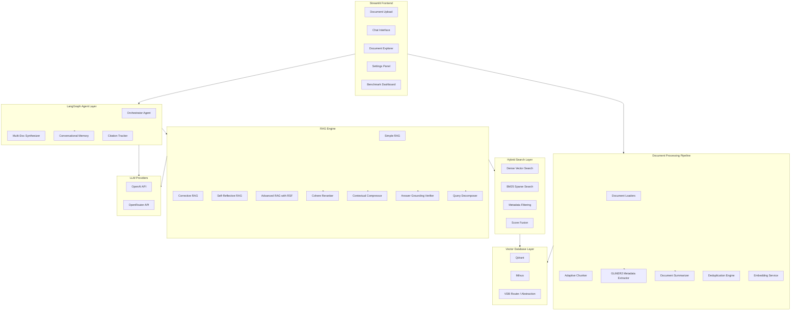
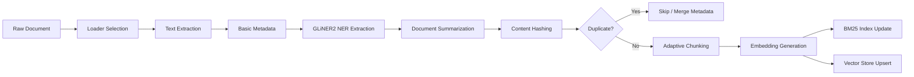
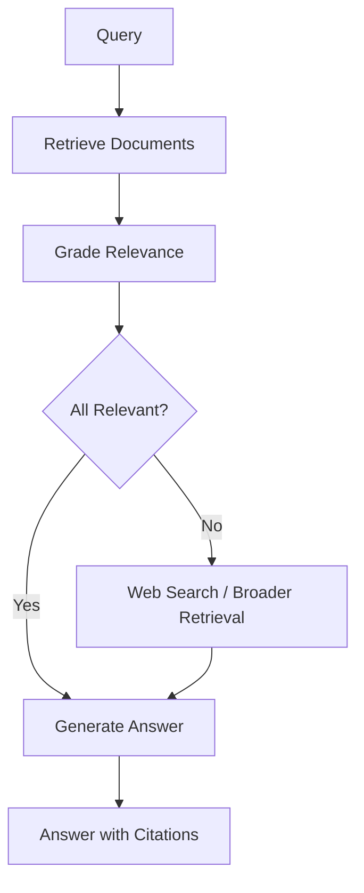
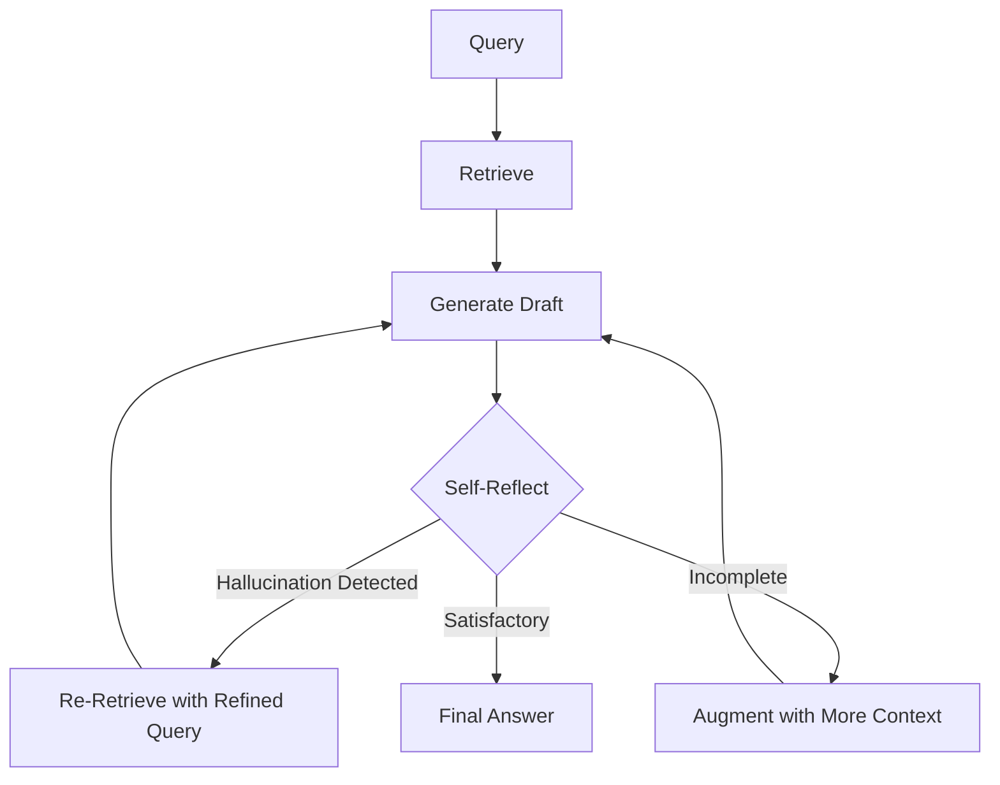
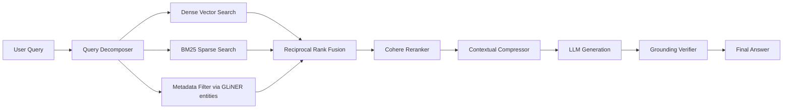
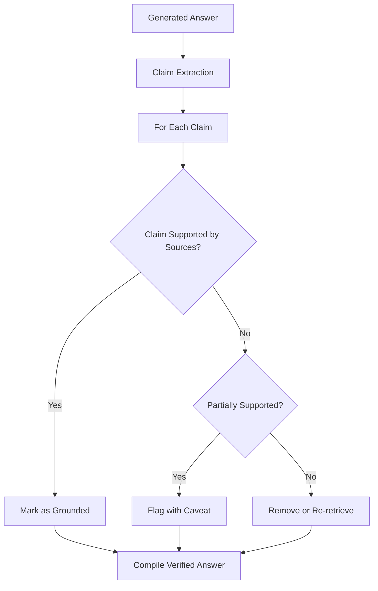
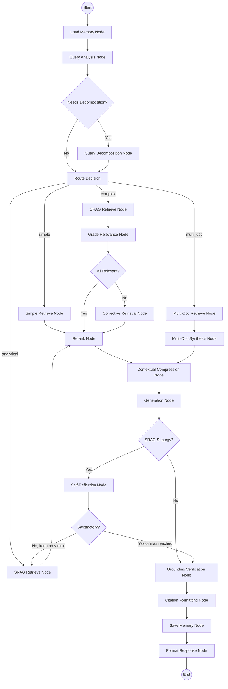
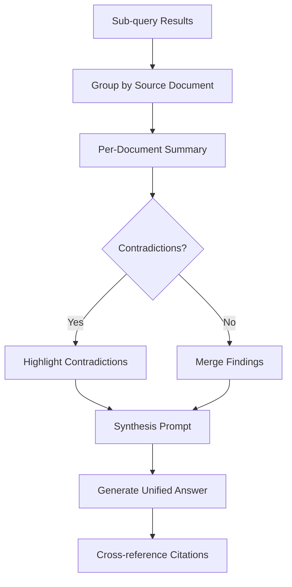

# Visual RAG Document Explorer - Architecture Plan

## 1. System Overview

A sophisticated document exploration system that ingests PDFs, Word docs, TXT, HTML, and JSON files into a searchable, conversational interface powered by advanced RAG strategies, multi-document synthesis agents, and dual vector database support. Enhanced with GLiNER2-based metadata extraction, hybrid search, query decomposition, contextual compression, answer grounding verification, and document-level summarization for maximum answer accuracy.



## 2. Project Structure

```
Visual_RAG_Document_Explore/
├── app.py                          # Streamlit entry point
├── config/
│   ├── __init__.py
│   ├── settings.py                 # Global configuration / env vars
│   └── models.py                   # Pydantic config models
├── core/
│   ├── __init__.py
│   ├── document_processing/
│   │   ├── __init__.py
│   │   ├── loaders.py              # PDF, Word, TXT, HTML, JSON loaders
│   │   ├── chunker.py              # Adaptive chunking with min/max params
│   │   ├── deduplication.py        # Content-hash and semantic dedup
│   │   ├── metadata.py             # Basic metadata extraction
│   │   ├── gliner_extractor.py     # GLiNER2 NER-based metadata extraction
│   │   ├── spacy_extractor.py      # spaCy NER-based metadata extraction
│   │   ├── ner_router.py           # NER model selection / ensemble
│   │   └── summarizer.py           # Document-level summarization
│   ├── embeddings/
│   │   ├── __init__.py
│   │   ├── voyage_embeddings.py    # Voyage AI embedding service
│   │   ├── bge_m3_embeddings.py    # BGE-M3 embedding service
│   │   └── embedding_router.py     # Embedding model selection
│   ├── search/
│   │   ├── __init__.py
│   │   ├── hybrid_search.py        # Hybrid dense + sparse search
│   │   ├── bm25_search.py          # BM25 sparse keyword search
│   │   └── metadata_filter.py      # Metadata-based filtering
│   ├── vectordb/
│   │   ├── __init__.py
│   │   ├── base.py                 # Abstract VectorDB interface
│   │   ├── qdrant_store.py         # Qdrant implementation
│   │   ├── milvus_store.py         # Milvus implementation
│   │   ├── router.py               # VDB routing / abstraction layer
│   │   └── benchmark.py            # Performance benchmarking
│   ├── reranking/
│   │   ├── __init__.py
│   │   └── cohere_reranker.py      # Cohere reranking service
│   ├── rag/
│   │   ├── __init__.py
│   │   ├── base.py                 # Base RAG interface
│   │   ├── simple_rag.py           # Basic retrieve-and-generate
│   │   ├── corrective_rag.py       # CRAG implementation
│   │   ├── self_reflective_rag.py  # SRAG implementation
│   │   ├── advanced_rag.py         # Advanced RAG with RSF
│   │   ├── rag_router.py           # Strategy selection
│   │   ├── query_decomposer.py     # Complex query decomposition
│   │   ├── contextual_compressor.py # Post-retrieval context compression
│   │   ├── grounding_verifier.py   # Answer grounding verification
│   │   └── hyde.py                 # HYDE query expansion
│   └── llm/
│       ├── __init__.py
│       ├── openai_provider.py      # OpenAI LLM wrapper
│       ├── openrouter_provider.py  # OpenRouter LLM wrapper
│       └── llm_router.py           # LLM provider selection
├── agents/
│   ├── __init__.py
│   ├── graph.py                    # LangGraph state graph definition & compilation
│   ├── state.py                    # AgentState TypedDict schema
│   ├── orchestrator.py             # Main orchestrator agent entry point
│   └── nodes/
│       ├── __init__.py
│       ├── memory_load.py          # Load conversation memory node
│       ├── routing.py              # Query analysis & routing node
│       ├── decomposition.py        # Query decomposition node
│       ├── retrieval.py            # Retrieve nodes (simple, CRAG, SRAG, multi-doc)
│       ├── grading.py              # Document relevance grading node (CRAG)
│       ├── correction.py           # Corrective retrieval node (CRAG)
│       ├── reranking.py            # Cohere reranking node
│       ├── compression.py          # Contextual compression node
│       ├── synthesis.py            # Multi-document synthesis node
│       ├── generation.py           # LLM response generation node
│       ├── reflection.py           # Self-reflection node (SRAG)
│       ├── grounding.py            # Answer grounding verification node
│       ├── citation.py             # Citation formatting node
│       ├── memory_save.py          # Save to memory node
│       └── format.py               # Final response formatting node
├── ui/
│   ├── __init__.py
│   ├── pages/
│   │   ├── chat.py                 # Chat interface page
│   │   ├── upload.py               # Document upload page
│   │   ├── explorer.py             # Document browser page
│   │   ├── settings.py             # Settings configuration page
│   │   └── benchmark.py            # VDB benchmark dashboard
│   ├── components/
│   │   ├── sidebar.py              # Sidebar navigation
│   │   ├── document_card.py        # Document display card
│   │   ├── citation_viewer.py      # Citation display component
│   │   └── chunk_inspector.py      # Chunk visualization
│   └── styles/
│       └── custom.css              # Custom Streamlit styling
├── data/
│   ├── uploads/                    # Uploaded documents
│   └── processed/                  # Processed document cache
├── tests/
│   ├── __init__.py
│   ├── test_loaders.py
│   ├── test_chunker.py
│   ├── test_dedup.py
│   ├── test_vectordb.py
│   ├── test_rag.py
│   └── test_agents.py
├── plans/                          # Architecture plans
├── .env.example                    # Environment variable template
├── .gitignore
├── pyproject.toml                  # Project dependencies
├── docker-compose.yml              # Qdrant + Milvus services
├── Makefile                        # Common commands
└── README.md
```

## 3. Component Deep Dives

### 3.1 Document Processing Pipeline



**Loaders**: Using LangChain document loaders:
- PDF: `PyPDFLoader` / `PDFPlumber`
- Word: `Docx2txtLoader`
- TXT: `TextLoader`
- HTML: `BSHTMLLoader`
- JSON: `JSONLoader` with configurable jq schema

**Adaptive Chunking Strategy**:
- Configurable `chunk_size_min` and `chunk_size_max` parameters
- `RecursiveCharacterTextSplitter` as base with semantic awareness
- Chunk overlap configurable (default 10-20% of chunk size)
- Metadata preserved per chunk: source file, page number, chunk index, content hash, GLiNER entities

**Deduplication**:
- **Content-hash dedup**: SHA-256 hash of normalized text for exact duplicates
- **Semantic dedup**: Cosine similarity threshold on embeddings for near-duplicates
- Configurable similarity threshold (default 0.95)

### 3.1.1 NER-Based Metadata Extraction (GLiNER2 + spaCy)

**Purpose**: Extract structured named entities from documents to enable metadata-filtered hybrid search, dramatically improving retrieval precision. Two NER backends are provided for comparison and ensemble use.

**Entity Types Extracted**:
- **People**: Names of individuals mentioned in documents
- **Organizations**: Companies, institutions, agencies
- **Dates/Times**: Temporal references, deadlines, periods
- **Locations**: Geographic references
- **Topics/Concepts**: Domain-specific key concepts
- **Custom entities**: Configurable per document collection (GLiNER2 only)

#### GLiNER2 (Primary)

A generalist NER model that can extract **arbitrary entity types** without fine-tuning. Runs locally with no API dependency.

**Strengths**: Zero-shot entity extraction for custom/domain-specific entity types, no training needed.

**Implementation Pattern** (inspired by metadata-hybrid-rag):
```python
from gliner import GLiNER

class GLiNERMetadataExtractor:
    def __init__:
        self.model = GLiNER.from_pretrained - urchade/gliner_multi_pii-v1 or similar
        self.entity_types = configurable list

    def extract - text -> dict of entity_type to list of entities:
        predictions = self.model.predict_entities - text, self.entity_types
        # Deduplicate and normalize entities
        # Return structured metadata dict

    def enrich_chunks - chunks -> chunks with entity metadata:
        # Add extracted entities to each chunk metadata
        # Also create document-level entity summary
```

#### spaCy NER (Complement/Fallback)

Uses spaCy pre-trained models (`en_core_web_trf` for accuracy or `en_core_web_sm` for speed) for standard NER.

**Strengths**: Fast, well-tested, excellent for standard entity types (PERSON, ORG, DATE, GPE, MONEY, etc.), includes dependency parsing and POS tagging for richer metadata.

```python
import spacy

class SpacyMetadataExtractor:
    def __init__:
        self.nlp = spacy.load - en_core_web_trf
    
    def extract - text -> dict of entity_type to list of entities:
        doc = self.nlp - text
        entities = group doc.ents by label
        # Also extract noun chunks for topic/concept extraction
        # Return structured metadata dict
```

#### NER Router / Ensemble

The [`ner_router.py`](core/document_processing/ner_router.py) provides three modes:
1. **GLiNER2 only**: Best for custom/domain-specific entity types
2. **spaCy only**: Best for speed and standard entity types
3. **Ensemble**: Run both, merge and deduplicate results for maximum recall. Entities found by both models get higher confidence scores.

| Feature | GLiNER2 | spaCy |
|---------|---------|-------|
| Custom entity types | Yes - zero-shot | No - fixed types |
| Speed | Moderate | Fast |
| Standard NER accuracy | Good | Excellent |
| Domain adaptation | No training needed | Requires fine-tuning |
| Dependency parsing | No | Yes |
| Local / no API | Yes | Yes |

**Storage**: Entities stored as payload/metadata in vector DB, enabling filtered queries like:
- "Find documents mentioning Organization X"
- "What happened on Date Y?"
- Filter retrieval to only chunks containing relevant entities

### 3.1.2 Document-Level Summarization

**Purpose**: Generate concise summaries of each document to provide high-level context during retrieval and synthesis.

**Approach**:
- On ingestion, generate a summary of each document using the configured LLM
- Store summaries as special "summary chunks" in the vector DB with `chunk_type: summary` metadata
- Summaries are retrieved alongside regular chunks to give the LLM document-level context
- Map-reduce summarization for documents exceeding context window

**Benefits**:
- Helps the agent understand document scope before diving into details
- Enables document-level questions: "What is this document about?"
- Improves multi-document synthesis by providing overview context

### 3.2 Embedding Services

| Model | Dimensions | Use Case | Provider |
|-------|-----------|----------|----------|
| Voyage AI (voyage-3) | 1024 | Primary embedding for high-quality retrieval | Voyage AI API |
| BGE-M3 | 1024 | Multilingual / local fallback | HuggingFace / local |

**Embedding Router**: Selects embedding model based on configuration. Both models produce compatible dimensionality for fair benchmarking.

### 3.3 Vector Database Layer

**Abstraction Layer**: A common interface (`VectorStoreBase`) with implementations for both Qdrant and Milvus, enabling:
- Transparent switching between backends
- Side-by-side benchmarking
- Future extensibility

**Qdrant Features Used**:
- Named vectors for multi-model embeddings
- Payload filtering for metadata queries
- Batch upsert with dedup checks

**Milvus Features Used**:
- Dynamic schema for flexible metadata
- GPU-accelerated search (if available)
- Partition-based collection management

**Benchmarking Metrics**:
- Indexing throughput (docs/sec)
- Query latency (p50, p95, p99)
- Recall@k at various k values
- Memory usage
- Results displayed in Streamlit benchmark dashboard

### 3.4 RAG Implementations

#### Simple RAG
Basic retrieve → rerank → generate pipeline.

#### Corrective RAG (CRAG)


- Retrieves documents, grades each for relevance
- If relevance score is low, triggers corrective retrieval (broader search, query reformulation)
- Uses LLM-as-judge for relevance grading

#### Self-Reflective RAG (SRAG)


- Generates draft answer, then self-evaluates
- Checks for hallucination, completeness, and faithfulness to sources
- Iterates up to N times (configurable)

#### Advanced RAG with Relevance Score Fusion (RSF)
- Multi-query retrieval: generates query variants
- Reciprocal Rank Fusion across multiple retrieval passes
- Cohere reranking as final stage
- Chunk-level and document-level scoring

### 3.5 Hybrid Search

**Purpose**: Combine dense vector search with sparse keyword search and metadata filtering for significantly better recall and precision.



**Components**:
- **Dense search**: Voyage AI / BGE-M3 embeddings → vector similarity
- **BM25 sparse search**: `rank_bm25` library, indexed at ingestion time, keyword matching for exact terms the dense model might miss
- **Metadata filtering**: Use GLiNER2-extracted entities to pre-filter or post-filter results (e.g., filter by organization, date range, person)
- **Reciprocal Rank Fusion**: Merge results from dense + sparse + metadata-filtered searches using RRF scoring

### 3.6 Reranking

**Cohere Reranker** (`rerank-v3.5`):
- Applied after hybrid search fusion
- Reranks top-k candidates (configurable k, default 20 → top 5)
- Score threshold filtering

### 3.7 Query Decomposition

**Purpose**: Break complex multi-part queries into simpler sub-queries for better retrieval.

**Approach**:
- LLM analyzes the query and determines if decomposition is needed
- Complex queries split into 2-5 focused sub-queries
- Each sub-query retrieves independently
- Results merged and deduplicated before reranking
- Particularly useful for comparative questions: "Compare policy X in document A vs document B"

**Example**:
- Input: "What are the revenue figures for Q1 and Q2, and how do they compare to last year?"
- Sub-queries: 1 - Q1 revenue figures, 2 - Q2 revenue figures, 3 - Previous year revenue figures

### 3.8 Contextual Compression

**Purpose**: After retrieval, extract only the relevant portions of each chunk before sending to the LLM, reducing noise and improving answer accuracy.

**Implementation**:
- Uses LLM to compress/extract relevant sentences from each retrieved chunk given the query
- Removes irrelevant context that might confuse the generation step
- Reduces token usage while maintaining answer quality
- LangChain `ContextualCompressionRetriever` with `LLMChainExtractor`

### 3.9 Answer Grounding Verification

**Purpose**: Post-generation check that every claim in the answer is supported by the retrieved sources.



**Implementation**:
- Extract individual claims/statements from the generated answer
- For each claim, verify it can be traced to a specific source chunk
- Claims without source support are flagged or removed
- Provides a "grounding score" indicating answer reliability
- Displayed in the UI alongside the answer

### 3.10 LangGraph Agent Architecture — Detailed Design

#### State Schema

The LangGraph state is a `TypedDict` that flows through all nodes. Every node reads from and writes to this shared state.

```python
from typing import TypedDict, Literal, Annotated
from langgraph.graph import add_messages

class AgentState - TypedDict:
    # Input
    query: str                              # Original user query
    chat_history: Annotated[list, add_messages]  # Conversation history
    
    # Query Analysis
    query_type: Literal[simple, complex, analytical, multi_doc]
    sub_queries: list[str]                  # Decomposed sub-queries if complex
    
    # Retrieval
    retrieved_docs: list[Document]          # Raw retrieved documents
    reranked_docs: list[Document]           # After reranking
    compressed_docs: list[Document]         # After contextual compression
    
    # Generation
    draft_answer: str                       # Initial generated answer
    final_answer: str                       # After verification
    
    # Quality Control
    relevance_scores: dict[str, float]      # Doc ID -> relevance score
    grounding_score: float                  # 0.0 to 1.0
    grounding_details: list[dict]           # Per-claim grounding info
    reflection_feedback: str                # Self-reflection notes
    
    # Metadata
    rag_strategy: str                       # Which RAG strategy was used
    citations: list[dict]                   # Source citations
    iteration_count: int                    # For SRAG loop control
    max_iterations: int                     # Max SRAG iterations
    
    # Routing decisions
    needs_correction: bool                  # CRAG: needs broader retrieval
    needs_reflection: bool                  # SRAG: needs self-reflection loop
    is_multi_doc: bool                      # Requires multi-doc synthesis
```

#### Main Orchestrator Graph



#### Node Definitions

Each node is a Python function that takes `AgentState` and returns a partial state update.

**1. Load Memory Node** ([`agents/nodes/memory_load.py`](agents/nodes/memory_load.py)):
- Loads conversation history from Streamlit session state
- Retrieves relevant long-term memory from vector DB based on current query
- Adds context to state for downstream nodes

**2. Query Analysis Node** ([`agents/nodes/routing.py`](agents/nodes/routing.py)):
- Uses LLM to classify query into: `simple`, `complex`, `analytical`, `multi_doc`
- Classification prompt considers: query complexity, number of topics, whether comparison is needed
- Sets `query_type` and `is_multi_doc` in state

```python
# Classification criteria
QUERY_TYPES = dict:
    simple: Direct factual question answerable from a single passage
    complex: Multi-faceted question needing corrective retrieval
    analytical: Question requiring deep analysis and self-verification
    multi_doc: Question explicitly or implicitly spanning multiple documents
```

**3. Query Decomposition Node** ([`agents/nodes/decomposition.py`](agents/nodes/decomposition.py)):
- Triggered when query is `complex` or `multi_doc`
- LLM breaks query into 2-5 focused sub-queries
- Each sub-query targets a specific aspect of the original question
- Sets `sub_queries` in state

**4. Retrieve Nodes** ([`agents/nodes/retrieval.py`](agents/nodes/retrieval.py)):
- **Simple Retrieve**: Single hybrid search (dense + BM25 + metadata filter)
- **CRAG Retrieve**: Same as simple, but results go through grading
- **SRAG Retrieve**: Same as simple, may be called multiple times in reflection loop
- **Multi-Doc Retrieve**: Runs retrieval for each sub-query independently, merges results
- All use the hybrid search layer with configurable top-k

**5. Grade Relevance Node** ([`agents/nodes/grading.py`](agents/nodes/grading.py)):
- Used in CRAG pipeline
- LLM-as-judge evaluates each retrieved document for relevance to the query
- Assigns relevance score (0-1) per document
- Sets `needs_correction = True` if average relevance < threshold (default 0.5)

**6. Corrective Retrieval Node** ([`agents/nodes/correction.py`](agents/nodes/correction.py)):
- Triggered when CRAG grading finds low relevance
- Reformulates the query using LLM
- Performs broader retrieval with relaxed parameters
- Merges new results with original results

**7. Rerank Node** ([`agents/nodes/reranking.py`](agents/nodes/reranking.py)):
- Applies Cohere reranker to retrieved documents
- Reduces from top-k (default 20) to final-k (default 5)
- Sets `reranked_docs` in state

**8. Contextual Compression Node** ([`agents/nodes/compression.py`](agents/nodes/compression.py)):
- For each reranked document, extracts only the sentences relevant to the query
- Uses LLM-based extraction
- Reduces noise, improves generation quality
- Sets `compressed_docs` in state

**9. Multi-Doc Synthesis Node** ([`agents/nodes/synthesis.py`](agents/nodes/synthesis.py)):
- Receives results from multiple sub-query retrievals
- Groups documents by source
- Generates per-document summaries if needed
- Creates a synthesis prompt that asks LLM to combine information across sources
- Handles contradictions between documents explicitly

**10. Generation Node** ([`agents/nodes/generation.py`](agents/nodes/generation.py)):
- Takes compressed documents + query + chat history
- Generates answer using configured LLM (OpenAI or OpenRouter)
- Prompt includes instructions for citation format
- Sets `draft_answer` in state

**11. Self-Reflection Node** ([`agents/nodes/reflection.py`](agents/nodes/reflection.py)):
- Used in SRAG pipeline
- LLM evaluates the draft answer for:
  - **Hallucination**: Claims not supported by retrieved docs
  - **Completeness**: Whether all aspects of the query are addressed
  - **Faithfulness**: Whether the answer accurately represents source content
- If issues found and `iteration_count < max_iterations`: sets `needs_reflection = True`, increments counter
- Otherwise: passes through to grounding

**12. Grounding Verification Node** ([`agents/nodes/grounding.py`](agents/nodes/grounding.py)):
- Extracts individual claims from the draft answer
- For each claim, checks if it can be traced to a specific source chunk
- Computes `grounding_score` (ratio of grounded claims to total claims)
- Populates `grounding_details` with per-claim verification results
- Sets `final_answer` (may modify draft to remove ungrounded claims)

**13. Citation Formatting Node** ([`agents/nodes/citation.py`](agents/nodes/citation.py)):
- Maps each grounded claim to its source document(s)
- Formats citations as: [Source: filename, Page: X, Chunk: Y]
- Creates structured citation list for UI display
- Sets `citations` in state

**14. Save Memory Node** ([`agents/nodes/memory_save.py`](agents/nodes/memory_save.py)):
- Saves the Q&A pair to short-term memory (session state)
- If conversation is getting long, triggers summarization of older messages
- Optionally stores in vector DB for long-term retrieval

**15. Format Response Node** ([`agents/nodes/format.py`](agents/nodes/format.py)):
- Compiles final response with: answer, citations, grounding score, RAG strategy used
- Formats for Streamlit display (markdown with expandable citation sections)

#### Conditional Edges

```python
# Pseudocode for graph construction
from langgraph.graph import StateGraph, END

graph = StateGraph - AgentState

# Add all nodes
graph.add_node - load_memory, load_memory_node
graph.add_node - analyze_query, analyze_query_node
graph.add_node - decompose_query, decompose_query_node
graph.add_node - retrieve_simple, retrieve_simple_node
graph.add_node - retrieve_crag, retrieve_crag_node
graph.add_node - retrieve_srag, retrieve_srag_node
graph.add_node - retrieve_multi, retrieve_multi_node
graph.add_node - grade_relevance, grade_relevance_node
graph.add_node - correct_retrieval, correct_retrieval_node
graph.add_node - rerank, rerank_node
graph.add_node - compress, compress_node
graph.add_node - synthesize, synthesize_node
graph.add_node - generate, generate_node
graph.add_node - reflect, reflect_node
graph.add_node - verify_grounding, verify_grounding_node
graph.add_node - format_citations, format_citations_node
graph.add_node - save_memory, save_memory_node
graph.add_node - format_response, format_response_node

# Entry
graph.set_entry_point - load_memory

# Linear edges
graph.add_edge - load_memory, analyze_query

# Conditional: needs decomposition?
graph.add_conditional_edges - analyze_query,
    lambda s: needs_decomp if len of s sub_queries > 0 else route,
    dict: needs_decomp -> decompose_query, route -> route_to_strategy

# Conditional: route to RAG strategy
graph.add_conditional_edges - route_to_strategy,
    lambda s: s query_type,
    dict: simple -> retrieve_simple, complex -> retrieve_crag,
          analytical -> retrieve_srag, multi_doc -> retrieve_multi

# CRAG path
graph.add_edge - retrieve_crag, grade_relevance
graph.add_conditional_edges - grade_relevance,
    lambda s: correct if s needs_correction else rerank,
    dict: correct -> correct_retrieval, rerank -> rerank

graph.add_edge - correct_retrieval, rerank

# Simple and SRAG paths
graph.add_edge - retrieve_simple, rerank
graph.add_edge - retrieve_srag, rerank

# Multi-doc path
graph.add_edge - retrieve_multi, synthesize
graph.add_edge - synthesize, compress

# Common path after rerank
graph.add_edge - rerank, compress
graph.add_edge - compress, generate

# SRAG reflection loop
graph.add_conditional_edges - generate,
    lambda s: reflect if s rag_strategy == srag else ground,
    dict: reflect -> reflect, ground -> verify_grounding

graph.add_conditional_edges - reflect,
    lambda s: retry if s needs_reflection and s iteration_count < s max_iterations else ground,
    dict: retry -> retrieve_srag, ground -> verify_grounding

# Final path
graph.add_edge - verify_grounding, format_citations
graph.add_edge - format_citations, save_memory
graph.add_edge - save_memory, format_response
graph.add_edge - format_response, END

app = graph.compile
```

#### Conversational Memory Design

**Short-term Memory** (per session):
- Stored in `st.session_state.chat_history`
- Last N messages (configurable, default 20)
- Full message content preserved
- Automatically included in generation prompts

**Long-term Memory** (persistent):
- Conversation summaries stored as vectors in the vector DB
- Collection: `conversation_memory` with metadata: `session_id`, `timestamp`, `summary`
- On each new query, relevant past conversations are retrieved via similarity search
- Provides cross-session context

**Context Window Management**:
- Token counting via `tiktoken` for the configured model
- When chat history exceeds 60% of context window:
  1. Summarize oldest messages using LLM
  2. Replace detailed messages with summary
  3. Keep most recent N messages in full detail
- Ensures the LLM always has room for retrieved documents + generation

#### Multi-Document Synthesis Strategy

When a query spans multiple documents, the synthesis node follows this approach:



1. **Group**: Organize retrieved chunks by source document
2. **Summarize**: Generate brief per-document summaries relevant to the query
3. **Detect Contradictions**: Compare key claims across documents
4. **Synthesize**: Generate a unified answer that:
   - Combines complementary information
   - Explicitly notes contradictions with source attribution
   - Provides a balanced view when sources disagree
5. **Cross-reference**: Ensure every claim cites its specific source

### 3.11 Streamlit UI

**Pages**:
1. **Chat**: Main conversational interface with citation display, RAG strategy indicator, and conversation history
2. **Upload**: Drag-and-drop document upload with progress tracking, format validation, and dedup feedback
3. **Explorer**: Browse indexed documents, view chunks, inspect metadata, search by metadata filters
4. **Settings**: Configure LLM provider, embedding model, vector DB backend, chunking parameters, RAG strategy
5. **Benchmark**: Side-by-side Qdrant vs Milvus performance comparison charts

## 4. Pydantic Data Models

All data flowing through the system uses Pydantic models for validation, serialization, and type safety. These models live in [`config/models.py`](config/models.py).

```python
from pydantic import BaseModel, Field
from typing import Literal, Optional
from datetime import datetime


# ============= Query Request Models =============

class QueryRequest(BaseModel):
    """User query input with all configurable options."""
    query: str = Field(..., min_length=1, max_length=2000)
    mode: Literal["simple", "crag", "srag", "advanced", "auto"] = Field(
        default="auto",
        description="RAG strategy: simple, crag, srag, advanced, or auto for agent routing"
    )
    search_mode: Literal["dense", "sparse", "hybrid"] = Field(
        default="hybrid",
        description="Search mode: dense - semantic, sparse - keyword BM25, hybrid - RRF fusion"
    )
    top_k: int = Field(default=5, ge=1, le=20)
    enable_hyde: bool = Field(
        default=False,
        description="Use HYDE - Hypothetical Document Embeddings - for query expansion"
    )
    enable_reranking: bool = Field(
        default=True,
        description="Use Cohere cross-encoder reranking for improved precision"
    )
    enable_compression: bool = Field(
        default=True,
        description="Use contextual compression to extract relevant portions"
    )
    metadata_filters: Optional[dict[str, list[str]]] = Field(
        default=None,
        description="Entity-based metadata filters e.g. {organizations: [Acme Corp]}"
    )


# ============= Document & Upload Models =============

class UploadResponse(BaseModel):
    """Response after document upload and processing."""
    file_id: str
    filename: str
    file_type: Literal["pdf", "docx", "txt", "html", "json"]
    chunks_created: int
    entities_extracted: dict[str, list[str]]  # GLiNER/spaCy entities
    summary: str                               # Document-level summary
    duplicate_status: Literal["new", "exact_duplicate", "near_duplicate"]
    status: Literal["success", "partial", "failed"]
    message: str


# ============= Chunk Models =============

class NEREntities(BaseModel):
    """Named entities extracted by GLiNER2 and/or spaCy."""
    people: list[str] = []
    organizations: list[str] = []
    dates: list[str] = []
    locations: list[str] = []
    topics: list[str] = []
    custom: dict[str, list[str]] = {}  # GLiNER2 custom entity types
    extractor: Literal["gliner", "spacy", "ensemble"] = "ensemble"
    confidence_scores: dict[str, float] = {}  # entity -> confidence


class ChunkMetadata(BaseModel):
    """Metadata attached to each document chunk."""
    chunk_id: str
    source_file: str
    file_type: Literal["pdf", "docx", "txt", "html", "json"]
    page_number: Optional[int] = None
    chunk_index: int
    total_chunks: int
    chunk_type: Literal["content", "summary"] = "content"
    doc_item_type: Optional[str] = None
    parent_heading: Optional[str] = None
    hierarchy_level: Optional[int] = None
    chunk_method: str = "recursive"
    chunk_size: int
    token_count: int
    char_count: int
    content_hash: str                          # SHA-256 for dedup
    content_preview: str                       # First 200 chars
    entities: NEREntities = NEREntities()      # Extracted entities
    keywords: list[str] = []
    created_at: datetime
    processed_at: datetime


class RetrievedChunk(BaseModel):
    """A chunk retrieved from the vector store with relevance score."""
    content: str
    metadata: ChunkMetadata
    score: float
    search_method: Literal["dense", "sparse", "hybrid"]


# ============= CRAG Models =============

class CRAGEvaluation(BaseModel):
    """Corrective RAG relevance evaluation result."""
    relevance_score: float = Field(ge=0.0, le=1.0)
    relevance_label: Literal["relevant", "ambiguous", "irrelevant"]
    confidence: float = Field(ge=0.0, le=1.0)
    evaluation_method: str = "llm_grader"
    needs_correction: bool
    correction_strategy: Optional[Literal["reformulate", "broaden", "decompose"]] = None
    evaluated_at: datetime


class CRAGResult(BaseModel):
    """Full CRAG pipeline result."""
    correction_applied: bool
    evaluation: CRAGEvaluation
    original_chunks: list[RetrievedChunk]
    corrected_chunks: Optional[list[RetrievedChunk]] = None
    reformulated_query: Optional[str] = None


# ============= Self-Reflective RAG Models =============

class ReflectionResult(BaseModel):
    """Self-reflection evaluation of a generated answer."""
    answer_grounded: bool
    hallucination_detected: bool
    completeness_score: float = Field(ge=0.0, le=1.0)
    faithfulness_score: float = Field(ge=0.0, le=1.0)
    sources_cited: list[str]
    reflection_score: float = Field(ge=0.0, le=1.0)
    needs_regeneration: bool
    reflection_reason: str
    iteration: int
    reflected_at: datetime


class SelfReflectiveResult(BaseModel):
    """Full SRAG pipeline result."""
    final_answer: str
    total_iterations: int
    reflections: list[ReflectionResult]  # One per iteration
    retrieved_chunks: list[RetrievedChunk]


# ============= Grounding Verification Models =============

class ClaimVerification(BaseModel):
    """Verification result for a single claim in the answer."""
    claim: str
    is_grounded: bool
    supporting_chunks: list[str]  # chunk_ids
    confidence: float = Field(ge=0.0, le=1.0)
    status: Literal["grounded", "partially_grounded", "ungrounded"]


class GroundingResult(BaseModel):
    """Full grounding verification result."""
    grounding_score: float = Field(ge=0.0, le=1.0)
    total_claims: int
    grounded_claims: int
    partially_grounded_claims: int
    ungrounded_claims: int
    claim_details: list[ClaimVerification]
    verified_at: datetime


# ============= Citation Models =============

class Citation(BaseModel):
    """A source citation for a claim in the answer."""
    source_file: str
    page_number: Optional[int] = None
    chunk_index: int
    relevant_text: str  # The specific text supporting the claim
    relevance_score: float


# ============= Multi-Document Synthesis Models =============

class DocumentSummary(BaseModel):
    """Per-document summary for multi-doc synthesis."""
    source_file: str
    summary: str
    key_findings: list[str]
    relevant_chunks: int


class SynthesisResult(BaseModel):
    """Multi-document synthesis result."""
    document_summaries: list[DocumentSummary]
    contradictions: list[dict]  # {claim, doc_a, doc_b, details}
    synthesized_answer: str


# ============= HYDE Models =============

class HYDEResult(BaseModel):
    """Hypothetical Document Embeddings result."""
    original_query: str
    hypothetical_documents: list[str]  # LLM-generated hypothetical answers
    enhanced_retrieval: bool


# ============= Full Query Response =============

class QueryResponse(BaseModel):
    """Complete response to a user query."""
    query: str
    answer: str
    mode: Literal["simple", "crag", "srag", "advanced", "auto"]
    search_mode: Literal["dense", "sparse", "hybrid"]
    sources: list[RetrievedChunk]
    citations: list[Citation]
    grounding: GroundingResult
    crag_details: Optional[CRAGResult] = None
    reflection_details: Optional[SelfReflectiveResult] = None
    synthesis_details: Optional[SynthesisResult] = None
    hyde_details: Optional[HYDEResult] = None
    response_time_ms: float
    hyde_used: bool = False
    reranking_used: bool = True
    compression_used: bool = True
    initial_retrieval_count: int
    final_retrieval_count: int


# ============= Benchmark Models =============

class BenchmarkResult(BaseModel):
    """Vector DB benchmark result."""
    db_name: Literal["qdrant", "milvus"]
    operation: Literal["index", "search", "delete"]
    num_documents: int
    latency_p50_ms: float
    latency_p95_ms: float
    latency_p99_ms: float
    throughput_ops_per_sec: float
    memory_usage_mb: float
    recall_at_k: Optional[dict[int, float]] = None  # k -> recall
    timestamp: datetime
```

**Note on HYDE**: The models include `HYDEResult` for Hypothetical Document Embeddings — an optional query expansion technique where the LLM generates hypothetical answer documents, which are then embedded and used for retrieval. This can improve recall for abstract or conceptual queries. Implementation lives in [`core/rag/hyde.py`](core/rag/hyde.py).

## 5. Configuration & Environment

```env
# .env.example
OPENAI_API_KEY=sk-...
OPENROUTER_API_KEY=sk-or-...
VOYAGE_API_KEY=pa-...
COHERE_API_KEY=...

# LLM Settings
DEFAULT_LLM_PROVIDER=openai          # openai | openrouter
DEFAULT_MODEL=gpt-4o                  # model name
OPENROUTER_MODEL=anthropic/claude-sonnet-4

# Embedding Settings
DEFAULT_EMBEDDING_MODEL=voyage        # voyage | bge-m3

# Vector DB Settings
DEFAULT_VECTOR_DB=qdrant              # qdrant | milvus
QDRANT_URL=http://localhost:6333
MILVUS_URL=http://localhost:19530

# Chunking Settings
CHUNK_SIZE_MIN=256
CHUNK_SIZE_MAX=1024
CHUNK_OVERLAP=128

# RAG Settings
DEFAULT_RAG_STRATEGY=crag             # simple | crag | srag | advanced
RERANK_TOP_K=20
FINAL_TOP_K=5
DEDUP_SIMILARITY_THRESHOLD=0.95
```

## 5. Infrastructure (Docker Compose)

```yaml
# docker-compose.yml services
services:
  qdrant:
    image: qdrant/qdrant:latest
    ports: 6333:6333, 6334:6334
    volumes: ./data/qdrant:/qdrant/storage

  milvus-standalone:
    image: milvusdb/milvus:latest
    ports: 19530:19530
    volumes: ./data/milvus:/var/lib/milvus

  etcd:  # Required by Milvus
    image: quay.io/coreos/etcd:v3.5.5

  minio:  # Required by Milvus
    image: minio/minio:latest
```

## 6. Key Dependencies

| Package | Purpose |
|---------|---------|
| `langchain` / `langchain-community` | Document loaders, text splitters, chains |
| `langgraph` | Agent state graph orchestration |
| `langchain-openai` | OpenAI LLM integration |
| `langchain-voyageai` | Voyage AI embeddings |
| `langchain-cohere` | Cohere reranker |
| `qdrant-client` | Qdrant vector DB client |
| `pymilvus` | Milvus vector DB client |
| `streamlit` | Web UI framework |
| `sentence-transformers` | BGE-M3 local embeddings |
| `gliner` | GLiNER2 NER-based metadata extraction |
| `spacy` + `en_core_web_trf` | spaCy NER-based metadata extraction |
| `rank-bm25` | BM25 sparse keyword search |
| `pdfplumber` / `pypdf` | PDF processing |
| `python-docx` / `docx2txt` | Word document processing |
| `beautifulsoup4` | HTML parsing |
| `pydantic` / `pydantic-settings` | Configuration management |
| `plotly` | Benchmark visualization |
| `tiktoken` | Token counting for context management |

## 7. Implementation Phases

### Phase 1: Foundation
- Project scaffolding, pyproject.toml, configuration, Docker Compose setup
- Document loaders for all 5 formats (PDF, Word, TXT, HTML, JSON)
- Adaptive chunking with configurable min/max parameters
- Basic metadata extraction
- GLiNER2 NER-based metadata extraction
- spaCy NER-based metadata extraction
- NER router / ensemble mode
- Document-level summarization service
- Embedding services (Voyage AI + BGE-M3 with router)

### Phase 2: Vector Database & Search Layer
- Abstract VDB interface (base class)
- Qdrant integration with CRUD operations
- Milvus integration with CRUD operations
- VDB router / abstraction layer
- BM25 sparse search index
- Hybrid search (dense + sparse + metadata filtering with RRF)
- Deduplication engine (content-hash + semantic)
- Incremental indexing support

### Phase 3: RAG Engine & Accuracy Features
- Simple RAG pipeline
- Cohere reranker integration
- Query decomposition for complex queries
- Contextual compression (post-retrieval)
- CRAG implementation
- SRAG implementation
- Advanced RAG with RSF
- Answer grounding verification
- RAG strategy router

### Phase 4: Agent Layer
- LangGraph state graph definition
- Query routing agent (classifies and routes to RAG strategy)
- Multi-document synthesis agent
- Conversational memory management (short-term + long-term)
- Citation tracking and formatting

### Phase 5: Streamlit UI
- Chat interface with streaming responses and grounding scores
- Document upload with progress, dedup feedback, and entity preview
- Document explorer with metadata filtering and chunk inspection
- Settings panel for all configurable parameters
- Benchmark dashboard with Plotly charts (Qdrant vs Milvus)

### Phase 6: Polish & Testing
- Unit tests for all core components
- Integration tests for RAG pipelines
- Performance benchmarking suite
- README and documentation
- Error handling and edge cases
